<!--------------------------------------------------------------------------------------------------------->
<!--------------------------------------------------------------------------------------------------------->
<!--------------------------------------------------------------------------------------------------------->
<!--------------------------------------------------------------------------------------------------------->
<!-- LcsNodes-The-Book Document                                                                         --->
<!--------------------------------------------------------------------------------------------------------->
<!--------------------------------------------------------------------------------------------------------->
<!--------------------------------------------------------------------------------------------------------->
<!--------------------------------------------------------------------------------------------------------->


<!--------------------------------------------------------------------------------------------------------->
<!-- This file is the LcsNodes Book. It is intended to be printed as a PDF file. To make the formatting --->
<!-- a bit nicer, the following style options are defined.                                              --->
<!--                                                                                                    --->
<!-- use <br> to have an explicit blank line                                                            --->
<!--                                                                                                    --->
<!-- use "&nbsp; " to insert a blank in the table column if too narrow...                               --->
<!--                                                                                                    --->
<!-- to copy a schematic from EasyEda. Export in EasyEda as PDF. Open PDF                               --->
<!-- in "Preview" on Mac. Export as picture with 300px.	                                                --->
<!--                                                                                                    --->
<!-- using specific picture size goes like this ...                                                     --->
<!--                                              --->
<!--                                                                                                    --->
<!-- There are several CSS style settings to make the chapter and paragraphs look a little nicer.       --->
<!--                                                                                                    --->
<!--------------------------------------------------------------------------------------------------------->

<style>

   div {
      text-align: justify;
      orphans:3;
      widow:2;
	  }
   table {
      width: 90%;
      padding: 12px;
      break-inside: auto;
    }
    img {
      display: block;
    	margin-left: auto;
     	margin-right: auto;
	    max-width:90%;
    	height: auto;
    }
    blockquote {
      break-inside: avoid;
      orphans:3;
      widow:2;
    }
    code {
      break-inside: avoid;
      font-size: 12px;
      line-height: 17px;
      orphans:3;
      widow:3;
    }
    @media print {
      code, blockquote, figure {
         break-inside: avoid;
      }
      table {
         break-inside: auto;
      }
      html, body {
        text-align: justify;
        height: auto;
        font-size: 14pt;
        orphans:3;
        widow:3;
      }
      h1, h2, h3, h4, h5, h6 { 
         page-break-after:avoid; 
         page-break-inside:avoid 
      }
    }
    @page { 
      size:21.0cm 29.7cm;
      margin-top:1.7cm; 
      margin-bottom:1.7cm; 
      margin-left:1.7cm; 
      margin-right:1.7cm  
    }
    .hljs {
      break-inside: avoid;
    }

</style>


<!--------------------------------------------------------------------------------------------------------->
<!--------------------------------------------------------------------------------------------------------->
<!-- Front Page ------------------------------------------------------------------------------------------->
<!--------------------------------------------------------------------------------------------------------->
<!--------------------------------------------------------------------------------------------------------->


# A Layout Control System for Model Railroads

Helmut Fieres
August, 2024

<br> <br>
<br> <br>

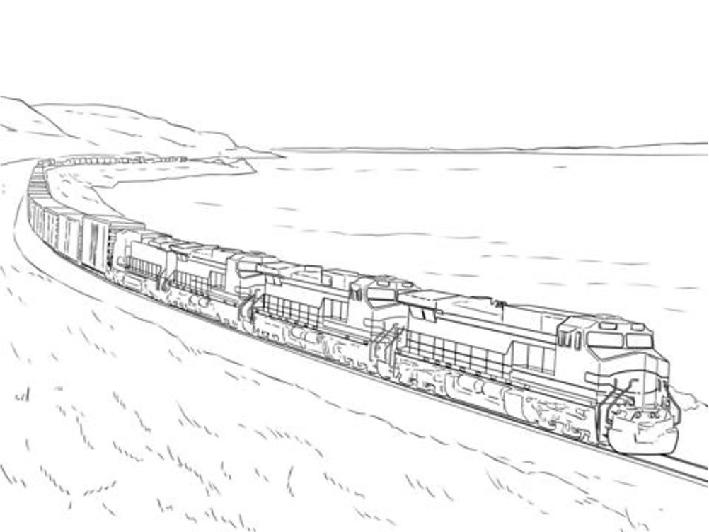  
 
<br> <br>
<br> <br>

<!--------------------------------------------------------------------------------------------------------->
<!--------------------------------------------------------------------------------------------------------->
<!-- Table of Contents ------------------------------------------------------------------------------------>
<!--------------------------------------------------------------------------------------------------------->
<!--------------------------------------------------------------------------------------------------------->

<div style="page-break-before: always;"></div>

## Table of Contents

<!-- TOC -->

- [A Layout Control System for Model Railroads](#a-layout-control-system-for-model-railroads)
  - [Table of Contents](#table-of-contents)
  - [Introduction](#introduction)
    - [Elements of a Layout Control System](#elements-of-a-layout-control-system)
    - [Components, Documentation, Standards and Compatibility](#components-documentation-standards-and-compatibility)
    - [This Book](#this-book)
    - [A final note](#a-final-note)
  - [*General Concepts*](#general-concepts)
    - [*Layout Control Bus*](#layout-control-bus)
    - [*Hardware Module*](#hardware-module)
    - [*Nodes*](#nodes)
    - [*Ports*](#ports)
    - [*Attributes*](#attributes)
    - [*Events*](#events)
    - [*DCC Subsystem*](#dcc-subsystem)
    - [*Analog Subsystem*](#analog-subsystem)
    - [*Configuration*](#configuration)
    - [*Operation*](#operation)
    - [*Summary*](#summary)
  - [*Message Formats*](#message-formats)
    - [*LCS Message Format*](#lcs-message-format)
    - [*General Management*](#general-management)
    - [*Node and Port Management*](#node-and-port-management)
    - [*Event Management*](#event-management)
    - [*DCC Track Management*](#dcc-track-management)
    - [*DCC Locomotive Decoder Management*](#dcc-locomotive-decoder-management)
    - [*DCC Accessory Decoder Management*](#dcc-accessory-decoder-management)
    - [*RailCom DCC Packet management*](#railcom-dcc-packet-management)
    - [*Raw DCC Packet Management*](#raw-dcc-packet-management)
    - [*DCC errors and status*](#dcc-errors-and-status)
    - [*Analog Engines*](#analog-engines)
    - [Summary](#summary-1)
  - [*Message Protocols*](#message-protocols)
    - [*Node startup*](#node-startup)
    - [*Setting a new Node Id*](#setting-a-new-node-id)
    - [*Node Ping*](#node-ping)
    - [*Node and Port Reset*](#node-and-port-reset)
    - [*Node and Port Access*](#node-and-port-access)
    - [*Layout Event management*](#layout-event-management)
    - [*General LCS Bus Management*](#general-lcs-bus-management)
    - [*DCC Track Management*](#dcc-track-management-1)
    - [*Locomotive Session Management*](#locomotive-session-management)
    - [*Locomotive Configuration Management*](#locomotive-configuration-management)
    - [*Configuration Management using RailCom*](#configuration-management-using-railcom)
    - [*DCC Accessory Decoder Management*](#dcc-accessory-decoder-management-1)
    - [*Sending DCC packets*](#sending-dcc-packets)
    - [*Summary*](#summary-2)
  - [*The LCS Runtime Library*](#the-lcs-runtime-library)
  - [*Runtime Library Storage*](#runtime-library-storage)
    - [*Node Map*](#node-map)
    - [*Port Map*](#port-map)
    - [*Node and Port Items*](#node-and-port-items)
    - [*Event Map*](#event-map)
    - [*User defined maps*](#user-defined-maps)
    - [*Pending Request Map*](#pending-request-map)
    - [*Driver map*](#driver-map)
    - [*Summary*](#summary-3)
  - [*LCS Runtime Library Functions*](#lcs-runtime-library-functions)
    - [*Library initialization*](#library-initialization)
    - [*Obtaining node information*](#obtaining-node-information)
    - [*Controlling a node aspect*](#controlling-a-node-aspect)
    - [*Controlling extension functions*](#controlling-extension-functions)
    - [*Reacting to events*](#reacting-to-events)
    - [*Sending messages*](#sending-messages)
    - [*Summary*](#summary-4)
  - [*LCS Library Callback Functions*](#lcs-library-callback-functions)
    - [*General Callbacks*](#general-callbacks)
    - [*Node and Port Initialization Callback*](#node-and-port-initialization-callback)
    - [*Node and Port Request Reply Callback*](#node-and-port-request-reply-callback)
    - [*Node and Port Control and Info Callback*](#node-and-port-control-and-info-callback)
    - [*Inbound Event Callback*](#inbound-event-callback)
    - [*Console Command Line Callback*](#console-command-line-callback)
    - [*DCC Message Callback*](#dcc-message-callback)
    - [*RailCom Message Callback*](#railcom-message-callback)
    - [*LCS Periodic Task Callback*](#lcs-periodic-task-callback)
    - [*Summary*](#summary-5)
  - [*Core Library Command Interface*](#core-library-command-interface)
    - [*Configuration Mode Commands*](#configuration-mode-commands)
    - [*Event Commands*](#event-commands)
    - [*Node Map and Attributes Commands*](#node-map-and-attributes-commands)
    - [*Send a raw Message*](#send-a-raw-message)
    - [*List node status*](#list-node-status)
    - [*Driver commands*](#driver-commands)
    - [*Batch mode*](#batch-mode)
    - [*LCS message text format*](#lcs-message-text-format)
    - [*Summary*](#summary-6)
  - [*LCS Core Library Usage Example*](#lcs-core-library-usage-example)
    - [*Sending Node*](#sending-node)
    - [*Receiving Node*](#receiving-node)
    - [*Summary*](#summary-7)
  - [*The DCC Subsystem*](#the-dcc-subsystem)
    - [*Locomotive session management*](#locomotive-session-management-1)
    - [*Stationary Decoders*](#stationary-decoders)
    - [*DCC Packet generation*](#dcc-packet-generation)
    - [*Sending a DCC packet*](#sending-a-dcc-packet)
    - [*DCC Track Signal Generation*](#dcc-track-signal-generation)
    - [*Power consumption monitoring*](#power-consumption-monitoring)
    - [*Decoder programming support*](#decoder-programming-support)
    - [*RailCom support*](#railcom-support)
    - [*DCC Track sections*](#dcc-track-sections)
    - [*A short Glimpse at Software Implementation*](#a-short-glimpse-at-software-implementation)
    - [*Summary*](#summary-8)
  - [*The Analog Subsystem*](#the-analog-subsystem)
    - [*Requirements*](#requirements)
    - [*Overall concept*](#overall-concept)
    - [*Locomotive session management*](#locomotive-session-management-2)
    - [*Analog Track Signal Generation*](#analog-track-signal-generation)
    - [*Analog Track Blocks and Track subsections*](#analog-track-blocks-and-track-subsections)
    - [*A short Glimpse at Software Implementation*](#a-short-glimpse-at-software-implementation-1)
    - [*Summary*](#summary-9)
  - [*LCS Hardware Module Design*](#lcs-hardware-module-design)
    - [*Selecting the controller*](#selecting-the-controller)
    - [*The Controller Platform*](#the-controller-platform)
    - [*Hardware Module Schematics*](#hardware-module-schematics)
    - [*Controller and Extension Board*](#controller-and-extension-board)
    - [*LCS Bus connector*](#lcs-bus-connector)
    - [*LCSNodes Extension Board Connector*](#lcsnodes-extension-board-connector)
    - [*Power Line Connectors*](#power-line-connectors)
    - [*Track Power Connectors*](#track-power-connectors)
    - [*Summary*](#summary-10)
  - [*A Main Controller Board with Raspberry PI Pico*](#a-main-controller-board-with-raspberry-pi-pico)
    - [*Block Diagram*](#block-diagram)
    - [*Main Controller*](#main-controller)
    - [*Connectors and Level Shifters*](#connectors-and-level-shifters)
    - [*A Main Controller Board PCB for PICO*](#a-main-controller-board-pcb-for-pico)
    - [*Summary*](#summary-11)
  - [*Controller Dependent Code*](#controller-dependent-code)
    - [*The big picture*](#the-big-picture)
    - [*Configuring the pins*](#configuring-the-pins)
    - [*CDC Library setup*](#cdc-library-setup)
    - [*General Controller Attributes and Functions*](#general-controller-attributes-and-functions)
    - [*Power Fail detect*](#power-fail-detect)
    - [*External Interrupt*](#external-interrupt)
    - [*Status LEDs*](#status-leds)
    - [*Timer*](#timer)
    - [*Digital IO*](#digital-io)
    - [*Analog Input*](#analog-input)
    - [*PWM Output*](#pwm-output)
    - [*UART Interface*](#uart-interface)
    - [I2C](#i2c)
    - [SPI](#spi)
    - [*Extension Connector and hardware pins*](#extension-connector-and-hardware-pins)
    - [*Summary*](#summary-12)
  - [*LCS Node Firmware Design*](#lcs-node-firmware-design)
    - [*General Thoughts - Nodes, Ports and Events*](#general-thoughts---nodes-ports-and-events)
    - [*General thoughts - Software layers*](#general-thoughts---software-layers)
    - [*Node Functions and Attributes*](#node-functions-and-attributes)
    - [*Port Functions and Attributes*](#port-functions-and-attributes)
    - [*Command Line and Display*](#command-line-and-display)
    - [*Event handling*](#event-handling)
    - [*Periodic Tasks*](#periodic-tasks)
    - [*Configuration*](#configuration-1)
    - [*The main code*](#the-main-code)
    - [*Summary*](#summary-13)
  - [*Power Module Design*](#power-module-design)
    - [*Dual Power Module - L6205*](#dual-power-module---l6205)
    - [*Mono Power Module - L6205*](#mono-power-module---l6205)
    - [*Power Module - Breakout Boards*](#power-module---breakout-boards)
    - [*Summary*](#summary-14)
  - [*Railcom Signal Detector*](#railcom-signal-detector)
    - [*Summary*](#summary-15)
  - [*The Base Station*](#the-base-station)
    - [*Key Requirements*](#key-requirements)
    - [Module hardware](#module-hardware)
    - [*Base Station PCB*](#base-station-pcb)
    - [*Summary*](#summary-16)
  - [*Base Station Firmware*](#base-station-firmware)
    - [*Locomotive Session Management*](#locomotive-session-management-3)
    - [*Base Station Global Functions*](#base-station-global-functions)
    - [*Locomotive Session Management Attributes and Functions*](#locomotive-session-management-attributes-and-functions)
    - [*DCC Track management*](#dcc-track-management-2)
    - [*DCC Track Management Attributes and Functions*](#dcc-track-management-attributes-and-functions)
    - [*RailCom Support*](#railcom-support-1)
    - [*RailCom Support Attributes and Functions*](#railcom-support-attributes-and-functions)
    - [*LocoNet Support*](#loconet-support)
    - [*Base Station Serial Commands*](#base-station-serial-commands)
    - [*Summary*](#summary-17)
  - [*The Cab Handheld*](#the-cab-handheld)
    - [*Requirements*](#requirements-1)
  - [*Cab Handheld Firmware Development Platform*](#cab-handheld-firmware-development-platform)
  - [*A basic Cab Handheld*](#a-basic-cab-handheld)
    - [*Summary*](#summary-18)
  - [*Cab Handheld Firmware*](#cab-handheld-firmware)
    - [Concepts](#concepts)
    - [Screen Layout](#screen-layout)
    - [Screen Navigation](#screen-navigation)
    - [Operate Screen](#operate-screen)
    - [Engine On/off Screen](#engine-onoff-screen)
    - [Engine Lights Screen](#engine-lights-screen)
    - [New Cab Screen](#new-cab-screen)
    - [Select Cab Screen](#select-cab-screen)
    - [Save Cab Screen](#save-cab-screen)
    - [Set DCC Function](#set-dcc-function)
    - [Config Cab Handheld Functions](#config-cab-handheld-functions)
    - [Options](#options)
    - [Diag](#diag)
    - [*Summary*](#summary-19)
    - [*Requirements*](#requirements-2)
    - [*Module hardware*](#module-hardware-1)
    - [*Module firmware*](#module-firmware)
    - [*Summary*](#summary-20)
  - [*Signaling Block Control*](#signaling-block-control)
    - [*Requirements*](#requirements-3)
    - [*Block Element Concept*](#block-element-concept)
    - [*Turnouts*](#turnouts)
    - [*Signals*](#signals)
    - [*ABS and APB*](#abs-and-apb)
    - [*Block Control Algorithms*](#block-control-algorithms)
    - [*Summary*](#summary-21)
  - [*The Block Controller Node Hardware*](#the-block-controller-node-hardware)
    - [*Requirements*](#requirements-4)
    - [*Overall hardware module design*](#overall-hardware-module-design)
    - [*Summary*](#summary-22)
  - [*Block Controller Board*](#block-controller-board)
    - [*Block Controller PCB*](#block-controller-pcb)
    - [*Summary*](#summary-23)
  - [*Block Controller Firmware*](#block-controller-firmware)
    - [*Block Controller Ports Overview*](#block-controller-ports-overview)
    - [*Block Port*](#block-port)
    - [*Section Port*](#section-port)
    - [*H-Bridge Port*](#h-bridge-port)
    - [*Turnout Port*](#turnout-port)
    - [*Signal Port*](#signal-port)
    - [*Block Controller Node*](#block-controller-node)
    - [*Info, Control and Events*](#info-control-and-events)
    - [*To think about*](#to-think-about)
    - [*Summary*](#summary-24)
  - [*Sensors and Actors*](#sensors-and-actors)
    - [*Requirements*](#requirements-5)
    - [*Extension Boards*](#extension-boards)
    - [*Summary*](#summary-25)
  - [*Hardware Extension Module Design*](#hardware-extension-module-design)
    - [*Requirements*](#requirements-6)
    - [*Concepts*](#concepts-1)
    - [*I2C Addressing*](#i2c-addressing)
    - [*Multiple Extension Boards*](#multiple-extension-boards)
    - [*Extension library*](#extension-library)
    - [Board Discovery and Setup](#board-discovery-and-setup)
    - [*Extension Descriptor Memory*](#extension-descriptor-memory)
    - [*Extension Board Driver*](#extension-board-driver)
    - [*Utility for writing the NVM*](#utility-for-writing-the-nvm)
    - [Summary](#summary-26)
  - [*Track Occupancy Detector Extension Board*](#track-occupancy-detector-extension-board)
    - [*Block Diagram*](#block-diagram-1)
    - [*Connectors and Logic*](#connectors-and-logic)
    - [*Detectors*](#detectors)
    - [*PCB*](#pcb)
  - [*Servo Extension Board*](#servo-extension-board)
    - [*Block Diagram*](#block-diagram-2)
    - [*Connectors*](#connectors)
    - [*Logic*](#logic)
    - [*PCB*](#pcb-1)
    - [*Firmware*](#firmware)
  - [*GPIO Extension Board*](#gpio-extension-board)
    - [*Block Diagram*](#block-diagram-3)
    - [*Connectors*](#connectors-1)
    - [*Logic*](#logic-1)
    - [*PCB*](#pcb-2)
  - [*Signal Extension Board*](#signal-extension-board)
    - [*Block Diagram*](#block-diagram-4)
    - [*Connectors*](#connectors-2)
    - [*Logic*](#logic-2)
    - [*PCB*](#pcb-3)
    - [*Firmware*](#firmware-1)
  - [*Turnout Extension Board*](#turnout-extension-board)
  - [*Relay Extension Board*](#relay-extension-board)
    - [*Block Diagram*](#block-diagram-5)
    - ["Connectors"](#connectors-3)
    - [*Logic*](#logic-3)
    - [*PCB*](#pcb-4)
    - [*Firmware*](#firmware-2)
  - [*Combo Extension Board*](#combo-extension-board)
    - [*Block Diagram*](#block-diagram-6)
    - ["Connectors"](#connectors-4)
    - [*Logic*](#logic-4)
    - [*PCB*](#pcb-5)
    - [*Firmware*](#firmware-3)
  - [*Cab Control Extension Board*](#cab-control-extension-board)
    - [*Block Diagram*](#block-diagram-7)
    - [*Connectors and Logic*](#connectors-and-logic-1)
    - [*PCB*](#pcb-6)
    - [*Firmware*](#firmware-4)
    - [Summary](#summary-27)
  - [*Prototype Extension Board*](#prototype-extension-board)
    - [*Block Diagram*](#block-diagram-8)
    - [*Connectors and Logic*](#connectors-and-logic-2)
    - [*PCB*](#pcb-7)
    - [*Firmware*](#firmware-5)
  - [*Layout Connector Panel*](#layout-connector-panel)
    - [*Requirements*](#requirements-7)
    - [*Implementation*](#implementation)
    - [*Summary*](#summary-28)
  - [*LCS Module - Gateways*](#lcs-module---gateways)
  - [*DCC Monitoring*](#dcc-monitoring)
    - [*Requirements*](#requirements-8)
    - [*Module hardware*](#module-hardware-2)
    - [*Module firmware*](#module-firmware-1)
    - [*Summary*](#summary-29)
  - [*Layout System Configuration*](#layout-system-configuration)
    - [*Requirements*](#requirements-9)
    - [*Layout Configuration Software*](#layout-configuration-software)
    - [*Summary*](#summary-30)
  - [*The LCS Guidance Computer*](#the-lcs-guidance-computer)
    - [*Nodes, Verbs, Nouns and Registers*](#nodes-verbs-nouns-and-registers)
    - [*Display and Keyboard*](#display-and-keyboard)
    - [*Summary*](#summary-31)
  - [*Utility boards*](#utility-boards)
  - [*UI Elements*](#ui-elements)
    - [*Concepts*](#concepts-2)
    - [*Buttons*](#buttons)
    - [*Rotary Encoders*](#rotary-encoders)
    - [*LEDs*](#leds)
    - [*Displays*](#displays)
    - [*Screens*](#screens)
    - [*Summary*](#summary-32)
  - [*Outlook*](#outlook)
    - [( Planned ) GitHub Structure](#-planned--github-structure)
    - [Schematics and Boards](#schematics-and-boards)
  - [*Appendix n - LCS Nodes Items Reference*](#appendix-n---lcs-nodes-items-reference)
    - [Concept review](#concept-review)
    - [Common items for an LCS node](#common-items-for-an-lcs-node)
    - [Power Module items](#power-module-items)
    - [Base Station items](#base-station-items)
    - [Cab Handheld items](#cab-handheld-items)
    - [GPIO extension items](#gpio-extension-items)
    - [Occupancy detect extension items](#occupancy-detect-extension-items)
    - [Servo extension items](#servo-extension-items)
  - [*Appendix Overview*](#appendix-overview)
  - [*Appendix n - Library Serial Commands Reference*](#appendix-n---library-serial-commands-reference)
  - [*Appendix n - DCC++ Serial Commands Reference*](#appendix-n---dcc-serial-commands-reference)
  - [*Appendix n - Runtime Library Routines Reference*](#appendix-n---runtime-library-routines-reference)
  - [*Appendix n - Controller Dependent Code Library Routines Reference*](#appendix-n---controller-dependent-code-library-routines-reference)
  - [*Appendix n - LCS Nodes and EasyEda*](#appendix-n---lcs-nodes-and-easyeda)
    - [*Symbols and Footprints*](#symbols-and-footprints)
    - [Links](#links)
  - [*Appendix n - Inspiring work and links*](#appendix-n---inspiring-work-and-links)
    - [Standards](#standards)
    - [Projects](#projects)
    - [Tools](#tools)
  - [*Appendix n - A generic power supply*](#appendix-n---a-generic-power-supply)
  - [*Notes for making this book*](#notes-for-making-this-book)

<!-- TOC -->
<!--------------------------------------------------------------------------------------------------------->

<div style="page-break-before: always;"></div>

## Introduction

Model railroading. A fascinating hobby with many different facets. While some hobbyist would just like to watch trains running, others dive deeper into parts of their hobby. Some build a realistic scenery and model a certain time era with realistic operations. Others build locos and rolling equipment from scratch. Yet others enjoy the basic benchwork building, electrical aspects of wiring and control. They all have in common that they truly enjoy their hobby.

This little book is about the hardware and software of a layout control system for controlling a model railroad layout. Controlling a layout is as old as the hobby itself. I remember my first model railroad. A small circle with one turnout, a little steam engine and three cars. Everything was reachable by hand, a single transformer supplied the current to the locomotive. As more turnouts were added, the arm was not long enough any more, simple switches, electrical turnouts and some control wires came to the rescue. Over time one locomotive did not stay alone, others joined. Unfortunately, being analog engines, they could only be controlled by electric current to the track. The layout was thus divided into electrical sections. And so on and so on. Before you know it, quite some cabling and simple electrical gear was necessary.

Nearly four decades ago, locomotives, turnouts, signals and other devices on the layout became digital. With growing sophistication, miniaturization and the requirement to model operations closer and closer to the real railroad, layout control became a hobby in itself. Today, locomotives are running computers on wheels far more capable than computers that used to fill entire rooms. Not to mention the pricing. Turnout control and track occupancy detection all fed into a digital control system, allowing for very realistic operations.

The demands for a layout control system can be divided into three areas. The first area is of course **running** locomotives. This is what it should be all about, right? Many locomotives need to be controlled simultaneously. Also, locomotives need to be grouped into consists for large trains, such as for example a long freight train with four diesel engines and fifty boxcars. Next are the two areas **observe** and **act**. Track occupancy detection is a key requirement for running multiple locomotives and knowing where they are. But also, knowing which way a turnout is set, the current consumption of a track section are good examples for layout observation. Following observation is to act on the information gathered. Setting turnouts and signals or enabling a track section are good examples for acting on an observation.

Running, observing an acting requires some form of **configurations** and **operations**. What used to be a single transformer, some cabling and switches has turned into computer controlled layout with many devices and one or more bus systems. Sophisticated layouts need a way to configure the locomotives, devices and manage operations of layouts. Enter the world of digital control and computers.

After several decades, there is today a rich set of product offerings and standards available. There are many vendors offering hardware and software components as well as entire systems. Unfortunately they are often not compatible with each other. Furthermore, engaged open software communities took on to build do it yourself systems more or less compatible with vendors in one or the other way. There is a lively community of hardware and software designers building hardware and software layout control systems more or less from scratch or combined using existing industry products.

### Elements of a Layout Control System

Before diving into concept and implementation details, let's first outline what is needed and what the resulting key requirements are. Above all, our layout control system should be capable to simultaneously run locomotives and manage all devices, such as turnouts and signals, on the layout. The system should be easy to expand as new ideas and requirements surface that need to be integrated without major incompatibilities to what was already built.

Having said that, we would need at least a **base station**. This central component is the heart of most systems. A base station needs to be able to manage the running locomotives and to produce the DCC signals for the track where the running locomotive is. There are two main DCC signals to generate. One for the main track or track sections and one for the programming track. This is the track where a locomotive decoder can be configured. A base station could also be the place to keep a dictionary of all known locomotives and their characteristics. In addition to interfaces to issues commands for the running locomotives, there also need to be a way to configure the rolling stock.

Complementing the base station is the **booster** or **block controller** component that produce the electrical current for a track section. The booster should also monitor the current consumption to detect electrical shortages. Boosters comes in several ranges from providing the current for the smaller model scales as well as the larger model scales which can draw quite a few amps. There could be many boosters, one for each track section. The base station provides the signals for all of them.

The **cab handheld** is the controlling device for a locomotive. Once a session is established, the control knobs and buttons are used to run the locomotive. Depending on the engine model, one could imagine a range of handhelds from rather simple handhelds just offering a speed dial and a few buttons up to a sophisticated handheld that mimics for example a diesel engine cab throttle stand.

With these three elements in place and a communication method between them, we are in business to run engines. Let's look at the communication method. Between the components, called nodes, there needs to be a **communication bus** that transmits the commands between them. While the bus technology itself is not necessarily fixed, the messaging model implemented on top is. The bus itself has no master, any node can communicate with any other node by broadcasting a message, observed by all other nodes. Events that are broadcasted between the nodes play a central role. Any node can produce events, any node can consume events. Base station, boosters and handhelds are just nodes on this bus.

But layouts still need more. There are **signals**, **turnouts**, **track detectors**, **LEDs**, **switches** and **buttons** and a whole lot more to imagine. They all need to be connected to the common bus. The layout control system needs to provide not only the hardware interfaces and core firmware for the various device types to connect, it needs to also provide a great flexibility to configure the interaction between them. Pushing for example a button on a control field should result in a turnout being set, or even a set of turnouts to guide a train through a freight-yard and so on.

Especially on larger layouts, **configuration** becomes quite an undertaking. The **configuration model** should therefore be easy and intuitive to understand. The elements to configure should all follow the same operation principles and be extensible for specific functions. A computer is required for configuration. Once configured however, the computer is not required for operations. The capacity, i.e. the number of locomotives, signals, turnouts and other devices managed should be in the thousands.

Configuration as well as operations should be possible through sending the defined messages as well as a simple ASCII commands send to the base station which in turn generates the messages to broadcast via the common bus. A computer with a graphical UI would connect via the USB serial interface using the text commands.

### Components, Documentation, Standards and Compatibility

The DCC family of standards is the overall guiding standard. The layout system assumes the usage of DCC locomotive decoder equipped running gear and DCC stationary decoder accessories. Beyond this set of standards, it is not a requirement to be compatible with other model railroad electronic products and communication protocols. This does however not preclude gateways to interact in one form or another with such systems. Right now, this is not in scope for our first layout system.

All of the project should be well documented. One part of documentation is this book, the other part is the thoroughly commented LCS core library and all software components built on top. Each lesson learned, each decision taken, each tradeoff made is noted, and should help to understand the design approach taken. Imagine a fast forward of a couple of years. Without proper documentation it will be hard to remember how the whole system works and how it can be maintained and enhanced.

With respect to the components used, it uses as much as possible off the shelf electronic parts, such as readily available microcontrollers and their software stack as well as electronic parts in SMD and non-SMD form, for building parts of the system. The concepts should not restrict the development to build it all from scratch. It should however also be possible to use more integrated elements, such as a controller board and perhaps some matching shields, to also build a hardware module.

### This Book

This book will describe my version of a layout control system with hardware and software designed from the ground up. The big question is why build one yourself. Why yet another one? There is after all no shortage on such systems readily available. And there are great communities out there already underway. The key reason for doing it yourself is that it is simply fun and you learn a lot about standards, electronics and programming by building a system that you truly understanding from the ground up. To say it with the words of Richard Feynman

> What I cannot create, I do not understand. -- Richard Feynman

Although it takes certainly longer to build a system from the ground up, you still get to play with the railroad eventually. And even after years, you will have a layout control system properly documented and easy to support and enhance further. Not convinced? Well, at least this book should be interesting and give some ideas and references how to go after building such a system.

The book is organized into several parts and chapters. The first chapters describe the underlying concepts of the layout control system. Hardware modules, nodes, ports and events and their interaction are outlined. Next, the set of message that are transmitted between the components and the message protocol flow illustrate how the whole system interacts. With the concepts in place, the software library available to the node firmware programmer is explained along with example code snippets. After this section, we all have a good idea how the system configuration and operation works. The section is rounded up with a set of concrete programming examples.

Perhaps the most important part of a layout control system is the management of locomotives and track power. After all, we want to run engines and play. Our system is using the DCC standard for running locomotives and consequently DCC signals need to be generated for configuring and operating an engine. A base station module will manage the locomotive sessions, generating the respective DCC packets to transmit to the track. Layouts may consist of a number of track sections for which a hardware module is needed to manage the track power and monitor the power consumption. Finally, decoders can communicate back and track power modules need to be able to detect this communication. Two chapters will describe these two parts in great detail.

The next big part of the book starts with the hardware design of modules. First the overall outline of a hardware module and our approach to module design is discussed. Building a hardware module will rest on common building blocks such as a CAN bus interface, a microcontroller core, H-Bridges for DCC track signal generation and so on. Using a modular approach the section will describe the building blocks developed so far. It is the idea to combine them for the purpose of the hardware module.

With the concepts, the messages and protocol, the software library and the hardware building blocks in place, we are ready to actually build the necessary hardware modules. The most important module is the base station. Next are boosters, block controllers, handhelds, sensor and actor modules, and so on. Finally, there are also utility components such as monitoring the DCC packets on the track, that are described in the later chapters. Each major module is devoted a chapter that describes the hardware building blocks used, additional hardware perhaps needed, and the firmware developed on top of the core library specifically for the module. Finally, there are several appendices with reference information and further links and other information.

### A final note

A final note. "Truly from the ground up" does not mean to really build it all yourself. As said, there are standards to follow and not every piece of hardware needs to be built from individual parts. There are many DCC decoders available for locomotives, let's not overdo it and just use them. There are also quite powerful controller boards along with great software libraries for the micro controllers, such as the CAN bus library for the AtMega Controller family, already available. There is no need to dive into all these details.

The design allows for building your own hardware just using of the shelf electronic components or start a little more integrated by using a controller board and other breakout boards. The book will however describe modules from the ground up and not use controller boards or shields. This way the principles are easier to see. The appendix section provides further information and links on how to build a system with some of the shelf parts instead of building it all yourself. With the concepts and software explained, it should not be a big issue to build your own mix of hardware and software.

I have added most of the source files in the appendix for direct reference. They can also be found also on GitHub. ( Note: still to do... ) Every building block schematic shown was used and tested in one component or another. However, sometimes the book may not exactly match the material found on the web or be slightly different until the next revision is completed. Still, looking at portions of the source in the text explain quite well what it will do. As said, it is the documentation that hopefully in a couple of years from now still tells you what was done so you can adapt and build upon it. And troubleshoot.

The book hopefully also helps anybody new to the whole subject with good background and starting pointers to build such a system. I also have looked at other peoples great work, which helped a lot. What I however also found is that often there are rather few comments in the source and you have to partially reverse engineer what was actually build for understanding how things work. For those who simply want to use an end product, just fine. There is nothing wrong with this approach. For those who want to truly understand, it offers nevertheless little help. I hope to close some of these gaps with a well documented layout system and its inner workings.

In the end, as with any hobby, the journey is the goal. The reward in this undertaking is to learn about the digital control of model railroads from running a simple engine to a highly automated layout with one set of software and easy to build and use hardware components. So, enjoy.


<!--------------------------------------------------------------------------------------------------------->
<!--------------------------------------------------------------------------------------------------------->
<!-- Chapter - General Concepts --------------------------------------------------------------------------->
<!--------------------------------------------------------------------------------------------------------->
<!--------------------------------------------------------------------------------------------------------->

<div style="page-break-before: always;"></div>

## *General Concepts*

At a higher level, the layout control system consists of components and a communication scheme. This chapter will define the key concepts of a layout system. At the heart of the layout control system is a common communication bus to which all modules connect. The others key elements are node, events, ports and attributes. Let's define these items first and then talk about how they interact. The following figure depicts the high level view of a layout control system.

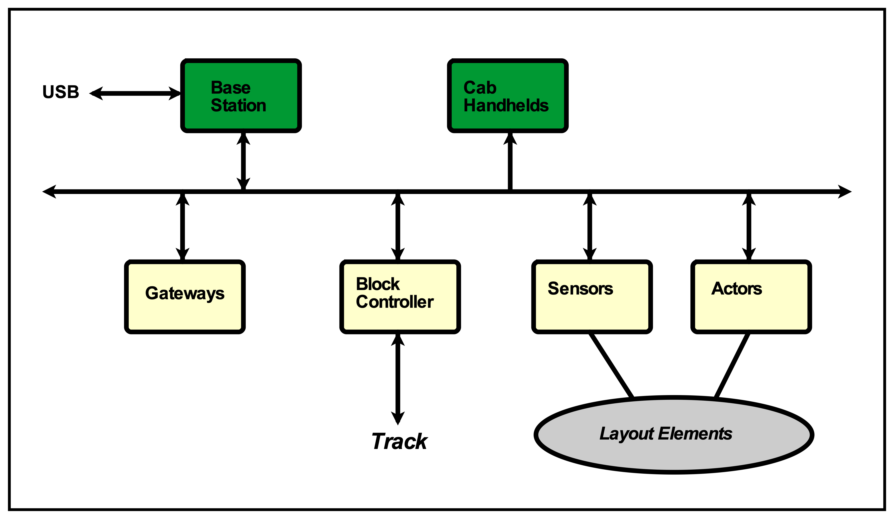

### *Layout Control Bus*

The layout control bus is the backbone of the entire system. The current implementation is using the industry standard CAN bus. All hardware modules connect to this bus and communicate via messages. All messages are broadcasted and received by all other hardware modules on the bus. The classic CAN bus standard limits the message size to 8 bytes and this is therefore the maximum message size chosen for the LCS bus. The CAN bus also has a hardware module limit of about 110 modules for bandwidth reasons. But even for a large layout this should be sufficient. And for really large layouts, another bus system or a system with CAN bus routers, could be envisioned. The software should therefore be designed to manage thousands of connected modules. While the CAN bus technology could be exchanged, the message format and size defined as well as the broadcasting paradigm are fixed in the overall design and will not change.

### *Hardware Module*

Everything connected to the LCS bus is a **hardware module**, which is the physical entity connected to the bus. Typically it is a micro controller with the bus interface and hardware designed for the specific purpose. For example, a CAN bus interface, an AtMega Controller, and digital output drivers could form a hardware module to control railroad turnouts and signals. Base stations, handhelds and gateways are further examples of a hardware module. Hardware modules are expected to be physically located near their use and thus spread throughout the layout. Some hardware modules could be at locations that cannot be reached easily. So all interaction for configuration and operations needs to be possible through the messages on the bus. Nevertheless, putting local controls on a hardware module should not be prohibited.

A hardware module consists of a controller part and a node specific part. The controller part is the **main controller**, which consists of the controller chip, a non-volatile memory to retain any data across power down, a CAN bus interface and interfaces to the node specific hardware. The node specific hardware is called the **node extension**. Conceptually, both parts can be one monolithic implementation on one PCB board, but also two separate units connected by the extension connector. The are defined connectors between the boards. The hardware chapter will go into more detail on the board layouts and hardware design options.

### *Nodes*

A hardware module is the physical implementation. A **node** is the software entity running in the firmware of the hardware module. Nodes are the processing elements for the layout. Conceptually, a hardware module can host more than one node. The current implementation however supports only one node on a given hardware module. A node is uniquely identified through the **node identifier**. There are two ways to set a nodeId. The first is to have central component to assign these numbers on request. The second method sets the number manually. Although a producer consumer scheme would not need a nodeId, there are many operations that are easier to configure when explicitly talking to a particular node. Both nodes and event identifiers are just numbers with no further classification scheme. A configuration system is expected to provide a classification grouping of nodes and event number ranges if needed.

A node also has a **node type**, to identify what the node is capable of. Examples of nodes types are the base station, a booster, a switch module, a signal control module, and so on. While the node number is determined at startup time and can change, the node type is set via the module firmware. As the node type describes what the hardware module can do the type cannot change unless the module changes. Once the node has an assigned node number, configuration tools can configure the node via configuration messages to set the respective node variables.

A node needs to be configured and remember its configuration. For this purpose, each node contains a **node map** that keeps all the information about the node, such as the number of ports, the node unique Id and so on. There is also a small set of user definable attributes to set data in a node map specific to the node. The data is stored in non-volatile memory space and on power up the node map is used to configure the node. If the module is a new module, or a module previously used in another layout, or the firmware version requires a new data layout of the node map, there is a mechanism to assign a new node number and initialize the node map with default values.

### *Ports*

A node has a set of receiving targets, called ports. Ports connect the hardware world to the software world, and are the connection endpoints for events and actions. For example, a turnout digital signal output could be represented to the software as a port on a node. The node registers its interest in the event that target the signal. An event sent to the node and port combination then triggers a callback to the node firmware to handle the incoming events. Although a node can broadcast an event anytime by just sending the corresponding message, the event to send is typically associated with an outbound port for configuration purposes. In addition to the event immediate processing, the event handling can be associated with a timer delay value. On event reception the timer value will delay the event callback invocation or broadcast.

A node has a **port map** that contains one entry for each defined port. **port map entries** describe the configuration attributes and state of the port such as the port type. There is also a small set of user definable attributes to set data in a port map entry specific to the port. These attributes can be used by the firmware programmer to store port specific data items such as a hardware pin or a limit value in the port map.

### *Attributes*

**Node attributes** and **port attributes** are conceptually similar to the CV resources in a DCC decoder. Many decoders, including the DCC subsystem decoders, feature a set of variables that can be queried or set. The LCS layout system implements a slightly different scheme based on items. In contrast to a purely decoder variable scheme an item can also just represent just an action such as setting an output signal. Items are passed parameter data to further qualify the item. Items are just numbers assigned. The range of item numbers is divided into a reserved section for the layout system itself, and a user defined range that allows for a great flexibility to implement the functions on a particular node and port. The meaning of user defined items is entirely up to the firmware programmer. If it is desired to have a variables, a combination of items and attributes can provide the traditional scheme as well. In addition, there are node local variables, called attributes, available to the firmware programmer for storing data items.

### *Events*

The LCS message bus, hardware module, node and ports describe layout and are statically configured. For nodes to interact, **events** and their configuration is necessary. An event is a message that a node will broadcast via the bus. Every other node on this bus will receive the event and if interested act on the event. The sender is the producer, the receiver is the consumer. Many producers can produce the same event, many consumers can act on the same event. The **event Id**, a 16 bit number, is unique across the layout and assigned by a configuration tool during the configuration process. Other than being unique, there is no special meaning, the number is arbitrary. There are in total 65536 events available.

In addition to the event Id, an event message contains the node Id of the sender. While most events will be an ON/OFF event, events can also have additional data. For example an overload event sent by a booster node, could send the actual current consumption value in the event message. A consumer node registers its interest in an event by being configured to react to this event on a specific port. The node maintains an **event map**, which contains one entry for each event id / port id combination. For the eventing system to work, the nodeID is not required. Any port on any node can react to an event, any node can broadcast an event.

To connect producers to consumers, both parties need to be told what to do with a defined event. A producer node outbound port needs to be told what event to send for a given sensor observation. For example, a simple front panel push button needs to be told what event to send when pushed. Likewise, a consumer node inbound port needs to be told what events it is interested in and what the port should do when this event is received. Both meet through the event number used. While an inbound port can be configured to listen to many event Ids, an outbound port will exactly broadcast one eventId.

Any port on any node can react to an event, any node can broadcast an event. Still, addressing a node and port combination explicitly is required for two reasons. The first is of course the configuration of the node and port attributes. Configuration data needs to go directly to the specified node and port. The second reason is for directly accessing a resource on the layout. For example, directly setting a turnout connected to one node. While this could also be implemented with associated an event to send when operating a turnout, it has shown beneficial and easier to configure also directly access such a resource through a dedicated node/port address.

### *DCC Subsystem*

The node, ports and events are the foundation for building a layout system based on the producer / consumer scheme. The scheme will be used heavily for implementing turnout control, signals, signal blocks and so on. In addition, there is the management of the mobile equipment, i.e. locomotives. The DCC subsystem is the other big part of our layout control system. In a sense it is another bus represented by the track sections.

LCS messages for DCC commands are broadcasted from controlling devices. For example, a handheld broadcasts a speed setting DCC command. In a layout there is one base station node which is responsible to produce the DCC signals for the track. The DCC signals are part of the physical LCS bus. While a base station design could directly supply the signal current to the track, larger layouts will typically have one or more boosters. They take the DCC signal from the LCS bus lines and generate the DCC signal current for their track section. All LCS messages for DCC operations are broadcasting messages, all nodes can send them, all nodes can receive them. Handhelds, base station and boosters are thus just nodes on the LCS bus. Only the base station will however generate the DCC signal.

The DCC standard defines mobile and stationary decoders. The DCC signal could also be used to control for example a set of turnouts via a stationary decoder. The LCS DCC  message set contains messages for addressing a stationary decoder. Since the commands for stationary equipment are just DCC commands, they will be transmitted via the track as well and take away bandwidth on the track. A layout will therefore more likely use the LCS bus for implementing the management of stationary equipment. Besides, the producer / consumer model allows for a much greater flexibility when building larger and partially automated layouts.

### *Analog Subsystem*

The layout control system is primarily a digital control system. There are however layout use cases where there are many analog locomotives that would represent a significant investment when converting to DCC or that cannot easily be equipped with a DCC decoder. In a DCC subsystem the decoder is in the locomotive and many locomotives can run therefore on the same track. In an analog system, the locomotive has no capabilities and therefore the track needs to be divided into sections that can be controlled individually. One locomotive per section is the condition. In a sense the decoder becomes part of the track section. The layout control system offers support for building such a track section subsystem. Often the sections are combined into blocks and build the foundation for a block signaling system. Note that the rest of the layout control system is of course digital. What is typically the booster to support a section of track, is the block controller for an analog layout. We will see in the later chapters that booster and block controller are very similar and design a block controller to accommodate both use cases.

### *Configuration*

Before operations the nodes, ports and events need to be configured. Once a node has an assigned valid nodeId, the node configuration is the process of configuring a node global information, the event map information and the finally the port information. The information is backed by non-volatile storage, such that there is a consistent state upon node power up. During operations, these value can of course change, but are always reset to the initial value upon startup.

The primary process of configuration is inventing events numbers and assigning them producers and consumers. The process follows the general "if this then that" principle. On the producer side the configuration process assigns a port to an event, i.e. the push of a button to an event to send. If this button is pushed then send that event. On the consumer side the configuration process is to assign the event to a port. If this event is received then execute that port action.

After the node is up and running with a valid node Id, there are event configuration messages than can be send to the node to set the event mapping table with this information. The event map table is the mapping between the event and the port associated. Events are thus configured by "teaching" the target node what port to inform about an occurring event.

### *Operation*

Besides the basic producer/consumer model with the event messages as communication mechanism, there are several LCS control and info messages used for managing the overall layout with signals turnouts and so on as well as the physical track and the running equipment. In a layout, the track typically consist of one or more sections, each managed by a booster or block controller node. Track sections are monitored for their power consumption to detect short circuits. Back communication channels such as RailCom are handled by the booster node and provide information about the running equipment. Stationary equipment such as turnouts and signals as well as detectors, such as track occupancy detectors or turnout setting detectors are monitored and controlled through LCS messages and the event system. Conceptually any node can send and receive such event, info or control messages. Some nodes, however have a special role.

For example, the key module for layout operations is the **base station**. The base station, a node itself, is primarily responsible for managing the active locomotives on the layout. When a control handheld wants to run a locomotive, a cab session for that locomotive is established by the base station. Within the session, the locomotive speed, direction and functions are controlled through the cab handheld sending the respective messages. The base station is responsible for generating the DCC packets that are sent by the booster or block controller power module to the actual track sections. Booster and block controller module are - you guessed it - node themselves.

Finally, there are LCS nodes that represent cab handhelds to control a locomotive or consists, layout panel connectors, gateways to other layout protocols, sensors and actors to implement for example turnout control, signaling, section occupancy detections and many more. All these components share the common LCS bus and use ports and events to implement the capabilities for operating a layout.

In a layout with many track sections the **block controller** is a special node that will manage a block on the layout. Like all other nodes, a block controller itself is a node that can react to events and is controller and monitored by LCS messages. There will be several chapters devoted to this topic later.

### *Summary*

This chapter introduced the basic concepts of the layout control system described in this book. It follows very few overall guiding principles. Above all, there is the clear separation of what needs to be available for operating the mobile equipments, i.e. locomotives, and the stationary layout elements. Controlling mobile decoders are left to the DCC subsystem, all other communication takes place via the LCS bus, which is the bus to which all of the hardware modules connect. Hardware modules host the nodes. Currently, a hardware module hosts exactly one node. A node can contains one or many ports, which are the endpoints for the event system. There is a set of user allocated attributes available to node and ports. Node, port and attribute data are backed by non-volatile memory, so that a restart will use defined initial values. Nodes and their ports are also directly addressable, which is needed for configuration purposes and the directly addressable components model. Using the producer / consumer paradigm, sensors generate events and interested actors just act on them. The configuration process is simply to assign the same event to the producer node and consumer node / port id when they should work together.

The communication bus should rest on a reliable bus with a sufficient bandwidth. Although the CAN bus is used in the initial implementation, it is just one option and other technologies can be considered. In all cases however, the message format should be available for a variety of bus technologies. Our messages are therefore short, up to eight data bytes. This causes on the one hand some complexity for data items larger than a few bytes on the other hand no messages blocks the bus for a longer period. The bus technology is expected to reliably deliver a message but does not ensure its processing. This must be ensured through a request reply message scheme built on top.


<!--------------------------------------------------------------------------------------------------------->
<!--------------------------------------------------------------------------------------------------------->
<!-- Chapter - Message Formats ---------------------------------------------------------------------------->
<!--------------------------------------------------------------------------------------------------------->
<!--------------------------------------------------------------------------------------------------------->

<div style="page-break-before: always;"></div>

## *Message Formats*

Before diving into the actual design of the software and hardware components, let us first outline the message data formats as they flow on the layout control bus. It is the foundation of the layout control system, so let's have a first brief look at all the messages defined. This chapter will provide the overview on the available messages a give a short introduction to what they do. Later chapters built on it and explain how the messages are used for designing LCS node functions. The layout control system messages can be grouped into several categories.

* General management
* Node and Port management
* Event management
* DCC Track management
* DCC Locomotive Decoder management
* DCC Accessory Decoder management
* RailCom DCC Packet management
* Raw DCC Packet management

All nodes communicate via the layout control bus by broadcasting messages. Every node can send a message, every node receives the message broadcasted. There is no central master. The current implementation is using the CAN bus, which ensures by definition that a message is correctly transmitted. However, it does not guarantee that the receiver actually processed the message. For critical messages a request reply scheme is implemented on top. Also to address possible bus congestion a priority scheme for messages is implemented to ensure that each messages has a chance for being transmitted.

### *LCS Message Format*

A message is a data packet of up to 8 bytes. The first byte represents the operation code. It encodes the length of the entire packet and opcode number. The first 3 bits represent the length of the message, the remaining 5 bits represent the opCode. For a given message length there are 32 possible opcode numbers. The last opcode number in each group, 0x1F, is reserved for possible extensions of the opcode number range. The remaining bytes are the data bytes and there can be zero to seven bytes. The message format is independent of the underlying transport method. If the bus technology would be replaced, the payload would still be the same. For example, an Ethernet gateway could send those messages via the UDP protocol. The messages often contain 16-bit values. They are stored in two bytes, the most significant byte first and labelled "xxx-H" in the message descriptions to come. The message format shown in the tables of this chapter just present the opCode mnemonic. The actual value can be found in the core library include file.

### *General Management*

The general management message group contains commands for dealing with the layout system itself. The reset command (RESET) directs all hardware modules, a node or a port on a node to perform a reset. The entire bus itself can be turned on and off (BUS-ON, BUS-OFF), enabling or suppressing the message flow. Once the bus is off, all nodes wait for the bus to be turned on again. Finally there are messages for pinging a node (PING) and request acknowledgement (ACK/ERR).

| Opcode |Data1|Data2|Data3|Data4|Data5|Data6|Data7|
|:-------|:----|:----|:----|:----|:----|:----|:----|
|RESET|npId-H|npId-L|flags|||||
|BUS-ON||||||||
|BUS-OFF||||||||
|SYS-TIME|arg1|arg2|arg3|arg4||||||
|LCS-INFO|arg1|arg2|arg3|arg4||||||
|PING|nId-H|nId-L||||||
|ACK|nId-H|nId-L||||||
|ERR|nId-H|nId-L|code|arg1|arg2||||
|||||||||


// ??? **note** Do we need a message for a central system time concept ?

// ??? **note** do we need a message for a message that describes the global LCS capabilities ?

// ??? do we need an emergency stop message that every node can just emit ?

| Opcode |Data1|Data2|Data3|Data4|Data5|Data6|Data7|
|:-------|:----|:----|:----|:----|:----|:----|:----|
|||||||||

### *Node and Port Management*

When a hardware module is powered on, the first task is to establish the node Id in order to broadcast and receive messages. The (REQ-NID) and (REP-ID) messages are the messages used to implement the protocol for establishing the nodeId. More on this in the chapter on message protocols. A virgin node has the hardware module specific node type and a node Id of NIL_NODE_ID. All nodes have a unique node UID, expected to be created by the hardware or firmware means. After a node Id is established, the node Id can also be set directly through the (SET-NID) command. This is typically done by a configuration tool.

| Opcode |Data1|Data2|Data3|Data4|Data5|Data6|Data7|
|:-------|:----|:----|:----|:----|:----|:----|:----|
|REQ-NID|nId-H|nId-L|nUID-4|nUID-3|nUID-2|nUID-1|flags|
|REP-NID|nId-H|nId-L|nUID-4|nUID-3|nUID-2|nUID-1|flags|
|SET-NID|nId-H|nId-L|nUID-4|nUID-3|nUID-2|nUID-1|flags|
|NCOL|nId-H|nId-L|nUID-4|nUID-3|nUID-2|nUID-1|||
|||||||||

All nodes monitor the message flow to detect a potential node collision. This could be for example the case when a node from one layout is installed in another layout. When a node detects a collision, it will broadcast the (NCOL) message and enter a halt state. Manual interaction is required. A node can be restarted with the (RES-NODE) command, given that it still reacts to messages on the bus. All ports on the node will also be initialized. In addition a specific port on a node can be initialized. The hardware module replies with an (ACK) message for a successful node Id and completes the node Id allocation process. As the messages hows, node and port ID are combined. LCS can accommodate up to 4095 nodes, each of which can host up to 15 ports. A Node ID 0 is the NIL node. Depending on the context, a port Id of zero refers all ports on the node or just the node itself.

The query node (NODE-GET) and node reply messages (NODE-REP) are available to obtain attribute data from the node or port. The (NODE-SET) allows to set attributes for a node or port for the targeted node. Items are numbers assigned to a data location or an activity. There are reserved items such as getting the number of ports, or setting an LED. In addition, the firmware programmer can also define items with node specific meaning. The firmware programmer defined items are accessible via the (NODE-REQ) and (NODE-REP) messages.

| Opcode |Data1|Data2|Data3|Data4|Data5|Data6|Data7|
|:-------|:----|:----|:----|:----|:----|:----|:----|
|NODE-GET|npId-H|npId-L|item|arg1-H|arg1-L|arg2-H|arg2-L|
|NODE-SET|npId-H|npId-L|item|val1-H|val1-L|val2-H|val2-L|
|NODE-REQ|npId-H|npId-L|item|arg1-H|arg1-L|arg2-H|arg2-L|
|NODE-REP|npId-H|npId-L|item|arg1-H|arg1-L|arg2-H|arg2-L|
|||||||||

Nodes do not react to attribute and user defined request messages when in operations mode. To configure a node, the node needs to be put into configuration mode. The (OPS) and (CFG) commands are used to put a node into configuration mode or operation mode. Not all messages are supported in operations mode and vice versa. For example, to set a new nodeId, the node first needs to be put in configuration mode. During configuration mode, no operational messages are processed.

| Opcode |Data1|Data2|Data3|Data4|Data5|Data6|Data7|
|:-------|:----|:----|:----|:----|:----|:----|:----|
|OPS|npId-H|npId-L||||||
|CFG|npId-H|npId-L|||||||
|||||||||

### *Event Management*

The event management group contains the messages to configure the node event map and messages to broadcast an event and messages to read out event data. The (SET-NODE) with the item value to set and remove an event map entry from the event map is used to manage the event map. An inbound port can register for many events to listen to, an outbound port will have exactly one event to broadcast. Ports and Events are numbered from 1 onward. When configuring, the portId NIL_PORT_ID has a special meaning in that it refers to all portIds on the node. For inbound ports, the event map will store the event / portId combinations. A configuration tool can query the event map by using the (QRY-NODE) command with the appropriate item number. The number of event map entries configured is available through the (NODE-GET) command.

Events are broadcasted by the producer when the assigned situation on the node occurs. There are three event messages. Since the ON and OFF event is a very often used event type, there are two message op codes dedicated to it. The third event type is the general event with an event data field.

|Opcode |Data1|Data2|Data3|Data4|Data5|Data6|Data7|
|:-------|:----|:----|:----|:----|:----|:----|:----|
|EVT-ON|npId-H|npId-L|evId-H|evId-L||||
|EVT-OFF|npId-H|npId-L|evId-H|evId-L||||
|EVT|npId-H|npId-L|evId-H|evId-L|arg-H|arg-L|||
|||||||||

### *DCC Track Management*

Model railroads run on tracks. Imagine that. While on a smaller layout, there is just the track, the track on a larger layout is typically divided into several sections, each controlled by a booster or block controller node. These nodes can accept events to turn on and off a section or send an event for power overload and so on. The track management messages TON and TOF deal with managing the individual track sections or the whole layout. The ESTP message will cause all engines or an individual loco to stop in emergency mode.  Any node can issue these commands.

| Opcode |Data1|Data2|Data3|Data4|Data5|Data6|Data7|
|:-------|:----|:----|:----|:----|:----|:----|:----|
|TON|npId-H|npId-L||||||
|TOF|npId-H|npId-L||||||
|ESTP|sid||||||||
|||||||||

### *DCC Locomotive Decoder Management*

Locomotive management comprises the set of messages that the base station uses to control the running equipment. To control a locomotive, a session needs to be established (REQ-LOC). This command is typically sent by a cab handheld and handled by the base station. The base station allocates a session and replies with the (REP-LOC) message that contains the initial settings for the locomotive speed and direction. (REL-LOC) closes a previously allocated session. The base station answers with the (REP-LOC) message. The data for an existing DCC session can requested with the (QRY-LOC) command. Data about a locomotive in a consist is obtained with the (QRY-LCON) command. In both cases the base station answers with the (REP-LOC) message.

| Opcode |Data1|Data2|Data3|Data4|Data5|Data6|Data7|
|:-------|:----|:----|:----|:----|:----|:----|:----|
|REQ-LOC|adr-H|adr-L|flags|||||
|REP-LOC|sId|adr-H|adr-L|spDir|fn1|fn2|fn3|
|REL-LOC|sId|||||||
|QRY-LOC|sId|||||||
|QRY-LCON|conId|index|||||||
|||||||||

Once the locomotive session is established, the (SET-LSPD), (SET-LMOD), (SET-LFON), (SET-LOF) and (SET-FGRP) are the commands sent by a cab handheld and executed by the base station to control the locomotive speed, direction and functions. (SET-LCON) deals with the locomotive consist management and (KEEP) is sent periodically to indicate that the session is still alive. The locomotive session management is explained in more detail in a later chapter when we talk about the base station.

| Opcode |Data1|Data2|Data3|Data4|Data5|Data6|Data7|
|:-------|:----|:----|:----|:----|:----|:----|:----|
|SET-LSPD|sId|spDir||||||
|SET-LMOD|sId|flags||||||
|SET-LFON|sId|fNum||||||
|SET-LFOF|sId|fNum||||||
|SET_FGRP|sId|fGrp|data|||||
|SET-LCON|sId|conId|flags|||||
|KEEP|sId||||||||
|||||||||

Locomotive decoders contain configuration variables too. They are called CV variables. The base station node supports the decoder CV programming on a dedicated track with the (REQ_CVS), (REP-CVS) and (SET-CVS) messages. (SET-CVM) supports setting a CV while the engine is on the main track. (DCC-ERR) is returned when an invalid operation is detected.

| Opcode |Data1|Data2|Data3|Data4|Data5|Data6|Data7|
|:-------|:----|:----|:----|:----|:----|:----|:----|
|SET-CVM|sId|cv-H|cv-L|mode|val|||
|REQ-CVS|cv-H|cv-L|mode|val||||
|REP-CVS|cv-H|cv-L|val|||||
|SET-CVS|cv-H|cv-L|mode|val|||||
|||||||||

The SET-CVM command allows to write to a decoder CV while the decoder is on the main track. Without the RailCom channel, CVs can be set but there is not way to validate that the operation was successful.

### *DCC Accessory Decoder Management*

Besides locomotives, the DCC standards defines stationary decoders, called accessories. An example is a decoder for setting a turnout or signal. There is a basic and an extended format. The (SET-BACC) and (SET-EACC) command will send the DCC packets for stationary decoders. Similar to the mobile decoders, there are POM / XPOM messages to access the stationary decoder via RailCom capabilities.

| Opcode |Data1|Data2|Data3|Data4|Data5|Data6|Data7|
|:-------|:----|:----|:----|:----|:----|:----|:----|
|SET-BACC|adr-H|adr-L|flags|||||
|SET-EACC|adr-H|adr-L|val|||||
|||||||||

These commands are there for completeness of the DCC control interfaces. There could be devices that are connected via the DCC track that we need to support. However, in a layout control system the setting of turnouts, signals and other accessory devices are more likely handled via the layout control bus messages and not via DCC packets to the track. This way, there is more bandwidth for locomotive decoder DCC packets.

### *RailCom DCC Packet management*

With the introduction of the RailCom communication channel, the decoder can also send data back to a base station. The DCC POM and XPOM packets can now not only write data but also read out decoder data via the RailCom back channel. The following messages allow to send the POM / XPOM DCC packets and get their RailCom based replies.

| Opcode |Data1|Data2|Data3|Data4|Data5|Data6|Data7|
|:-------|:----|:----|:----|:----|:----|:----|:----|
|SET-MPOM|sId|ctrl|arg1|arg2|arg3|arg4||
|REQ-MPOM|sId|ctrl|arg1|arg2|arg3|arg4||
|REP-MPOM|sId|ctrl|arg1|arg2|arg3|arg4||
|SET-APOM|adr-H|adr-L|ctrl|arg1|arg2|arg3|arg4|
|REQ-APOM|adr-H|adr-L|ctrl|arg1|arg2|arg3|arg4|
|REP-APOM|adr-H|adr-L|ctrl|arg1|arg2|arg3|arg4|
|||||||||

The XPOM messages are DCC messages that are larger than what a CAN bus packet can hold. With the introduction of DCC-A such a packet can hold up to 15 bytes. The LCS messages therefore are sent in chunks with a frame sequence number and it is the responsibility of the receiving node to combine the chunks to the larger DCC packet.

### *Raw DCC Packet Management*

The base station allows to send raw DCC packets to the track. The (SEND-DCC3), (SEND-DCC4), (SEND-DCC5) and (SEND-DCC6) are the messages to send these packets. Any node can broadcast such a message, the base station is the target for these messages and will just send them without further checking. So you better put the DCC standard document under your pillow.

| Opcode |Data1|Data2|Data3|Data4|Data5|Data6|Data7|
|:-------|:----|:----|:----|:----|:----|:----|:----|
|SEND-DCC3|arg1|arg2|arg3|||||
|SEND-DCC4|arg1|arg2|arg3|arg4||||
|SEND-DCC5|arg1|arg2|arg3|arg4|arg5|||
|SEND-DCC6|arg1|arg2|arg3|arg4|arg5|arg6|||
|||||||||

The above messages can send a packet with up to six bytes. With the evolving DCC standard, larger messages have been defined. The XPOM DCC messages are a good example. To send such a large DCC packet, it is decomposed into up to four LCS messages. The base station will assemble the DCC packet and then send it. 

| Opcode |Data1|Data2|Data3|Data4|Data5|Data6|Data7|
|:-------|:----|:----|:----|:----|:----|:----|:----|
|SEND-DCCM|ctrl|arg1|arg2|arg3|arg4||||
|||||||||

### *DCC errors and status*

Some DCC commands return an acknowledgment or an error for the outcome of a DCC subsystem request. The (DCC-ACK) and (DCC-ERR) messages are defined for this purpose.

| Opcode |Data1|Data2|Data3|Data4|Data5|Data6|Data7|
|:-------|:----|:----|:----|:----|:----|:----|:----|
|DCC-ACK||||||||
|DCC-ERR|code|arg1|arg2||||||
|||||||||

### *Analog Engines*

The messages defined for the DCC locomotive session management as outlined above are also used for the analog engines. An analog engine will just like its digital counterpart have an allocated locomotive session and the speed/dir command is supported. All other commands will of course not be applicable. The speed/dir command will be sent out on the bus and whoever is in control of the track section where the analog engine is supposed to be, will manage that locomotive. In the following chapters we will answer the question of how exactly multiple analog engines can run on a layout.

### Summary

The layout system is a system of nodes that talk to each other. At the heart are consequently messages. The message format is built upon an 8-byte message format that is suitable for the industry standard CAN bus. Although there are many other standards and communication protocols, the CAN bus is a widely used bus. Since all data is encoded in the message, there is no reason to select another communication media. But right now, it is CAN.

<!--------------------------------------------------------------------------------------------------------->
<!--------------------------------------------------------------------------------------------------------->
<!-- Chapter - Message Protocols  ------------------------------------------------------------------------->
<!--------------------------------------------------------------------------------------------------------->
<!--------------------------------------------------------------------------------------------------------->

<div style="page-break-before: always;"></div>

## *Message Protocols*

This chapter will present how the messages presented in the previous chapter are used to form the protocols for layout configuration and operations. We begin with node management and port management. Next, the event system is described. Finally, the DCC locomotive and track management related commands and messages round up this chapter. The protocols are described as a set of high level messages flow from requestor to receiver and back.

### *Node startup*

Node startup includes all the software steps to initialize local data structures, hardware components and whatever else the hardware module requires. To the layout system, the node needs to be uniquely identified across the layout. A configuration software will use the nodeId to manage the node. The (REQ-NID) and (REP-NID) messages are used to establish the nodeId on node startup. On startup the current nodeId stored in the module non-volatile memory is broadcasted. The (REQ-NID) message also contains the node UID. This unique identifier is created when the node is first initialized and all non-volatile data structures are built. The UID will not change until the node is explicitly re-initialized again.

After sending the (REQ-NID) message the node awaits the reply (REP-NID). The reply typically comes from a base station node or configuration software. In fact, any node can take on the role of assigning nodeIds. But a layout can only have one such node in charge of assigning nodeIds. The reply message contains the UID and the nodeId assigned. For a brand new module, this is will the node nodeId from now on.

|Node|Base Station|
|:---|:-----------|
|**REQ-NID**( nodeId, nodeUID ) --> | |
| |<-- **REP-NID**( nodeId, nodeUID ) or timeout|

The nodeUID plays an important role to detect nodeId conflicts. If there are two modules with the same nodeId, the nodeUID is still different. A requesting node will check the (REP-NID) answer, comparing the nodeUID in the message to its own nodeUID. If the UID matches, the nodeId in the message will be the nodeId to set. Note that it can be the one already used, or a new nodeId. If the UIDs do not match, we have two nodes assigned the same nodeId. Both nodes will enter the collision and await manual resolution.

The above nodeId setup scheme requires the presence of a central node, such a base station, to validate and assign node identifiers. In addition, the nodeId can also be assigned by the firmware programmer and passed to the library setup routine. Once assigned, the node is accessible and the node number can be changed anytime later with the (SET-NID) command. All nodes are always able to detect a nodeId conflict. If two or more nodes have the same nodeId, each node will send an (NCOL) message and go into halted state, repeating the collision message. Manual intervention is required to resolve the conflict through explicitly assigning a new nodeId.

###*Switching between Configuration and Operations mode*

After node startup, a node normally enters the operation state. During configuration, certain commands are available and conversely some operational commands are disabled. A node is put into the respective mode with the (CFG) and (OPS) message command.

|Base Station| Target Node|
|:---|:-----------|
| **CFG/OPS**( nodeId ) -> | node enters the config / operations state  |
|| <- **ACK/ERR**( nodeId ) |

### *Setting a new Node Id*

A configuration tool can also set the node Id to a new value. This can only be done when the node is configuration mode. The following sequence of messages shows how the node is temporarily put into configuration mode for setting a new node Id.

|Base Station|Node|
|:---|:-----------|
| **CFG** ( nodeId ) -> | node enters config mode |
|| <- **ACK/ERR**( nodeId ) |
| **SET-NID**( nodeId, nodeUID ) -->| |
||<-- **ACK/ERR**( nodeId ) |
|**OPS** ( nodeId )-> | node enters operations mode |
|| <- **ACK/ERR**( nodeId ) ||

It is important to note that the assignment of a node Id through a configuration tool will not result in a potential node Id conflict resolution or detection. This is the responsibility of the configuration tool when using this command. The node Id, once assigned on one way or another, is the handle to address the node. There is of course an interest to not change these numbers every time a new hardware module is added to the layout.

### *Node Ping*

Any node can ping any other node. The target node responds with an (ACK) message. If the nodeId is NIL, all nodes are requested to send an acknowledge (ACK). This command can be used to enumerate which nodes are out there. However, the receiver has to be able to handle the flood of (ACK) messages coming in.

|Requesting Node | Target Node |
|:---|:-----------|
|**PING**( nodeId ) ->| |
| |<-- **ACK**( nodeId )|

### *Node and Port Reset*

A node or individual port can be restarted. This command can be used in configuration as well as operations mode. The node or will perform a restart and initialize its state from the non-volatile memory. A port ID of zero will reset the node and all the ports on the node.

|Requesting Node | Target Node |
|:---|:-----------|
|**RES-NODE**( npId, flags ) ->| node or port is restarted  |

### *Node and Port Access*

A node can interact with any other node on the layout. The same is true for the ports on a node. Any port can be directly addressed. Node/port attributes and functions are addressed via items. The are reserved item numbers such as software version, nodeId, canId and configuration flags. Also, node or port attributes have an assigned item number range. Finally, there are reserved item numbers available for the firmware programmer.

The query node message specifies the target node and port attribute to retrieve from there. The reply node message will return the requested data.

|Requesting Node | Target Node |
|:---|:-----------|
|**QRY-NODE**( npId, item ) ->| |
| |<-- **REP-NODE**( npId, item, val1, va12 ) if successful, else **ERR**( nodeId ) |

A node can also modify a node/port attribute at another node. Obviously, not all attributes can be modified. For example, one cannot change the nodeId on the fly or change the software version of the node firmware. The (SET-NODE) command is used to modify the attributes that can be modified for nodes and ports. To indicate success, the target node replies by echoing the command sent.

|Requesting Node | Target Node |
|:---|:-----------|
|**SET-NODE**( npId, item, arg1, arg2 ) ->| |
|| <-- **ACK/ERR**( nodeId ) |
|||

Some item numbers refer to functions rather than attributes. In addition, all firmware programmer defined items are functions.  The (REQ-NODE) message is used to send such a request, the (REP-NODE) is the reply message.

|Requesting Node | Target Node |
|:---|:-----------|
|**REQ-NODE**( npId, item, arg1, arg2 ) ->| |
|| <-- **REP-NODE**( npId, item, val1, va12 ) if successful, else **ERR**( nodeId ) |
|||

### *Layout Event management*

Events play a key role in the layout control system. Nodes fire events and register their interest in events. Configuring events involves a couple of steps. The first step is to allocate a unique event Id. The number does not really matter other than it is unique for the entire layout. A good idea would be to have a scheme that partitions the event ID range, so events can be be tracked and better managed. Consumer configuration is accomplished by adding entries to the event map. The target node needs to be told which port is interested in which event. A port can be interested in many events, an event can be assigned to many ports. Each combination will result in one event map entry. The (SET-NODE) command is used with the respective item number and item data.

|A node( e.g. config tool )|Target Node|
|:-----|:-----|
|**SET-NODE**( nodeId, item, eventId, portId ) --> | allocate an entry in the portMap |
| |<-- **REP-NODE**( nodeId, item, arg1, arg2 ) if successful, else **ERR**( nodeId ) |
|||

An entry can be removed with the remove an event map entry item in the (SET-NODE) message. Specifying a NIL portId in the messages, indicates that all eventId / portId combinations need to be processed. Adding an event with a NIL portID will result in adding the eventID to all ports, and removing an event with a NIL portID will result in removing all eventId / portID combinations with that eventId.

Producers are configured by assigning an eventId to broadcast for this event. The logic when to send is entirely up to the firmware implementation of the producer.

|A node( e.g. config tool )|Target Node|
|:-----|:-----|
|**EVT-ON**( nodeId, item, eventId ) --> | broadcast an "ON" event to all nodes |
|**EVT-OFF**( nodeId, item, eventId ) --> | broadcast an "OFF" event to all nodes |
|**EVT**( nodeId, item, eventId, val ) --> | broadcast an event to all nodes with "val" as argument |
|||

Even a small layout can already feature dozens of events. Event management is therefore best handled by a configuration tool, which will allocate an event number and use the defined LCS messages for setting the event map and port map entry variables on a target node.

### *General LCS Bus Management*

General bus management messages are message such as (RESET), (BUS-ON), (BUS-OFF) and messages for acknowledgement of a request. While any node use the acknowledgement messages (ACK) and (NACK), resetting the system or turning the bus on and off are typically commands issued by the base station node. Here is an example for turning off the message communication. All nodes will enter a wait state for the bus to come up again.

|A node( e.g. config tool )| Operation |
|:-----|:-----|
|**BUS-OFF** -> | all nodes stop using the bus and wait for the (BUS-ON) command |
|**BUS-ON** -> | all nodes start using the bus again |
|||

### *DCC Track Management*

DCC track management messages are commands sent by the base station such as turning the track power on or off. Any node can request such an operation by issuing the (TON) or (TOF) command.

|Any node( e.g. config tool )| Base station |
|:-----|:-----|
|**TON**( npId )| all nodes or an individual node/port for a track section execute the TON command |
|**TOF**( npId )| all nodes or an individual node/port for a track section execute the TOF command |
|||

Another command is the emergency stop (ESTP). It follows the same logic. Any node can issue an emergency stop of all running equipment or an individual locomotive session. The base station, detecting such a request, issues the actual DCC emergency stop command. 

|Any node( e.g. config tool )| Base station |
|:-----|:-----|
|**ESTP**( npId )| all engine or a locomotive session will enter emergency stop mode. |
|||

In addition, LCS nodes that actually manage the track will have a set of node/port attributes for current consumptions, limits, and so on. They are accessed via the node info and control messages.

### *Locomotive Session Management*

Locomotive session management is concerned with running locomotives on the layout. The standard supported is the DCC standard. Locomotive session commands are translated by the base station to DCC commands and send to the tracks. To run locomotives, the base station node and the handheld nodes, or any other nodes issuing these commands,  work together. First a session for the locomotive needs to be established.

|Handheld|Basestation|
|:-----|:-----|
|**REQ-LOC**( locoAddr, flags ) --> ||
|| <-- **REP-LOC**( sessionId, locoAddr, SPDir, fn1, fn2, fn3 ) |
|||

When receiving a REQ-LOC message, the base station will allocate a session for locomotive with the loco DCC address. There are flags to indicate whether this should be a new session to establish or whether to take over an existing session. This way, a handheld can be disconnected and connected again, or another handheld can take over the locomotive or even share the same locomotive. Using the REP-LOC message, the base station will supply the handheld with locomotive address, type, speed, direction and initial function settings. Now, the locomotive is ready to be controlled.

|Handheld|Basestation|
|:-----|:-----|
|**SET-LSPD**( sId, spDir ) --> | send DCC packet to adjust speed and direction |
|**SET-LMOD**( sId, flags ) --> | send DCC packet to set session options |
|**SET-LFON**( sId, fNum ) --> | send DCC packet to set function Id value ON |
|**SET-LFOF**( sId, fNum ) --> | send DCC packet to set function Id value OFF |
|**SET-FGRP**( sId, fGroup, data ) --> | send DCC packet to set the function group data |
|**KEEP**( sId ) -->|base station keeps the session alive|
|||

The base station will receive these commands and generate the respective DCC packets according to the DCC standard. As explained a bit more in the base station chapter, the base station will run through the session list and for each locomotive produce the DCC packets. Periodically, it needs to receive a (KEEP) message for the session in order to keep it alive. The handheld is required to send such a message or any other control message every 4 seconds.

Locomotives can run in consists. A freight train with a couple of locomotive at the front is very typical for American railroading. The base station supports the linking of several locomotives together into a consist, which is then managed just like a single loco session. The (SET-LCON) message allows to configure such consist.

|Handheld|Basestation|
|:-----|:-----|
|**SET-LCON**( sId, conId, flags ) --> | send DCC packet to manage the consist |
|||

To build a consist, a consist session will be allocated. This is the same process as opening a session for a single locomotive using a short locomotive address. Next, each locomotive, previously already represented through a session, is added to the consist session. The flags define whether the locomotive is the head, the tail or in the middle. We also need to specify whether the is forward or backward facing within the consist.

### *Locomotive Configuration Management*

Locomotives need to be configured as well. Modern decoders feature a myriad of options to set. Each decoder has a set of configuration variables, CV, to store information such as loco address, engine characteristics, sound options and so on. The configuration is accomplished either by sending DCC packets on a dedicated programming track or on the main track using with optional RailCom support. The base station will generate the DCC configuration packets for the programming track using the (SET-CVS), (REQ-CVS), (REP-CVS) commands. Each command uses a session Id, the CV Id, the mode and value to get and set. Two methods, accessing a byte or a single bit are supported. The decoder answers trough a fluctuation in the power consumption to give a yes / no answer, according to the DCC standard. The base station has a detector for the answer.

|Handheld or Computer|Basestation|
|:-----|:-----|
|**SET-CVS**( cvId, mode, val ) --> | validate session, send a DCC packet to set the CV value in a decoder on the prog track  |
|**REQ-CVS**( cvId, mode, val ) --> | validate session, send a DCC packet to request the CV value in the the decoder on the prog track |
| receive the data from the base station | <-- **REP-CVS**( cvId, val ) if successful or **DCC-ERR** |
|||

Programming on the main track is accomplished with the SET-CVM message. As there are more than one locomotive on the main track, programming commands can be send, but the answer cannot be received via a change in power consumption. One alternative for programming on the main track ( POM, XPOM ) is to use the RailCom communication standard. The base station and booster or block controller are required to generate a signal cutout period in the DCC bit stream, which can be used by the locomotive decoders to send a datagram answer back. There is a separate section explaining this in more detail.

|Handheld or Computer|Basestation|
|:-----|:-----|
|**SET-CVM**( sId, cvId, mode, val ) --> | validate session, send the DCC packet to set the CV on the main track |
| | <-- if not successful **DCC-ERR** |
|||

### *Configuration Management using RailCom*

Instead of configuring engines and stationary decoders on the programming track, i.e. a separate track or just a cable to the decoder, configuring  these devices on the main track would be a great asset to have. A key prerequisite for this to work is the support of receiving RailCom datagrams from the decoder.

// ??? **note** to be defined... we would need LCS messages to support this capability...

// ??? one message could be the channel one message of a RC detector...

### *DCC Accessory Decoder Management*

The DCC stationary decoders are controlled with the (SET_BACC) and (SET-EACC) commands. A configuration/management tool and handhelds are typically the nodes that would issues these commands to the base station for generating the DCC packets. The following sequence shows how to send a command to the basic decoder.

|Handheld or Computer|Basestation|
|:-----|:-----|
|**SET-BACC**( accAdr, flags ) --> | validate decoder address, send the DCC packet to the accessory decoder |
| | <-- if not successful **DCC-ERR** |
|||

Since the layout control system uses the LCS bus for accessing accessories, these messages are just intended for completeness and perhaps on a small layout they are used for controlling a few stationary decoders. It is also an option to use a two wire cabling to all decoders to mimic a DCC track and send the packets for the decoders. On a larger layout however, the layout control system bus and the node/event scheme would rather be used.

### *Sending DCC packets*

The base station is the hardware module that receives the LCS messages for configuring and running locomotives. The primary task is to produce DCC signals to send out to the track. In addition to controlling locomotives, the base station can also just send out raw DCC packets.

|Handheld or Computer|Basestation|
|:-----|:-----|
|**SEND-DCC3**( arg1, arg2, arg3 ) --> | puts a 3 byte DCC packets on the track, just as is|
|**SEND-DCC4**( arg1, arg2, arg3, arg4 ) --> | puts a 4 byte DCC packets on the track, just as is|
|**SEND-DCC5**( arg1, arg2, arg3, arg4, arg5 ) --> | puts a 5 byte DCC packets on the track, just as is|
|**SEND-DCC6**( arg1, arg2, arg3, arg4, arg5, arg6 ) --> | puts a 6 byte DCC packets on the track, just as is|
|||

Sending a large DCC packet will use the **SEND-DCCM** message. The "ctrl" byte defines which part of the message is send. The base station will assemble the pieces and then issue the DCC packet. 

|Handheld or Computer|Basestation|
|:-----|:-----|
|**SEND_DCCM**| ... |

Again, as the DCC packets are sent out without further checking you better know the packet format by heart. Perhaps put the NMRA DCC specification under your pillow.

### *Summary*

This chapter introduced the general message flow for the layout control bus functions. By now you should have a good idea how the system will work from a message flow between the nodes perspective. Most of the messages dealing with nodes, ports and events follow a request reply scheme using the nodeId as the target address. The DCC messages and protocols implicitly refer to nodes that implement base station and handheld functions. The base station is the only node that actually produces DCC packets to be sent to the track. However, any node implementing DCC functions can act on these messages. All message functions as well as functions to configure and manage nodes, ports and events are available for the firmware programmer through the **LCS Runtime Library**. The next chapter will now concentrate on the library concepts and functions.


<!--------------------------------------------------------------------------------------------------------->
<!--------------------------------------------------------------------------------------------------------->
<!-- Chapter - Runtime Library  --------------------------------------------------------------------------->
<!--------------------------------------------------------------------------------------------------------->
<!--------------------------------------------------------------------------------------------------------->

<div style="page-break-before: always;"></div>

## *The LCS Runtime Library*

Intended for the node firmware programmer, the LCS runtime library is the main interface to the hardware module. The library has methods for node and port configuration, event processing and layout control bus management. Most of the LCS bus management, node, port and port data management is performed transparently to the node firmware programmer. The library also provides convenience methods to send messages to other nodes and allows for a rich set of callback functions to be registered to act on messages and events.

The key design objective for the runtime library is to relief the LCS nodes firmware programmer as much as possible from the details of running a firmware inside a hardware module. Rather than implementing the lower layers for storage and message processing at the firmware level, the runtime library will handle most of this processing transparently to the upper firmware layer. A small set of intuitive to use and easy to remember functions make up the core library. The library communicates back to the firmware layer via a set of defined callbacks. Throughout the next chapters, the library will be presented in considerable detail. Let's start with the high level view.

The following figure depicts the overall structure of a LCS hardware module and node. At the bottom is the hardware module, which contains the communication interfaces, the controller and the node specific functions. The core library offers a set of APIs and callbacks to the node firmware. The firmware programmer can perform functions such as sending a message or accessing a node attribute through the APIs provided. The library in turn communicates with the firmware solely via registered callbacks.

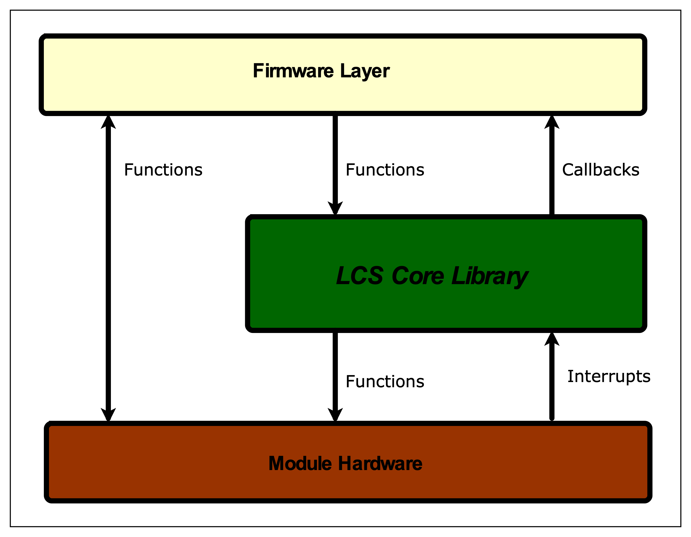

The firmware has of course also direct access to the hardware module capabilities. This is however outside the scope for the LCS core library. As we will see in the coming chapters, the library has a rich set of functions and does also perform many actions resulting form the protocol implementation transparently to the firmware programmer. It is one of the key ideas, that the firmware programmer can concentrate on the module design and not so much on the inner workings of the LCS layout system. Events, ports, nodes and attributes form a higher level foundation for writing LCS control system firmware. Not all of the functionality will of course be used by every node. A base station and a handheld cab control will for example make heavy use of the DCC commands. A turnout device node will use much more of the port and event system. Size and functions of the various library components can be configured for a node.

As a consequence, the library is not exactly a small veneer on top of the hardware and does take its program memory toll on controller storage. However, with the growing capabilities of modern controllers, this should not be a great limitation. The first working versions required an Arduino Atmega1284 alike version as the controller. The current working version is based on the Raspberry Pi Pico controller. More on the individual requirements and selection later.

The appendix contains the detailed description of all library interfaces. If a picture says more than a thousands words, an excerpt of the data declarations from the implementation says even more to the firmware programmer. At the risk of some minor differences on what is shown in the book and the actual firmware, you will find a lot of declarations directly taken from the "LcsRuntimeLib.h" include file.


<!--------------------------------------------------------------------------------------------------------->
<!--------------------------------------------------------------------------------------------------------->
<!-- Chapter - Runtime Library Storage -------------------------------------------------------------------->
<!--------------------------------------------------------------------------------------------------------->
<!--------------------------------------------------------------------------------------------------------->

<div style="page-break-before: always;"></div>

## *Runtime Library Storage*

All data of a LCS node is kept in volatile (MEM) and non-volatile (NVM). The data is structured into several data areas which we call **map**s. A map is a memory area which can be found in MEM and NVM or only in MEM. The key idea is that a map in MEM is initialized from its NVM counterpart at runtime start. Changes in a MEM map can be synced with its NVM map counterpart. There are also maps that do not have a NVM counterpart. These maps are initialized with default values defined for this map. 

Maps do of course have a size. A port map for example will have a number of entries, one for each port. The design choice was whether all map sizes are configurable or rather a fixed size. The current design features a fixed size scheme. There are a few key reasons for this decision. First, there is no configuration need when initializing a node. Second, the total size even when generously sizing the maps is rather small compared to what the hardware can do. A node with 64 node attribute, 15 ports each of which also have 64 port attributes, an event map of 1024 events to manage and space for some miscellaneous date items will be around 8 Kbytes of data. A node with a 32K NVM chip still has plenty of space for user data. A raspberry Pi PICO has 264Kbytes of MEM, so also not an issue. Finally, with a fixed map layout, the NVM data can be copied in one swoop to a memory area on runtime start or reset. 

This chapter presents a high level overview of the available maps and their purpose. Instead of painting many pictures, we will directly take code snippets from the runtime include files to show the data found in each map. Note that all maps are only accessible via runtime library routines.

### *Node Map*

The node map is a node private data structure only accessible to the library firmware. It contains the information about the configured maps, the node options, nodeId, canId and other data such as the library version. When a node is initially created the configuration descriptor contains all the required information to set up a node map. Nodes need volatile and non-volatile storage. Our design implements a mirroring scheme. For the LCS storage there is a memory and an EEPROM version with the same layout. When a node is running the memory version is the storage to use for performance reasons. Also, it can be expected that the memory contents changes very often during operation. EEPROMs do have a limited number of writes in their lifetime and are not that performant for a write cycle. On the other the other hand the data is stored non-volatile. Information that needs to be changed and available across a restart is therefore synced from MEM to NVM. On restart, the NVM data is just copied to MEM. We always start with a defined state. The following figure shows the nodeMap data structure.

```cpp

// ??? the high level structure of the node map...


```

Most of the data items deal with the location and entry sizes of the key maps. In addition, there are the nodeId, the node name, creation options, actual status flags and the set of node map attributes. Finally, the software version of the node version is kept here. For the firmware programmer there are methods to read from and write an item to the node. The library the ***nodeInfo*** and ***nodeControl*** routines offer a controlled access to the node map and other node data for node firmware programmers. They both use an item / value concept. Each routine passed an item Id for the data of interest and the data value. We will see an example later in this chapter. There are also three LCS messages, (QRY-NODE), (REP-NODE) and (SET-NODE) which allow for access from another node. Since these messages come from another node, there is also the option to register a callback for access control checks to node data before the operation is performed.

### *Port Map*

The port map is an array of port map entries. The maximum number of ports are set through the node configuration descriptor values set by the firmware programmer. Changing the number of ports results in a node re-initialization, rebuilding the port map and all non-volatile port map data lost. During runtime there is a non-volatile and a memory version of this map. On node startup or reset, the non volatile port map entries are copied to their memory counterpart.

```cpp
 struct LcsPortMapEntry {

    uint16_t                  flags                         = 0;
    uint8_t                   portType                      = 0;

    uint16_t                  eventNodeId                   = NIL_NODE_ID;
    uint16_t                  eventId                       = NIL_EVENT_ID;
    uint8_t                   eventAction                   = PEA_EVENT_IDLE;
    uint16_t                  eventValue                    = 0;
    uint32_t                  eventTimeStamp                = 0L;
    uint8_t                   eventDelayTime                = 0;

    char                      portName[ MAX_NODE_NAME_SIZE ]          = { 0 };
    uint16_t                  portAttrMap[ MAX_PORT_ATTR_MAP_SIZE ]   = { 0 };
  };
```

The port map entry contains flags that describe the port configuration options and the current operational setting. The event handling fields hold for an inbound port the current event received, the action and value as well as the a possible time delay before invoking the callback. For an outbound port the event fields describe the event to send when the condition for sending that event is encountered. The port map entries are located by just indexing into the port map.

The library ***nodeInfo*** and ***nodeControl*** routines presented before, offer a controlled access to the port map entry. The item and portId passed determine whether a node or port item is requested. Depending on the item, a portId of 0 will refer to all ports on the node or the node itself.

### *Node and Port Items*

The term "item" came up numerous times by now. Nodes and ports features to access their attributes through an **item ID**. An item Id is just a number in the range from 1 to 255. Here is the definition from the library include file. The include file also contains the item numbers for the reserved node info and control items.

```
Node and Port Info:

  0         -> NIL Item.
  1   - 63  -> Reserved items for node and ports
  64  - 127 -> Node or Port Attribute returned from MEM ( normal  case )
  128 - 191 -> Node or Port Attributes first copied from NVM to MEM and then returned
  192 - 255 -> user defined items passed to the registered callback function

Node and Port Control:

  0         -> NIL Item.
  1   - 63  -> Reserved items for node and ports
  64  - 127 -> Attributes written to MEM ( normal  case )
  128 - 191 -> Attributes written to MEM and then copied to NVM
  192 - 255 -> user defined items passed to the registered callback function
```

The first set of item numbers are reserved by the core library itself for node and port items that are standardized across all nodes. The range 64 to 127 and 128 to 191 describes the set of node or port attributes. The two groups actually represent the same attributes. For example the item number 64 refers to the same attributes as item 128 does. The difference is that the latter group also accesses the NVM storage. Items 192 to 255 are completely user defined. Using these numbers will just result in a callback invocation. Note that a callback can do anything. For example, turning a signal on or off could be an item Id of let's say 205 and sending a node control message with the item 205 and the value of 1 in the first argument would result in invoking a callback which implements how to turn the signal on. In short, a node supports variable access, comparable to the CV concept in DCC, and also a function call concept which allows a great flexibility for the firmware programmer.

### *Event Map*

The event map is an array of event map entries, each containing the eventId that node is interested in and the port Id to inform when the event is encountered. The maximum number of event map entries is set through the node configuration descriptor values set by the firmware programmer. When a new node is configured, this value is used to construct the empty event map. Any change of this value results in a node re-initialization of the node, rebuilding the event map with all non-volatile event map data lost.

```cpp
  struct LcsEventMapEntry {

	  uint16_t	eventId;
	  uint16_t 	portId;
  };
```
// ??? explain the SYNC approach for this map...

Like all other maps, the event map is stored in two places. The non-volatile version of the eventMap is an array of event map entries. Whenever a new entry is added, a free entry is used to store this information. The memory version of the event map is a sorted version of all used non-volatile entries. The entries are first sorted by event Id. For entries with the same event Id, the port Id is then sorted in ascending order.

In addition to the search function, event map entries can be added and deleted by specifying the eventId and portId. EventMap entries can also be accessed by their position in the event map. This is necessary to read out the event map for example though a configuration tool. While reading an event map entry from the event map is supported in both node configuration and operation mode, deleting or adding an entry is only supported in node configuration mode.

### *User defined maps*

In addition to the runtime maps for node, ports, and events, the LCS runtime offers a user map for the firmware to use. This storage area is simply an unstructured array and the size depends on the capability of the node hardware NVM storage size. The area is the remaining storage available in the NVM chip array.

// ??? **note** explain the concept and purpose ...


### *Pending Request Map*

The pending request map, is a small map that keeps track of outstanding reply messages to a previously issued message request. If a node sends a request, an entry is added to this map that indicates that a reply from another node is pending. When a reply messages is detected, the firmware callback is only invoked if this reply matches a previous request. This map is a volatile structure, a restart will clear all outstanding requests.

// ??? a timeout concept

### *Driver map*

// for extension boards to be explained later...

### *Summary*

// ??? **note** explain again why this NVM is key and thus important...

To summarize, node storage is organized in maps. 

There is the node map, which is the global place for locating all other areas in the node. The port map contains the data for the configured ports. The event map is the mapping mechanism for events to ports. During node startup, the non-volatile data is copied to a newly allocated memory area. After initialization the node will only work from the memory area. All read and write operations use the memory storage area. When setting a value in any map, the flush option allows for setting its non-volatile counter part as well, so that we have a new initial value for the next restart.

Any change to the structure of the maps, for example changing the number of entries in a map, but also a different size of a data structure caused by a new library version, will result in a rebuilding of the non-volatile memory area with all previous data lost. The layout configuration data, such as the mapping of events to the node and port needs to be stored for example in a computer system so that can be reloaded once a node is re-created. A node has no way of keeping stored data across structural changes to its map layout.


<!--------------------------------------------------------------------------------------------------------->
<!--------------------------------------------------------------------------------------------------------->
<!-- Chapter - LCS Runtime Library Functions -------------------------------------------------------------->
<!--------------------------------------------------------------------------------------------------------->
<!--------------------------------------------------------------------------------------------------------->

<div style="page-break-before: always;"></div>

## *LCS Runtime Library Functions*

The LCS runtime library is the foundation for any module firmware written. The library presents to the firmware programer a set of routines to configure, manage the LCS node and use the LCS functions, such as sending a message. This chapter will present the key functions used. We will look at library initialization, obtaining node information, controlling a node aspect, reacting to an event and sending message to other nodes.
Refer to the appendix for a complete set of available LCS runtime functions.

### *Library initialization*

The LCS runtime is initialized with the **init** routine. After successful runtime initialization, the firmware programmer can perform the registration of the callback functions needed, as well as doing other node specific initialization steps. This also includes the setup of the particular hardware. The subject of hardware setup will be discussed in a later chapter, "controller dependent code". 

While there are many library functions to call, the only way for the library to communicate back to the module firmware when a message is received are the callbacks registered for. Callbacks will be described in the next chapter. A key task therefore is to register call back functions for all events and messages the node is interested. The following code fragment illustrates the basic library initialization.

```cpp
  #include "LcsRuntimeLib.h"

  // code to initialize HW structures ( to be discussed later... )
  CDC::CdcConfigInfo cfg;

  ...

  int rStat;

  // ... create the LCS library object and startup
  rStat = LCS::initRuntime( &cfg );

  // ... register callbacks with lcsLib
  // ... other node specific things to do
  // ... invoke the run method. We never return from it ...
  LcsRuntimeLib::run( );
```

The final library call is a call to **run**. The run function processes the incoming LCS messages, manages the port event handling, reacts to console commands and finally invokes user defined callback functions. Being a loop, it will not return to the caller, but rather invoke the registered callback functions to interact with the node specific code. Before talking about the callback routines, let's have a look at the local functions available to the  programmer to call functions in the core library.

### *Obtaining node information*

Obtaining node or port information is an interface to query basic information about the node or port. A portID or NIL_PORT_ID will refer to the node, any other portID to a specific port on that node. The data is largely coming from the nodeMap and portMap data structures. The LCS library defines a set of data items that can be retrieved. The return result is stored in one or two 16-bit variables and is request item specific. The nodeInfo / nodeControl routines allow for local access, the (QRY-NODE) and (REP_NODE) messages allow for remote access. The following example shows how the number of configured ports is retrieved from the nodeMap.

```cpp
  int 		rStat;
  uint16_t	value;
  
  rStat = LCS::nodeInfo( 0, NPI_PORT_MAP_ENTRIES, &value );
  if ( rStat != ALL_OK ) { ... }
  ```

### *Controlling a node aspect*

Very similar to how we retrieve node data, the nodeControl routine allows for setting node attribute. A node attribute does not necessarily mean that there is a data value associated with the attribute. For example, turning on the "ready" LED is a control item defined for the nodeControl routine. There is a detailed routine description in the appendix that contains the items that are defined. The following example turns on the ready LED on the module hardware.

```cpp
  int 		rStat = ALL_OK;
  uint16_t	value = 1;

  rStat = LCS::nodeControl(  0, NPC_SET_READY_LED, &value );
  if ( rStat != ALL_OK ) { ... }
```

The example shows that a node item is not only used to read or write a data item. It can also be used to execute a defined command, such as turning on an LED. In addition to the predefined node items, there is room for user defined items. In order to use them, a callback function that handles these items needs to be registered. This concept allows for a very flexible scheme how to interact with a node.

### *Controlling extension functions*

// ??? the extension and driver stuff....

### *Reacting to events*


// ??? rather a callback topic ?


### *Sending messages*

Sending a message represent a large part of the available library functions. For each message defined in the protocol, there is a dedicated convenience function call, which will take in the input arguments and assemble the message buffer accordingly. As an example, the following code fragment will broadcast the ON event for event "200".

```cpp
  int 	   rStat      = ALL_OK;
  uint16_t nodeId     = LCS::getNodeId( );
  uint16_t eventId    = 200;

  ...
  
  rStat = sendEventOn( nodeId, eventId );
  if ( rStat != ALL_OK ) { ... }
```

All message sending routines follow the above calling scheme. The data buffer is assembled and out we go. Transparent to the node specific firmware, each message starts with a predefined messages priority. If there is send timeout, the priority will be raised and the message is sent again. If there is a send timeout at the highest priority level, a send error is reported.

### *Summary*

A key part of the runtime library is the setup and manipulation of node and port data. A small comprehensive function set was presented in this chapter. That is all there is to invoke the core library functions. There are a few more functions that will be described in the chapters that deal with their purpose. For the other direction of information flow, i.e. the core library sends information back to the firmware layer, callback functions are used, presented in the following chapter.


<!--------------------------------------------------------------------------------------------------------->
<!--------------------------------------------------------------------------------------------------------->
<!-- Chapter - LCS Library Callback Functions ------------------------------------------------------------->
<!--------------------------------------------------------------------------------------------------------->
<!--------------------------------------------------------------------------------------------------------->

<div style="page-break-before: always;"></div>

## *LCS Library Callback Functions*

One key idea in LCS library message processing is the idea of a callback method to interact with the node firmware. The library inner loop function will continuously check for incoming messages, command line inputs and other periodic work to do. Most of this work is handled by the core library code itself transparently to the node firmware. For example, reading a port attribute from another node is done without any user written firmware interaction. There are other messages though that require the node firmware interaction. As an example, consider an incoming event. We check that there is port interested and if so, invoke a callback with the message and port information to handle the event. The same applies to the console command line handler and the generic loop callback. Since the library has complete control over the processing loop, the callbacks are essential to invoke other periodic work. Depending on the callback type, it is invoked before the action is taken or afterwards. For example, switching from configuration mode to operations mode, will first perform the switch and then invoke the bus management callback routine if there was one defined.

### *General Callbacks*

The general callback routine invokes the registered handler with messages that concern the general working of the node. Those are for example (RESET), (BUS_ON), (BUS_OFF), but also (ACK) and (ERR).

```cpp
// ... the busMgt msg handler routine
void busMgtMsgHandler( uint8_t *msgBuf ) {
	//... handle the cases of busMgt messages
}
...
// during module firmware initialization ...
lcsLib -> registerMsgHandler( busMgtMsgHandler )
```

### *Node and Port Initialization Callback*

Once the library is initialized the various handlers can be registered and all other firmware specific initialization can be done. The last step is the call to the **run** method, which will never return. The very first thing the **run** method does after some internal setup is to invoke the node and port initialization callback if registered. The callbacks are also invoked whenever a node is restarted with the (RES-NODE) command or the (RESET) command for nodes and ports. The following code snippet shows how to register such a callback.

```cpp
// ... the node init msg handler routine
void nodeInitHandler( uint16_t nodeId ) { ... }
...
// during module firmware initialization ...
lcsLib -> registerInitCallback( NIL_PORT_ID, nodeInitHandler )
```

Note that a portID or NIL_PORT_ID will refer to the node. Registering an initialization callback fro a port will just pass a non-nil portId instead. The port init callbacks are invoked in ascending portId order.

### *Node and Port Request Reply Callback*

Node and port attributes can be queried from other nodes. The reply from sending a (QRY-NODE) command to the target node, the (REP-NODE) message, is passed back to the requesting firmware through the node request callback.

```cpp
// ... the node query handler routine
void nodeReqHandler( uint16_t nodeId, uint8_t portId, uint8_t item, uint16_t val1, uint16_t val2 ) { ... }
...
// during module firmware initialization ...
lcsLib -> registerReqRepCallback( nodeReqHandler );
```
The callback returns in addition to the arguments, the node and port ID of the replying node. Again, a portId of NIL_PORT_ID refers to a node item answer.

### *Node and Port Control and Info Callback*

The nodeControl and nodeInfo routines offer callbacks for user defined items. There is a callback function for user defined control items and one for the info items.

```cpp
uint8_t ( *infoHandler ) ( uint8_t portId, uint8_t item, uint16_t *arg1, uint16_t *arg2 ) { ... }
uint8_t ( *ctrlHandler ) ( uint8_t portId, uint8_t item, uint16_t arg1, uint16_t arg2 ) { ... }
...
// during module firmware initialization ...
lcsLib -> registerInfoCallback( portId, infoHandler );
lcsLib -> registerCtrlCallback( portId, ctrlHandler );
```

All the callback routines return a status code. When the item is not found or the arguments are not valid, the callback should return an error code. Any other status than ALL_OK is passed back to the caller as the result of the nodeInfo or nodeControl method.

### *Inbound Event Callback*

The event callback function is invoked when an event was received and the node has an inbound port that is interested in the event. The eventId / portId was previously configured in the event map. A port reaction to the incoming event can be configured to have a delay between the receipt of the event and the actual invocation of the port event callback routine. The callback function is passed the actual event information.

```cpp
// ... the inbound event handler routine
void eventHandler ( uint16_t nodeId, uint8_t portId, uint8_t eAction, uint16_t eId, uint16_t eData ) { ... }
...
// during module firmware initialization ...
lcsLib -> registerPortEventCallback( eventHandler )
```

If there is more than one port configured to react on the the incoming event, they are invoked in ascending order of portIds. The ***eAction*** parameter specifies whether the event is a simple ON/OFF event or a generic event with optional associated data. Note that only ports can react to events.

### *Console Command Line Callback*

The LCS library implements a console command interface. Although not typically used during normal operations, it is very handy for tracking down firmware problems during development. Furthermore, troubleshooting in a layout is a good reason for having such an interface. As we will see in the hardware section, a simple serial data line or even an USB connector can be part of the module hardware. Simply connecting a computer to the node allows to query and control the node. Note, that this is also to some degree possible using the LCS bus messages.

In addition to the serial commands defined for the LCS  core library, the firmware programmer can implement an additional command interface. Any command not recognizes by the library is passed to the registered command line callback. The callback itself returns a status code about the successful command execution. Any status other than ALL-OK will result in an error message listed to the serial command device connected.

```cpp
// ... the command line handler routine
uint8_t commandLineHandler( char *line ) { ... }
...
// during module firmware initialization ...
lcsLib -> registerCommandCallback( commandLineHandler )
```

Why implementing a serial command handler on top of the core library serial commands? The key reason is that a firmware programmer can add additional commands for firmware specific commands. Other than further debug and status commands, nodes such as the base station can implement an entire set of their own commands. A good example is our base station, which implements most of the DCC\+\+ serial command set. Configuring a DCC locomotive decoder can then be handled with decoder programming software such as the JMRI DecoderPro tool, which in turn issues DCC\+\+ commands as one option.

### *DCC Message Callback*

The LCS Library defines a set of DCC related LCS messages to configure and operate the running equipment and track. These messages are typically used by cab handhelds and the base station, which is in charge to produce the DCC signals for the tracks. The DCC message callbacks are used to communicate these messages to the node firmware. The callback routines are all passed the message buffer. The following code snippet shows the declaration for a DCC type callback.

```cpp
// ... the DCC message handler routine for DCC messages
void dccMsgHandler( uint8_t *msg ) { ... }
...
// during module firmware initialization ...
lcsLib -> registerDccMsgCallback( dccTrackMsgHandler )
```

### *RailCom Message Callback*

Railcom is a concept for the DCC decoders to communicate back. DCC is inherently a broadcast protocol just like a radio station. There was no way to communicate back.  Railcom was design to allow for a decoder to send back data when the DCC channel is told to "pause". The chapter on the DCC subsystem will explain DCC and RailCom in greater detail. The Railcom Message callback is the function callback that will be invoked when a RailCom Messages is received.

```cpp
// ... the Railcom message handler routine for DCC messages
void railComMsgHandler( uint8_t *msg ) { ... }
...
// during module firmware initialization ...
lcsLib -> registerRailComMsgCallback( dccTrackMsgHandler )
```

### *LCS Periodic Task Callback*

The LCS core library attempts to handle as much as possible of message and event processing transparent to the user developed firmware. The core library ***run*** method, called last in the firmware setup sequence, will do the internal housekeeping and periodically scan for messages and serial commands. In addition, the run loop will also handle periodic activities outside the library. For example, a booster needs to periodically monitor the current consumption. The library therefore offers a callback registration function for periodic tasks. The example shown below registers a task to be executed every 1000 milliseconds.

```cpp
// ... a periodic task to be registered
void aTask( ) { ... }
...
// during module firmware initialization ...
lcsLib -> registerPeriodicTask( aTask, 1000 );
```

The runtime library ***run*** routine never returns. All interaction between the library is done through previously registered callbacks and calls to the library from within those callbacks. It is also important to realize that a callback runs to completion. In other words, the library inner working is put on hold when executing a callback. For example, no further LCS messages are processed during callback execution. The same is true for the periodic tasks. It also means that one cannot rely on exact timing. Specifying for example a 1000 milliseconds time interval, could mean that the task is invoked later because of other tasks running for a longer period. A periodic task would however not run earlier than the specific interval. In summary, callback routines should therefore be short, quick and mist of all non-blocking.

Putting the library inner working on hold is however not true for functions that react on hardware interrupts. If there are interrupt routines for let's say a hardware timer, they will of course continue to take place. As we will see in the DCC track signal generation part of the base station, the interrupt driven signal generation is not impacted. Nevertheless, a firmware programmer needs to be aware that the order of callback invocation is fixed and that a callback runs to completion.

### *Summary*

LCS callbacks are a fundamental concept in the core library. A firmware designer will write code that uses the core library functions to access the lower layers and callback functions that are invoked by the library to communicate back. Well, that is all there is a the core layer. Other than functions and callbacks, how can you access the library ? Wouldn't is be nice to have a simple interface to access the node data, set some options and simply test new hardware ? That is the subject of the next chapter.


<!--------------------------------------------------------------------------------------------------------->
<!--------------------------------------------------------------------------------------------------------->
<!-- Chapter - Core Library Command Interface ------------------------------------------------------------->
<!--------------------------------------------------------------------------------------------------------->
<!--------------------------------------------------------------------------------------------------------->

<div style="page-break-before: always;"></div>

## *Core Library Command Interface*

// ??? **note** explain the general concept ...
// ??? **note** only "!" results in a callback ?


The primary communication method of the layout control system are LCS messages sent via the bus. In addition, each module that offers an USB connector or the serial I/O connector, implements also the serial command console interface. The interface is intended for testing and tracing purposes. LCS console commands are entered through the hardware module serial interface. A command line is surrounded by the "<" and ">" character and consist of the command and optional arguments.

Perhaps the most important command is the help command, which lists all available command and  their basic syntax.

```
<!?>
<#?>
```

In order to distinguish the LCS commands from other user implemented command line interfaces, the LCS library command line handler expects a "!"  or a "#" as the first character, followed by the command character.

```
<! lcs-command-char [ arguments ] >
<# lcs-command-char [ arguments ] >
```

Anything that does not start with the "!" or "#" will be passed to the registered command call back function, if there is one registered. The following summary shows the available LCS serial commands. The appendix contains a detailed description of of the commands implemented by the LCS library.

### *Configuration Mode Commands*

The configuration mode commands will place a node into either operations or configuration mode.

|Command | Arguments | Operation |
|:----|:-----|:-----|
|!c | | enter node configuration mode |
|!o | | enter node operations mode |

### *Event Commands*

Event commands work with the event map. They add and remove an event, search the map for an event/port pair, or locally send an event to the node itself to test the event handling and so on.

|Command | Arguments | Operation |
|:----|:-----|:-----|
|!a | eventId&nbsp; \[portId\] | add an event to the eventMap. If the portId is omitted, all eventMap entries with a matching eventId will be removed.  |
|!r | eventId&nbsp;\[portId\]| remove an event the eventMap. If the portId is omitted, all eventMap entries with a matching eventId will be removed. |
|!f | eventId&nbsp; \[ portId \] | search an event in the eventMap. |
|!e | mode&nbsp;nodeId&nbsp;eventId&nbsp;\[arg\] | simulate sending an event ( mode: 0 - ON, 1 - OFF, 2 - EVT ) |

### *Node Map and Attributes Commands*

The node map and attribute map will examine and modify these maps.

|Command | Arguments | Operation |
|:----|:-----|:-----|
|!n| item \[arg1\[arg2\]\]| lists a node or port map item.|
|!N| item \[arg1\[arg2\]\]| sets a node or port map item.|
|!v | attrId \[mode\] | list a global attribute. |
|!V | attrId mode val | sets a a global attribute.|

### *Send a raw Message*

For testing the message send mechanism, a command is available to send a raw data packet via the LCS bus.

|Command | Arguments | Operation |
|:----|:-----|:-----|
|!B | byte1 [ byte2 .. byte8 ] | send a raw LCS message |

### *List node status*

The "s" command will list a great detail on the node data. When debugging a node problem, this is perhaps the most useful command to see what is store locally.

|Command | Arguments | Operation |
|:----|:-----|:-----|
|!s | \[level\] | list status at detail level, default is summary. ( 1 - ConfigDesc, 2 - NodeMap, 3 - PortMap, 4 - EventMap, 6 - NVM Area, 7 - MEM Area ) |

### *Driver commands*


|Command | Arguments | Operation |
|:----|:-----|:-----|
||||

What about the "#" commands? Well, they are used issue commands to the hardware drivers. We have not talked about them so far. This topic is presented when we know more about how the hardware is structured. Stay tuned.

### *Batch mode*

// ??? **note** "<...>" will be executed as long as there are commands available in the input stream. This way we also can feed in batch like input... such as board configuration ...

### *LCS message text format*

Just like the LCS core library accepts simple ASCII command strings, the LCS messages can also be transmitted as an ASCII text line. This is very useful for building communication gateways that transmit the message via another medium, such as an ethernet channel. There is a simple scheme for the ASCII representation of the message:

```
<$ data-byte-1 ... data-byte-n>
```
The message is enclosed in the "<" and ">" delimiters and the first character is the "$" sign. Up to 8 hexadecimal values written as "0xdd" follow, where "d" is a hexadecimal digit.

```cpp
int lcsMsgToStr( char *msgStr, uint8_t *dataBuf, uint8_t dataBufLen );

int strToLcsMsg( uint8_t *dataBuf, uint8_t dataBufLen, char *msgStr );
```

( **Note**: to be implemented. Perhaps to simple library routines to create an ASCII version of a LCS message and convert an ASCII string to an LCS message. )

### *Summary*

The command line interface provides a way to interact with a node at the command line level. This is very useful for initial testing new hardware and software debugging. All that is needed is a USB interface and a computer. As we will see in the main controller chapter, a USB or serial interface is also necessary for downloading new firmware to the boards. Besides that, this interface is normally not used during regular operations.


<!--------------------------------------------------------------------------------------------------------->
<!--------------------------------------------------------------------------------------------------------->
<!-- Chapter - LCS Core Library Usage Example ------------------------------------------------------------->
<!--------------------------------------------------------------------------------------------------------->
<!--------------------------------------------------------------------------------------------------------->

<div style="page-break-before: always;"></div>

## *LCS Core Library Usage Example*

The previous sections covered a lot of grounds and discussed messages format and flow as well as the core library interactions. Time to put all of this into a small but complete example. Consider a node that just has one button to operate a signal and another node that implements that signal. All this node would do is to send an ON event whenever the button is pushed. During layout configuration the eventId 200 was defined to represent the particular button push event. The nodeId of 100 was assigned to the button hardware module, the node assigned to the signal node is 110. To keep the example short, the button hardware setup and error checking is omitted.

### *Sending Node*

The following little program will read a button input and when pressed, broadcast an event. We assume a main controller hardware and a button connected to one of the digital inputs. Again, the hardware chapters will go on greater detail on the hardware layers. Right now, we just look at the software.

```cpp
#include "LcsCdcLib.h"
#include "LcsCoreLib.h"

const uint16_t  eventId = 200;

void setupButtonHw( ) { ... }  // set up the button ...
bool readButton( ) { ... }     // read the button state ...

void readButtonTask( ) {

   int rStat = ALL_OK;
   
   if ( readButton( )) {
           rStat = sendEventOn( getNodeId( ), eventId );
           if ( rStat != ALL_OK ) { ... }
   }
}

void main( ) {

    LcsConfigDesc   cDesc = LCS::getCoreLibConfigDescDefaults( );
    uint8_t         rStat;

    cDesc.nodeId   = 100;
    cDesc.options  = NF_SKIP_NODE_ID_CONFIG;

    rStat = initRuntime( );
    if ( rStat != ALL_OK ) { ... }

    rStat = LCS::registerPeriodicTask( readButtonTask );
    if ( rStat != ALL_OK ) { ... }

	setupButtonHw( );
	run( );
}
```

### *Receiving Node*

Every time the button is pushed, the above code will broadcast an ON event with the eventId 200. The producer node did its work, let's look at the consumer code. Again, the code is a bit shortened and just shows the principle. We expect that the node was configured with nodeId 110 and to react to the eventId 200 on portId 1.

```cpp
#include "LcsCdcLib.h"
#include "LcsCoreLib.h"

// code to initialize HW structures ( to be discussed later... )
CDC::CdcConfigInfo cfg;
...

LcsLib    *lcsLib;
uint8_t   portId  = 1;

void setupSignalHw( ) { ... }         // set up the signal HW ...
void setSignal( bool arg ) { ... }    // set the signal state ...

void eventCallback ( uint16_t nodeId, uint8_t portId, uint8_t eAction, uint16_t eId, uint16_t eData ) {

     if ( eAction == PEA_EVENT_ON ) setSignal( true );
     else if ( eAction == PEA_EVENT_OFF ) setSignal( false );
}

void setup( ) {

    LcsConfigDesc   cDesc = LcsCoreLib::getCoreLibConfigDescDefaults( );
	uint8_t         rStat;

    cDesc.nodeId   = 110;
    cDesc.options  = NF_SKIP_NODE_ID_CONFIG;

    rStat = LcsCoreLib::init( &cDesc, &lcsLib );
    if ( rStat != ALL_OK ) { ... }

    rStat = lcsLib.registerPortEventCallback( eventHandler );
    if ( rStat != ALL_OK ) { ... }

    setupSignalHw( );
    lcsLib -> run( );
}

// Arduino loop, not used, never reached...
void loop( ) { }
```

### *Summary*

OK, this was a really simple example. The example just illustrated how the producer firmware sets up the node and for the button being pushed and then send an event. The consumer firmware showed how the event callback is invoked for the desired event. Producing and receiving events is at the heart of the entire Layout Control System. That is all there is for most of the operations in a layout. An event broadcasted results in all interested parties handling it. Now that we have a good idea how the core library and the general concept work, there are some more subsystems to understand before we actually build components. Next stop: the DCC subsystem.


<!--------------------------------------------------------------------------------------------------------->
<!--------------------------------------------------------------------------------------------------------->
<!-- Chapter - DCC Subsystem ------------------------------------------------------------------------------>
<!--------------------------------------------------------------------------------------------------------->
<!--------------------------------------------------------------------------------------------------------->

<div style="page-break-before: always;"></div>

## *The DCC Subsystem*

The LCS core library builds the software foundation for implementing the layout control software. So far we have discussed the general working, node and port functions and callbacks. One part that was only touched upon briefly so far is the digital command control (DCC) subsystem. A significant part of the LCS messages deal with the control of running equipment decoder, stationary decoders and the track itself.

This chapter now dives a little deeper into the DCC subsystem. At the heart of this subsystem is the base station node that is in charge for of managing locomotives and tracks. It receives LCS messages from devices such as a cab throttle and translates these commands into a series of DCC packets. The packets are the basis for the DCC track power modules to actually produce the electrical signals on the track. The power module is either a part of the base station or a separate booster. Base station, boosters and throttles are just nodes making use of the DCC commands in the LCS message set. They too can implement reacting to events and send themselves events. First we will look at a base station and what it takes to manage a locomotive session and to generate the DCC packets for mobile and stationary decoders. Next, we will look into how a DCC packet actually gets out on the track.

### *Locomotive session management*

Digital locomotives are equipped with a mobile decoder. The decoder will analyze the DCC packets on the track and if addressed perform the desired function. For each active locomotive the base station first establishes a locomotive session. Across the layout, a locomotive is uniquely identified by its **cabId**. In DCC terms this is the address of the locomotive. The DCC standard defines an address range that all decoders, mobile and stationary, share. Once a session is established for the cabId, the base station accepts LCS DCC commands, such as setting the speed, direction or a function, and produce the corresponding DCC packet. We will see later what happens to the packet.

A base station typically works with two DCC tracks. There is the **main track**, which consist of all the track sections of the layout. Commands such as setting a locomotive speed and direction, refer to this track. In addition, there is a **service track** which is used to configure an individual locomotive. This track is electrically separated from the main track. However, when it comes to packet transmission, the two tracks are very similar. For the base station functionality there are thus two key functional components. The first is the locomotive session management, the second is the programming of a locomotive mobile decoder. The programming track commands do not need a cabId, i.e. address, as there should only be one locomotive on this track. This has to do with the way a decoder replies the base station and will be discussed when we talk about decoder programming.

### *Stationary Decoders*

While mobile decoders can be found in a locomotive, a stationary decoder can be found somewhere on the layout. For example, a stationary decoder that is close to a set of turnouts. It is connected to the main track and just like its mobile cousin decodes the DCC packets. Stationary decoders, called accessories in the NMRA standard, are assigned to a part of the address range and react to their configured address. The base station accepts LCS commands for such a decoder and generates the DCC packets for it.

As said before, the trend is to use a layout control system with a dedicated bus for the layout components. The key idea is to offload the track where the engines run from the packets for the accessories. Another approach is to have a dedicated wire to all accessory decoders and send the DCC packets on this. In a sense another track without locomotives. Our layout control system will support generating the stationary decoders packets and send them via the main track.  But the feature is only implemented for completeness. Maybe there is still one old decoders that is put to use this way. Our layout will be controlled by the LCS bus.

### *DCC Packet generation*

The key task of the locomotive session management is to generate the DCC packets for running and configuring mobile and stationary decoders. There are also packets, such as RESET or IDLE, that concern all decoders on the track. The DCC packets are described officially in the NMRA specifications. The *RailCommunity* specification documents ( RCN-xxx) also have an excellent description of the packets layout and their interpretation. Each bit is either a zero or a one. A "one" bit has a period of 116 microseconds, a zero bit a period of 232 microseconds. The exact timings are listed on the DCC standard, for now, this is a good enough description. The appendix contains links to their web pages for diving into all the details of the DCC packet format and protocol.

The base station part that produces DCC packets is not concerned with how these packets are actually transmitted to the locomotive. This is the task of the DCC track management component, which will be presented shortly. In general, a DCC packet is a stream of bits consisting of the preamble, a decoder address and the command bytes followed by a checksum byte. The preamble is to sync a decoder with the upcoming data stream. The address tells which decoder is address and the command bytes actually tell what needs to be done. Finally, the checksum makes sure that there was no error in transmitting the packet. The following figure shows a simple packet.

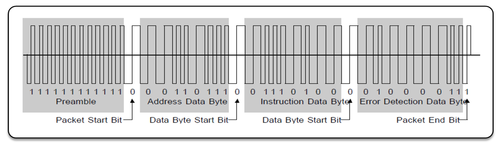

The high level LCS DCC commands are translated by the base station into the corresponding DCC packets. There are two modes of transmission. With the first mode, any incoming command is translated and sent out immediately with an optional repeat count. Consider a locomotive speed stop command. This has of course top priority. The second mode of transmission is a one time fixed sequence of DCC packets for a high level LCS command, such as it is used for programming a decoder.

When no command is pending, the base station will loop through all active session entries and send packets for refreshing the previously sent commands. For example, after sending a speed/direction command, this command will be repeated periodically, until a new command is issued for this locomotive session. While looping through the session table, only a part of the necessary refresh packets are generated to make sure that all engines get a fair share of the track bandwidth in time. The complete refresh of speed/direction and function keys are spread over a couple of loop iterations. The DCC standard makes recommendations what data to send out how often or periodically. Time to discuss how the DCC packets actually get to the track.

### *Sending a DCC packet*

The DCC track management software component does not store any DCC packets other than the active packet that is currently being transmitted and the pending next packet. If it is busy with sending a packet and there is already a pending packet queued, the packet loading routine in the locomotive session management component is waiting until the pending packet becomes the current packet and then the next packet is queued. There is one more scenario to address. Suppose there is no packet currently sent from the locomotive management and thus there is no packet to send to the track. In this case, we cannot just stop sending packets, as the locomotives draw their track power from the track signal. DCC track management signal generation then just "invents" a packet to send out. This is is the DCC IDLE packet for the main track and the DCC RESET packet for the programming track.

### *DCC Track Signal Generation*

The primary task of a DCC track signal generator is to receive the DCC packets generated by the base station producing the hardware signals for the packet bits on the track. The other task is to monitor the power consumption and the optional RailCom channel communication. DCC signals are square wave signals with a defined duty cycle period. A duty cycle of 58 microseconds represents a "DCC one", a duty cycle of 116 microseconds a "DCC zero" bit. This signal is sent to the track by reversing the polarity of the two tracks lanes with the respective timing. Typically, a H-Bridge such as found in motor drivers will perform this task. If the H-Bridge is enabled, sending a "DCC One" will mean to set the digital input signals for the H-Bridge to enable the "+" direction, and then reverse the digital signals for the "-" direction. The H-Bridge hardware essentially reverses the track polarity accordingly to digital series and ones. The DCC packet is broken down, bit by bit and the digital signal is produced.  That's it, we have a nice signal on the track. How exactly the base station does the digital signal output generation is discussed in more detail in the base station chapter.

### *Power consumption monitoring*

DCC track management is also responsible for continuously monitoring the track power consumption. Considering that boosters can emit several Amps a short circuit for a longer time will certainly damage track and running equipment. It is therefore paramount to monitor the actual current consumption very closely. Monitoring track power consumption can be done by measuring the voltage drop over a shunt resistor in serial with the H-Bridge. The controller analog input will periodically read the value and process the incoming data. From a software perspective there are a couple of ways when to measure the voltage and how to process it. One way is to measure at defined spots in the bitstream.

During the signal generation, the track power current consumption will be measured at defined spots in the bit stream. A zero bit in a packet is a good place. The hardware just need to make sure that the measurement completes during the 116us half cycle of the zero bit. But certainly, there are other ways of measuring. When exceeding the configured consumption limit, it is stored in a node variable, DCC track management will broadcast a power overload event and shut down the track. After a configured time a restart is attempted. If the restarting fails for several times, the track is powered down permanently and manual intervention is required.

In addition, care needs to be taken to report a power consumption value that reflects the consumption over a period of time. Most locomotive decoder use a PWM ( pulse width modulation ) approach to drive the motor in the engine. Depending on when the current consumption measurement takes place a high level value or a zero value is returned. This does of course not reflect the actual power consumption. Therefore, several values sampled need to be used to build the "root mean square" value to indicate the actual power consumption.

### *Decoder programming support*

There it is. A new locomotive unpacked, sitting on the programming track. At a minimum it needs to be told what its locomotive address will be on our layout. This task is accomplished by writing values to the decoder CV variables. A short locomotive address for example is a writing of this address to CV 1.

DCC is a broadcasting protocol. Just like a radio station, you can send but not receive. In order to communicate back the decoder raises its consumption power for specific value and time period to indicate an OK. DCC track management needs to be able to detect this consumption power fluctuation on the programming track. The detection is very similar to the previously discussed power consumption monitoring except that is done in two steps. Before accessing a CV variable, the current decoder power consumption is measured to establish a base line. This base line is then compared with the actual power consumption after the CV access. A fluctuation for the value and time specified by the DCC standard is considered a positive answer.

Reading all CV variables from a sophisticated decoder can easily take several minutes this way. Furthermore this communication will not work on the main track, as there are many locomotives running, making it impossible to detect the raise in power consumption of a single locomotive. There had to be a better way and there is. And there is. It is RailCom.

### *RailCom support*

RailCom was invented to address the problem of effective back communication on the programming track and also on the main track. DCC track management needs to implemented the basic mechanism for this kind of communication. As the DCC is a broadcasting protocol, no other transmission is possible while it is broadcasting. The key idea of RailCom is to briefly turn off the DCC communication and use this moment of quiescence to transmit back data from the decoder. The period of short circuiting the DCC track is called the cutout period. In addition to to generating the DCC zeroes and ones on the track, DCC track management is also implementing the cutout support.

The following figure depicts the overall signal timing for RailCom support. All the details can be found in the NMRA and RailCommunity standard document including a hardware reference implementation for a RailCom decoder and detector. After the last bit of a packet and during the first bits of the DCC packet preamble, the track signal is turned off, the track is short circuited. The decoder can now send out data to the track and a signal detector can receive that data. The signal is a simple serial signal with a baud rate of 250 Kbits. The following figure shows the overall DCC and RailCom signal timing.

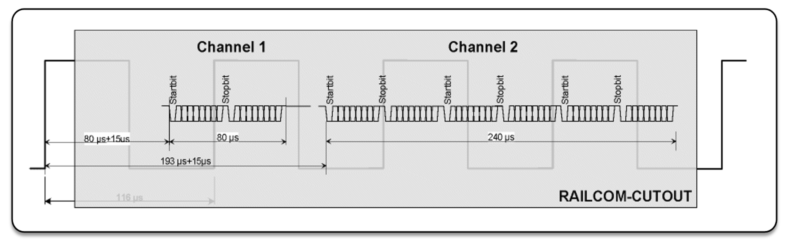

The NMRA and RailCommunity standards describe the data format used when sending the RailCom data. There are two channels defined which in total send a maximum 8 bytes during the cutout period. Channel one takes up two bytes, channel two takes up four bytes. To ensure data transmission integrity, the bytes itself are encoded as values with four bits one and four bits zero. This leaves 64 useful values that the byte contains. All else is an invalid data byte. Put together, there are up to 48 bits of data in a RailCom message.

The individual messages available in channel one and two are called datagram. For channel one, a datagram is 12bits, i.e. the six bits encoded in the two raw data bytes, for channel two there are in total 36 bits. Each datagram tarts with a four bit identifier followed by the payload. A decoder is required to transmit its address every time it is addressed on channel one. Decoders will send data on channel two only of explicitly requested. This leaves channel one with a bit of chaos more than one decoder transmits. There are options to tell the decoder to stop sending its ID after an initial couple of times.

Channel two is only used when the decoder is explicitly addressed via an POM or XPOM DCC packet. Still, the base station needs to ensure that multiple requests form different encoders are transmitted one at a time and there is enough tie for the addressed decoder to answer. Als, the decoder needs to be addressed at least twice to complete a data request via RailCom. The first DCC packet tells what to get, the second DCC packet gives the controller a chance to put the RailCom reply in the next cutout packet. Finally, the DCC-A ( RCN218 ) standard uses the RailCom infrastructure for automatic locomotive registration and fast access to the information in the decoder. For this purpose, channel one and two are combined to a 48bits payload data. More on these topics in the base station chapter.

### *DCC Track sections*

A base station may have a powerful main track and a less powerful programming track. For smaller layouts this is a typical scenario. In fact, the DCC standard requires for the programming track to limit the maximum current to 100mA after initialization to avoid any decoder damage from misconfiguration when testing a new hardware. Larger layouts however are typically divided into several sections each of which is controlled by a DCC booster. This has the key benefit that a short circuit will only affect a track section. A DCC booster can also be equipped with a RailCom detector to implement for example locomotive detection on a per section basis.

To the DCC track management in a base station a booster managing a track section is largely transparent. All track management is concerned with is that the DCC signals are generated. A base station for a larger layout could just have two H-Bridges with a low current rating. One would produce the DCC signal for the main track, the other for the programming track. The programming track output is directly connected to the programming track. The main track output of the base station however is just a signal line that is then fed via the LCS bus data lines into the booster. All track sections will receive the same DCC signal. All boosters are required to be wired with the same track polarity.

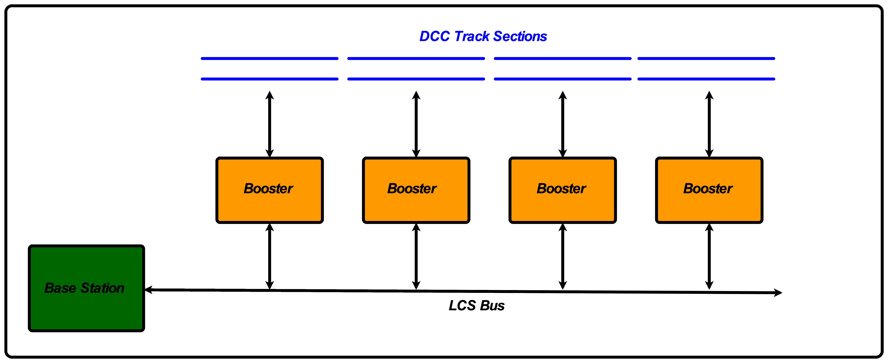

All boosters will measure the power consumption continuously and in the case of exceeding the limits, send an event that the base station is interested in. Boosters are just LCS nodes like anything else. Port variables and events are the mechanism of communication. The actual implementation of a booster with variables and events are described in the hardware module chapter on boosters.

There is one more thing to take care of. If a layout consists of more than one track section there is the situation that the two boosters are not in close sync with respect to polarity and signal generation timing. Again, it is first of all very important that all boosters have a common polarity wiring. If not, short circuits caused by running equipment crossing from one section to the other are likely to happen. If RailCom is enabled, the cutout period acts as a short circuit of one section as well. If one booster section is in cutout mode and the adjacent booster not yet, crossing rolling equipment would effectively short circuit the active booster. To avoid this problem, boosters need not only be in close sync, the also should feature a kind of "security gap" period before starting the cutout period. In this period the booster is put into disconnected mode. This topic is also discussed a bit more in the booster hardware part.

### *A short Glimpse at Software Implementation*

The DCC base station plays the key role in the DCC subsystem. In addition to manage the locomotive sessions and generating the necessary DCC packets, it is also responsible to manage the two tracks MAIN and PROG. Built on top of the LCS library, the base station will have two key software components, one for session management and one for track management. The session management part is rather straightforward, a table of active locomotive sessions that are processed periodically. The track management part is by nature very close to the hardware. Two interlinked state machines, one for track signal generation and one for track power management build the core of tack management. The actual implementation of the two key parts of the base station module is described in more detail in the base station chapter.

### *Summary*

This chapter gave a high level overview on the DCC subsystem. The base station and booster firmware implement the DCC decoder management and track signal generation. Locomotive session management is concerned with managing the running equipment. The key concept is the session, which contains all data needed to control a locomotive on the track. DCC Packets for all active locomotives are generated and sent to the track management component and thereafter periodically refreshed. Programming a locomotive decoder sends a DCC packet sequence which the decoder addressed interprets. There are two tracks, the main track and the programming track. While they are a different in what they are used for and what hardware capacities they need, both will just as their key function putting out the packets generated by the locomotive session management software.

DCC track management is responsible for the track signal generation and track power management. It takes the DCC packets and sends them out bit by bit. First the preamble and optional cutout period then each data byte of the packet. The track consumption power is monitored for the main tack and also used for the programming track decoder acknowledge power consumption fluctuation. Exceeding the configured power consumption limits will result an a shutdown of the signal followed by a number of restarts. The DCC signals produced by the based station are ready to be used and can directly be fed to a track. However, in larger layouts, there will track sections with a DCC boosters for each section. Base station and boosters are, you guessed it, just nodes on the LCS Bus.


<!--------------------------------------------------------------------------------------------------------->
<!--------------------------------------------------------------------------------------------------------->
<!-- Chapter - The Analog SubSystem  ---------------------------------------------------------------------->
<!--------------------------------------------------------------------------------------------------------->
<!--------------------------------------------------------------------------------------------------------->

<div style="page-break-before: always;"></div>

## *The Analog Subsystem*

Analog? Yes, there is analog. Although the Layout Control System is a digital system with locomotives controlled via DCC, there are cases where implementing a layout based on controlling all rolling stock via DCC would mean to equip all your analog running engines with DCC decoders. Besides that it represents quite a considerable cost and converting some older locomotives is a real project in itself. Also, there are model railroad clubs with literally hundreds of locomotives. These layouts are analog and you will find miles of cables to a central control station. Converting all of the existing infrastructure in one swoop represents a considerable cost.

This chapter presents an overview for a subsystem managing analog locomotives. We will only focus on analog running equipment. Devices such as signals, turnouts and other stationary equipment is managed with the LCS node, port, event system, i.e. digital. This chapter will introduce extensions required to manage an analog and also a potentially hybrid layout.

### *Requirements*

The first major difference to a DCC based system is that for a given track section there can only be one locomotive or consist. In contrast to a digital signal with a permanent flow of the square wave signal, an analog system will use a pulse width modulated (PWM) approach. A wider pulse width will make the engines run faster, a smaller pulse width makes it run slower. The signal contains no information about the actual engine and just delivers power corresponding to speed desired to the track section.

To still run several engines, the layout needs to be divided into several sections or blocks. Just as we divided a layout into sections with separate DCC boosters, analog layouts will control sections with a separate power module. It is not necessary to have a power module for each section, but the more sections and power modules the more analog engines could run simultaneously. Built on top, an analog layout often has a concept of blocks to run trains automated managed by a block signal control system. The blocks are often divided further into subsections and there are track occupancy detectors to know where the loco is within the block.

Just like their DCC cousin, analog track sections need special consideration when an engine is moving from one block to the next. For DCC track sections, each having a booster receiving the same DCC signal from the base station, there is a short window of power disconnect to address any small booster timing differences. For the analog world, the current section and the following one need to be also in sync for the engine to cross from one block to the next. The PWM signals, which deliver the power to the locomotive, need to be synchronized in order to avoid that one block still delivers power and the next block not quite yet. A locomotive would not run smoothly in that case.

An analog track block would also need to know the actual engine characteristics of the engine in a block. Each engine has different power consumption characteristics, so the speed is a function of engine type and actual train load. This track control mechanism is very closely associated with an overall block signaling control system. In fact, an analog system almost every time has a block signaling system implemented to manage several engines. Note that in an analog the smarts must be in the block controller and not in the engine. In a DCC system, the smarts is in the engine. In A DCC system the booster are there to address the overall power needed, dividing a layout into several power sections. In an analog system, the sections are there to address the need to run many engine simultaneously. There can only be one engine in a track sections or block.

There is also the situation that a layout is in a transition from analog to digital. Wouldn't it be nice to manage both worlds in the same layout? A block could either host a DCC equipped locomotive or an analog locomotive, but never at the same time. Also, it needs to be ensured that the follow-on block where the engine is heading is of the right kind. This is brings up several more design questions, and we will talk about it in the following sections.

In any case, an analog system also needs a means of a cab handheld to control the engine. Following the LCS overall concept, the communication between the cab handheld and the layout nodes that ultimately control the engine, is digital. The concept of a locomotive session and a base station that manages all active sessions supports both DCC as well as analog engines. The base station managing locomotive sessions would need to be enhanced slightly to also support analog running equipment. Of course the cab handheld for an analog locomotive is much simpler. All that is needed is the direction and speed control.

### *Overall concept*

Before diving into details, this section shows how support for an analog system could be implemented. There is the basis station managing all active locomotive sessions. The cab handheld will broadcast the speed / direction LCS message, which is received by the base station and translated to a DCC command packet sent out via the LCS bus. From an overall perspective, there is no difference in managing a locomotive session. There is still a handheld to set the speed and direction and there is a central place that is aware of all active sessions.

However, an analog engine has no concept being directly addressable. The typical solution is to divide the track into sections and control the sections where the locomotive currently is. The section is called a block and a block itself consist of one or more sub sections. The track subsections each have a sensor to detect that there is something drawing current from the track and the block controller has a way to know which locomotive is in which block. The following figure depicts an analog layout using the LCS components.

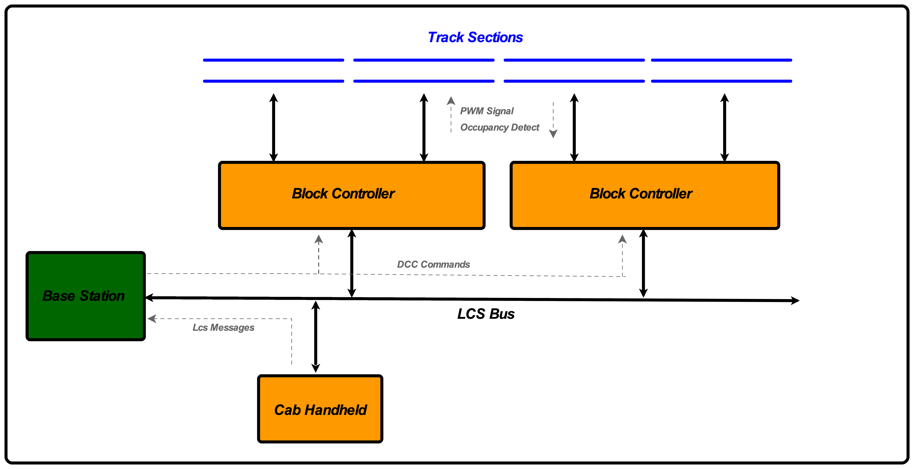

The LCS base station that manages all active locomotives, will not work differently for a digital or analog locomotive. It will create a session and also emit DCC data packets for controlling among other thongs speed and direction. The DCC signal is broadcasted via the LCS bus. This way it will also reach all block controllers that manage a block. The block controller will then decode the DCC packet and if it concerns a locomotive that according to the block controller data is currently in the block will put the respective PWM signal on the track. This is different to a normal DCC booster. A DCC booster just amplifies the incoming DCC signal and puts it onto the track. A block controller will decode the DCC signal and put a corresponding PWM signal on the track.

### *Locomotive session management*

For each active locomotive the base station first establishes a locomotive session. Across the layout, a locomotive is uniquely identified by its **cabId**. Once a session is established for the cabId, the base station accepts LCS commands for setting the speed and direction. This is common to both the DCC digital and analog control of a locomotive as far as the base station is concerned. The only difference is that for an analog engine, only speed and direction can be set. All other capabilities such as sound control and functions for turning on and off a headlight are not available.

### *Analog Track Signal Generation*

The analog track signal does not contain any information transmitted via the signal. The signal is just a pulse width modulated electrical current. The wider the pulse the faster the engines will go. The direction is determined through the polarity of the track. Just like emitting a DCC signal waveform, the H-Bridge of the power modules can easily also emit a pulse width signal with the right polarity. Short circuit detection and power consumption measurement work independent of the kind of signal emitted.

### *Analog Track Blocks and Track subsections*

Layouts with analog engines will almost certainly have a number of blocks that can be powered individually. There is a one to one relationship of a power module with a block. A block is further divided into a number of track subsections with occupancy detectors, so the locations where power is drawn within the block can be determined. The chapter on block controller and block signaling will pick up this topic in more detail.

Just like the DCC subsystem, care needs to be taken when a locomotive crosses from one block fed from a power module to the next block fed by another power module. The actual current put on the tracks needs to be in sync, such that there is not awkward jump or worse current flow between the blocks connected via the locomotive wheels when crossing. It needs a way of synchronizing the PWM signals. Classic analog block control system transmitted a separate signal for all block controllers. In our world, the DCC signal emitted to all block controller nodes throughout the LCS layout via the LCS bus is our synchronization method.

### *A short Glimpse at Software Implementation*

The block controller is the heart of managing a block in an analog layout. It will be responsible for managing the track block with a number of subsections. Using the LCS event system, blocks communicate and broadcast data about the locomotive entering and leaving their block. Using defined node and port attributes, they also communicate about block occupancy. Turnout control and position feedback as well as signal control can also be the part of the duties of a block controller.

A part of the block controller firmware will decode DCC packets to determine if there is a DCC command that concerns a locomotive that according to the block controller data is currently in the block managed. Note that there is no way to really know that this is the locomotive until there is some mechanism of identifying a locomotive when entering a block. Another part of the block controller firmware needs to manage the power module. Depending on the locomotive characteristics the speed and direction are set. Short circuiting and power consumption are measured just like it is done in a DCC subsystem.

Finally, the firmware will track that a train truly left the block. This information is a combination of the follow-on block indicating that the train entered and a computed time interval where the train should have completely left the previous block has passed. If this is not the case, perhaps the train derailed or a part of it decoupled.

### *Summary*

Analog systems have their purpose also in a digital world. The approach taken by the Layout Control Systems is to put the smarts of managing the running equipment of such a layout into a set of block controllers with the base station and cab handhelds transparently supporting DCC equipped and analog engines. Both worlds use the power module for managing the track current delivery and consumption measurement. While for DCC the power module generates an amplified copy of the DCC signal, it will generate a PWM signal for an analog engine.

The block controller takes on part of the duties of a DCC locomotive decoder in a digital layout. The DCC signal broadcasted to all nodes in the layout is simply decoded and matched with the locomotive information of the respective block controller. All block controllers constantly broadcast via the LCS event mechanism their current state.

Not discussed yet, there needs to be a central configuration system that keeps all the data about all blocks and their relation to each other. There also needs to be a dictionary of all locomotives and their characteristics. On top configuration software and also panels to set track routines and so on. The requirements will be discussed in the block signaling chapter.


<!--------------------------------------------------------------------------------------------------------->
<!--------------------------------------------------------------------------------------------------------->
<!-- Chapter - LCS Hardware Module Design ----------------------------------------------------------------->
<!--------------------------------------------------------------------------------------------------------->
<!--------------------------------------------------------------------------------------------------------->

<div style="page-break-before: always;"></div>

## *LCS Hardware Module Design*

So far we covered the general concepts, messages, protocols as well as the LCS core library and a glimpse how all of this might be used. Let's take a break from all that concepts and mostly software talk. For the software to run, hardware modules need to be built. Welcome to the next big part of this book. Here, we will talk about the lCS hardware modules. A hardware module conceptually consist of three key parts.

- communication
- controller
- function block(s)

At the center of a hardware module is the **controller**. There is a great variety of controllers and development environments available. When selecting a controller for LCS, we will talk in a minute which one was picked, its is important that there is enough CPU power and equally important a powerful development environment. A console command line interface and interfaces to load the software is also very handy for configuring, monitoring and debugging. The **communication** part implements at a minimum the LCS message bus interface for the messages to transmit between the modules. Finally, the **function block**s implement the hardware module specific capabilities.

 This chapter is the first in series of chapters on hardware modules. Instead of presenting complete schematics for each major hardware module, such as the base station, we will go a slightly different route. We will first present the basic components an LCS node might need. Definitively we will need a controller and a CAN bus interface. Some LCS nodes might make use of an extended non-volatile storage, others need plenty of digital outputs. Just like Lego Blocks, all these parts should be combined easily to form the desired LCS hardware module. We will tackle each component one at a time to understand how they work. The later chapters will just combine these basic blocks with minor adaptations and perhaps some very dedicated components for their functionality.

### *Selecting the controller*

The module designs described in this book initially used the AtMega controller platform along with the Arduino IDE to write the software. There is the Arduino IDE and by now a whole set of different processors. Since it was released, the Atmega controller family and boards such as Arduino UNO, Arduino NANO, Arduino MEGA are in widespread use. The LCS core library program and non-volatile storage requirements do place however a higher demand on the controller capabilities.

Meanwhile, the Raspberry PI Pico (PICO) controller joined the club. And it has a lot to offer. The PICO is a dual core controller running at up to 133 Mhz. It features a whopping 16Mbytes of flash and 264 Kbytes of main memory. There are plenty of IO ports, and functional blocks for UARTS, SPI and I2C interfaces. What makes this controller especially interesting are the PIO state machines that allow for implementing your own I/O protocols. There is CAN bus software library built using these state machines. This way no extra CAN bus controller is needed. The PICO comes with its own software development kit and also an Arduino IDE integration is available.

As time goes by, there will be for sure more capable controller entering the market. However, when you want to complete a project versus chasing the latest controllers, you will need to pick. In our case, the PICO is the controller of choice. Its capabilities match our requirements and will be a good choice for the years to come. nevertheless, the LCS library software should be designed as independent of a particular controller as possible. More on this later. 

### *The Controller Platform*

 The following table gives some guidance on the capabilities needed in our designs. This list also applies in general to other controllers.

|Attribute|Comment|
|---|---|
|Processor| For a typical module, the PICO offers plenty in terms of CPU power. Since we use a software implementation for the CAN bus, running the software in one core and the CAN bus state machine in the other will well match what the PICO offers. |
|Memory| Memory depends on the size requirements of the node, port and event maps and the node specific firmware data  demands. A simple module would perhaps get by with 2Kb, a base station could easily use 32Kb or even more. |
|Program Memory| The LCS library already uses round about 64Kb of code storage. A simple module would get by with 32Kb, a base station could easily use 128Kb and more. |
|External NVM Storage| Additional NVM storage is allocated in a separate EEPROM or FRAM. The capacity is highly dependent on the module use case. External NVM components typically also require the SPI or I2C interface. Most external EEPROM chips have write cycles of more than a million. At a minimum, a chip size of 32Kb is recommended. The PICO does not offer an internal EEPROM, so an external NVM; is always required.|
|Digital channels | The bulk of control lines is digital and used heavily. For some hardware modules, a subset of the digital pins should also be PWM capable. |
| Analog channels | Analog input is typically used for the power module for analog voltage measurements. Otherwise it is perhaps optional. The PICO allows for only three inputs. If more are desired, an external multiplexer needs to be implemented. |
|I2C| The I2C interface comes in very handy to connect a large variety of chips. Communication to the external NVM and also to chips that implement functions such as a servo controller will require this bus. |
| Serial I/O | The serial I/O is used in some hardware modules for implementation of RailCom detectors. The PICO features two hardware UARTS and the option to implement more in software using the PIO state machines.
|Console I/O | Serial I/O is used for console I/O. Rather than using dedicated I/O pins and a UART block in the controller, the PICO serial I/O will be implemented via the USB connector. |
|LEDs, Button and Dip Switches | A hardware module could make use of LEDs to indicate readiness and activity, as well as a set of switches to configure a hardware option. Not really required but certainly useful.|
|WLAN| WLAN is optional. But there is a PICO version with WLAN capability integrated. |
|||

### *Hardware Module Schematics*

Hardware modules are described to large extent via schematics. The schematics shown in the following chapters are all drawn with the EasyEDA software. It is a great hardware development platform, and you can order PCBs for the final design in one easy step. Following a building block principle, the schematic diagrams will show functional components with many network endpoints where they connect to other building blocks. Each network endpoint is labelled with a name that is unique across all building blocks used in a hardware module schematic drawn. For example, "VCC-3V3" will always refer to the 3.3V power supply line. If two building blocks have an endpoint with the same name, the endpoints will be connected on all building block schematics in the final hardware module design.

A general word to the building blocks. They serve as examples of how the individual parts could be implemented and help to understand how each part works. Parts of the library software assume the presence of these blocks and how they basically work. Although the library has been written with as much as possible independence of the hardware, the final adaption of timers, serial lines, I/O pins and so on is required needs to be considered. Throughout the next chapters, you will find comments on what is perhaps generic and what would require some adaption if moving to another processor family.

### *Controller and Extension Board*

Each node in the layout control system is a node and hence there is a controller for running the node firmware. Without a question, there will be many different nodes and as time goes by perhaps even a new controller families. However, each node would need at least some form of power supply, the CAN bus interface and depending on the storage demands and controller family, an external NVM. On top there is the node specific hardware. One approach is to design a board for each dedicated purpose. This board would include all the common portion for a LCS node and the hardware module specific portion. Another approach is to design a node controller board with extension boards that can be connected to it. In the remainder of this chapter, we will describe the main controller and extension concept. However, it is also perfectly all-right to design a hardware component with all the components integrated on one board. For a complex node such as the base station, this is a very reasonable solution. The building blocks shown in this chapter thus also form the basis for a more monolithic hardware module design. But first, let's look at the physical dimension of our boards.

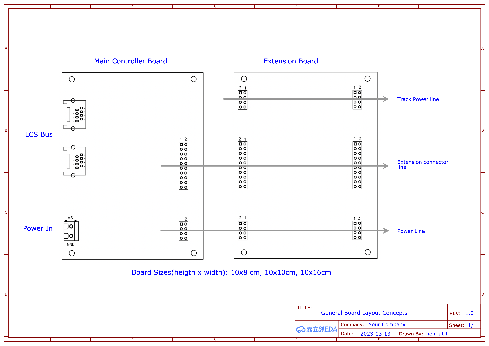

All boards will have a form factor of 10cm wide and 8, 12, and 16cm long. In particular, the 10x16cm board should be very familiar as the "Euro PCB" format. The main controller board has on the left side the connectors for the LCS bus and the power input. On the left side, there are two connectors toward an extension board. The middle one is the extension connector described earlier, the lower right side is the power lines routed through from the power in connector.

Extension boards have three connectors pairs, in and out. The lower pair just routes power through to the next extension board. The middle connector pair will route a subset of the extension connector signals from the main controller. What exactly is routed is described in the extension board chapters. Finally, the extension boards have an optional third line, which is the track power connectors. This line is used by the base station and block controller boards. Again, all this will be explained in the later chapters. To ease the hardware schematic development and ensure that all boards fit together, the PCB boards along with their connectors are available as footprints in the EasyEDA library.

### *LCS Bus connector*

Every hardware module needs the LCS bus interface to connect to the bus. Some modules may also draw power from this bus. The modules use an RJ45 connector for connecting to the bus. The bus signals can be grouped in several categories. The CAN bus differential lines represent the CAN bus. The VS line is intended for hardware modules with very little power consumptions so that they can directly be powered by the bus. The DCC signal lines are an exact copy of the DCC signal that would go to a track sent out by the DCC signal generating base station. The signal is intended to be routed from the base station to booster nodes, but also to hardware modules that analyze the DCC signal for some action. Finally there is the STOP signal line. This is a wired OR line that allows a simple button along the layout with access to this line to issue a STOP signal. The base station or any nodes interested in the signal can monitor this line. There are the following signal lines.

|Pin|Name|Purpose|Pin|Name|Purpose|
|:--|:---|:------|:--|:---|:------|
|1|DCC-Sig-1| The DCC signal labelled "+" | 5| RSV | reserved |
|2|DCC-Sig-2| The DCC signal labelled "-" | 6| VS | The bus supplied 12V power line. This line is intended for devices with very little power consumption to get their power from. Any other module should connect to its own power supply line. |
|3|GND| Common ground | 7| CAN-L|Line L of the differential CAN bus signal.|
|4|RSV| reserved| 8 | CAN-H|Line H of the differential CAN bus signal.|
|||||||

### *LCSNodes Extension Board Connector*

For interchangeability of extensions, there is a standardized **extension board connector** between controller and extensions. Furthermore, an extension board should have two connectors so we can for example add two or more extension to the main controller board. This concept is very similar to the the shield concept found in the Arduino or Raspberry PI universe, except that we do not stack boards, we place them next to each other. Not all IO lines of a controller are exported to the extension board. For example, the SPI interface, configuration switches and status LEDs are local to the main controller board. The I2C interface will be the main communication method between the boards. Nevertheless, a rather rich functionality set from the controller should be available to the extension board for flexibility. There should be ports for digital input and output, analog input, PWM outputs, serial outputs and so on. Many pins of a controller chip double up in function. All of these special purpose pins can also be used just as plain digital input/output pins. The following table shows the extension connector pin assignments.

|Pin|Name|Purpose|Pin|Name|Purpose|
|---|:---|:---|---|:---|:---|
|1| DCC-SIG1 | The DCC "+" signal as generated by the DCC Signal Generator. On the main controller board, the DCC signals are routed from the extension connector directly to the LCS Bus connector. |2| DCC-SIG2 | The DCC "+" signal as generated by the DCC Signal Generator.  On the main controller board, the DCC signals are routed from the extension connector directly to the LCS Bus connector.|
|3| GND | Common ground. |4| GND | Common ground. |
|5| ADC-0 | Analog input pin. The input is not protected. The analog voltage range is 0 to VCC. |6| ADC-1 | Analog input pin. The input is not protected. The analog voltage range is 0 to VCC.|
|7| - | reserved.|8| RST | Reset line available to the extension boards. A reset line is active low.|
|9| DIO-0 (RX-1) | Digital pin, UART RX capable. The pin is protected. |10| DIO-1 (TX-1) | Plain digital pin, UART TX capable. The pin is protected. |
|11| DIO-2 | Plain digital Pin, input or output. The pin is protected. The pin DIO-2 and DIO3 are on the same controller IO port and can be set simultaneously. |12| DIO-3 | Plain digital Pin, input or output. The pin is protected. The pin DIO-2 and DIO-3 are on the same controller IO port and can be set simultaneously.|
|13| DIO-4 | Plain digital Pin, input or output. The pin is protected. The pin DIO-4 and DIO-5 are on the same controller IO port and can be set simultaneously. |14| DIO-5 | Plain digital Pin, input or output. The pin is protected. The pin DIO-4 and DIO-5 are on the same controller IO port and can be set simultaneously.|
|15|  DIO-6 (PWM-1) | Plain digital Pin, PWM capable. The pin is protected. The pin DIO-6 and DIO-7 are on the same controller IO port and can be set simultaneously.|16| DIO-7 (PWM-2) |  Plain digital Pin, PWM capable. The pin is protected. The pin DIO-6 and DIO-7 are on the same controller IO port and can be set simultaneously. |
|17| VCC | VCC 5V supply to extension boards.|18| VCC | VCC 5V supply to extension boards. |
|19| SCL | I2C Interface SCL line. The line is protected with a serial resistor and there is a pull-up resistor to VCC. |20| SDA |  I2C Interface SCL line. The line is protected with a serial resistor and there is a pull-up resistor to VCC. |

Since the connector chosen is a 2x10 connector, the signal pin numbers shown above change their row numbering, depending whether it is output or input connector. When looking at the schematics and the connector layout on the PCB, the signals on the output connector have pin 1 to 10 on the leftmost row, and on the rightmost row on the input connector, such that pin 1 of the output connector connects to pin 1  of the input connector and so on. The same is true for pins 11 to 20. There are EasyEDA symbols that offer the connector pins with you going through these details. The appendix contains EasyEDA symbols for the most common board dimensions with the connectors placed in the right location. A new projects can just start with this EasyEDA symbol. There is also the option of  cascading extensions. An extension connector could therefore be on both ends of the board and pass the GND, VCC, Reset, DCC and I2C lines from board to board. For this type of board, EasyEDA symbols are also available.

A key question is how many controller pins are available to an extension board. Most of the extension boards would just need the I2C bus. However, if there is a rather complex extension board, such as a block controller shown in one of the next chapters, the IO pins needed from the controller board to the extension are many and quickly reach the limit of the extension connector. Why not place a connector with more pins on the boards ? First, a different controller may not have that many IO pins and there would be no easy mix and match between main and extension boards. Second, the majority of extension boards are rather encapsulated and most often just need the I2C bus to communicate. To find a middle ground, the 20-pin connector along with the pin capabilities outlined was chosen. For more complex extension boards, it is perhaps the better idea to combine a main board with an extension board to one monolithic board and still keep the extension connector for other not so complex boards to attach. As a convention, only the first extension board will benefit from all signals coming from the main controller board. All follow on extension boards will only get the DCC signals, the reset line, the I2C signal and the power lines.

### *Power Line Connectors*

The **power line connector** forward the power line input of the main controller board to an extension board. This connector is primarily needed for power unit extension to power the H-Bridges on such a board. Extensions that do not require this power input forwarding just leave it out. The first pair of connector pins is always connected, all the others are optional. Boards with a high current consumption could pool more than one connector pin pair.

|Pin|Name|Purpose|Pin|Name|Purpose|
|---|:---|:---|---|:---|:---|
|1|GND| Common ground|5|VS|Input voltage forward, always connected. |
|2|GND|Common ground|6|VS|Input voltage forward, optional connected.|
|3|GND|Common ground|7|VS|Input voltage forward, optional connected.|
|4|GND|Common ground|8|VS|Input voltage forward, optional connected.|

### *Track Power Connectors*

In addition to the extension board and power line connector, there is the **track power connector**. This connector is only used by the base station, block controller and associated extensions. Its purpose is to pass the track power signals from the H-bridges on the block controller ( or booster ) board to the extension boards. This connector is described in more detail in the base station and block controller chapter.

|Pin|Name|Purpose|Pin|Name|Purpose|
|---|:---|:---|---|:---|:---|
|1|DCC-Sig1-B0|Bridge-0 DCC Signal "+"|5|DCC-Sig2-B0|Bridge-0 DCC Signal "-"|
|2|DCC-Sig1-B1|Bridge-1 DCC Signal "+"|5|DCC-Sig2-B1|Bridge-1 DCC Signal "-"|
|3|DCC-Sig1-B2|Bridge-2 DCC Signal "+"|5|DCC-Sig2-B2|Bridge-2 DCC Signal "-"|
|4|DCC-Sig1-B3|Bridge-3 DCC Signal "+"|5|DCC-Sig2-B3|Bridge-3 DCC Signal "-"|

When using all four bridge signal outputs, each each output is rated up to 3Amps. For high power bridges with up to 6Amps, two pairs can be combined and the number of bridges signals passed on is two.

### *Summary*

This chapter introduced the basic architecture of a hardware modules, it connectors and board layout. A key concept is the idea of a common component, the main controller, and extension that can be connected. Nevertheless, there are good cases for combining a main controller and the extension hardware into one monolithic board. But in any case, the connectors and their purposes stay the same from board to board. Throughout the chapter to come, you will see how easy boards can be combined using the three connectors lanes and standards behind them. Currently, the boards are designed in a layout, where they just connect next to each other. Conceptually, they could also be stacked. It is a matter of PCS layout design.

Ready for the first hardware work ? All aboard, the train leaves for the next chapter.


<!--------------------------------------------------------------------------------------------------------->
<!--------------------------------------------------------------------------------------------------------->
<!-- Chapter - A Main Controller Board with Raspberry PI Pico --------------------------------------------->
<!--------------------------------------------------------------------------------------------------------->
<!--------------------------------------------------------------------------------------------------------->

<div style="page-break-before: always;"></div>

## *A Main Controller Board with Raspberry PI Pico*

The Raspberry PI Pico is a powerful controller with a dual core, generous program and memory sizes and USB also included. The Pico is a small board that can be soldered to a mother PCB or connected just like a big IC. This chapter will present our main controller board which is just the controller along to a CAN bus interface, the non-volatile memory and the level shifters to accommodate our 5V interface level standard. Although there will be more different controller boards in the chapters to come, this basic building block is the generic heart and can be used for many other projects in the LCS system.

### *Block Diagram*

The following schematic depicts the block diagram of our main controller. All of our schematics will start with a block diagram and the one or more parts of the overall schematic.

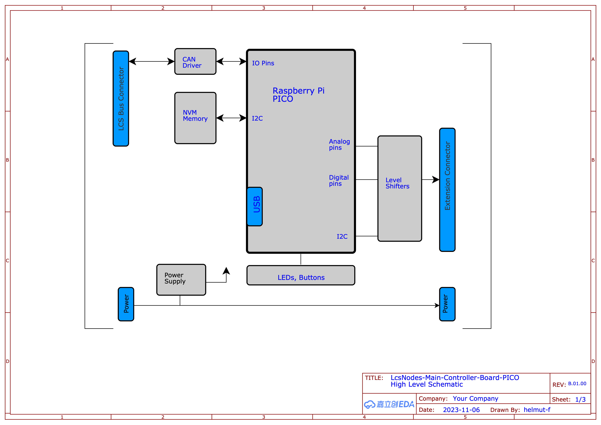

### *Main Controller*

The first part of the schematics shows the PICO processor, LEDS, Button, CAN bus driver and NVM storage as well as the power supply with the optional power fail capability.

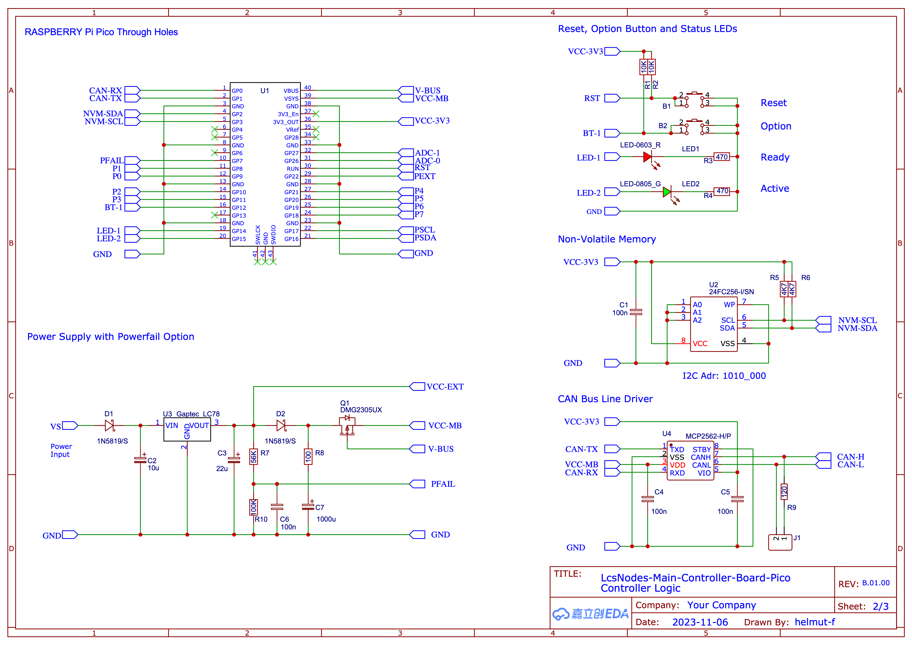

### *Connectors and Level Shifters*

The second part depicts the connectors and the level shifters. The ADC inputs also need a divider to map the incoming voltage range of 0 to 5V to 0 to 3V3. A simple resistor divider does the job.

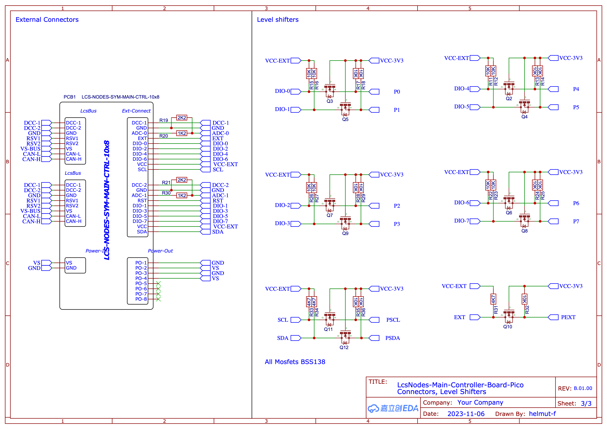

### *A Main Controller Board PCB for PICO*

And here is the PCB for the PICO based main controller. Note that there is quite some real estate allocated to the level shifters between 5V and 3V3. When most of the IO pins are used in a monolithic board design, these level shifters are perhaps not needed. Since our extension connectors standardizes on 5V for digital levels, we we need them for this board.

<!-- using specific picture size goes like this ... -->
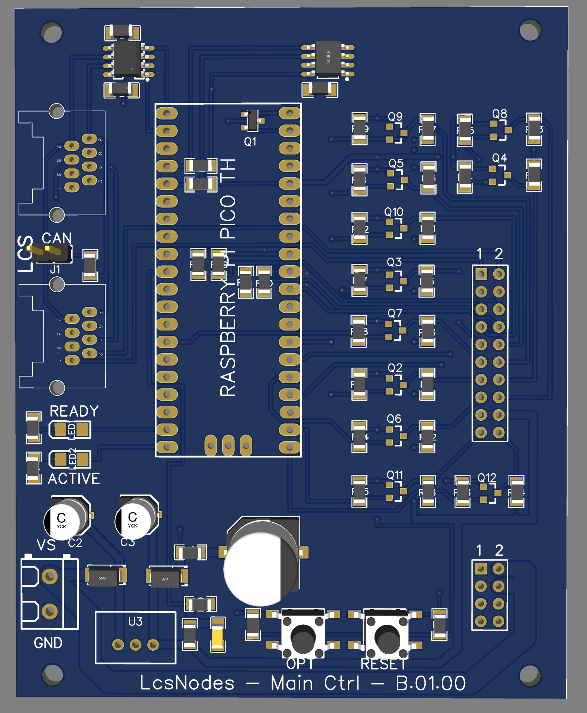


### *Summary*

By now we have a core library which can handle the basics of just about any node and we have a main controller board that will form the heart of many projects to come for the layout control system. However, while LCS boards will all run the same core library, there are still differences how for example the controller pins are assigned on the boards. It is very likely that new software versions and perhaps different processors and boards layouts will require that the core library is adapted to each processor / board combination. This is especially true for monolithic board designs, where there is a great freedom which pins to use for what. At this point, many projects found on the web will now start a symphony of "ifdefs" in their coding. The conditional compiles often reach up to the highest layers of the firmware programming. 

Perhaps there is a way to shield all these differences at a lower layer such that higher level libraries and firmware just refer to symbolic names for controller functions and pins. A mapping structure will translate between the symbolic names and the actual HW counterpart. This **controller dependent layer** will be the topic of the next chapter.


<!--------------------------------------------------------------------------------------------------------->
<!--------------------------------------------------------------------------------------------------------->
<!-- Chapter - Controller Dependent Code ------------------------------------------------------------------>
<!--------------------------------------------------------------------------------------------------------->
<!--------------------------------------------------------------------------------------------------------->

<div style="page-break-before: always;"></div>


// ??? **note** this concept will be enhanced to cover the board specifics, most of the requirements stay the same... perhaps this chapter should become "Hardware Abstraction Layer"

// ??? **note** rework the text ... extend it...

## *Controller Dependent Code*

Enough software talk ? Well not quite. The previous chapter presented the main controller boards and the extension concept. A main controller board features the controller itself, the CAN bus interface, the non-volatile memory and the extension connector with several IO pins of the controller assigned to it. During board initialization the controller hardware needs to be mapped to the actual board. Two processor versions of the main controller board were presented. It can be easily seen that different controller and board versions would place a great configuration and perhaps conditional compile burden on the LCS core library. To address this problem, there is a hardware layer library at the very bottom of the architecture that isolates the controller dependencies.

### *The big picture*

The figure depicted below shows the refined overall structure of the node firmware. There is the core library discussed in a previous chapters and a new layer, which is the **controller dependent code layer**. The layer essentially encapsulates the required controller functions, such as a timer or a digital I/O pin, and offers a common interface to core library and firmware layer that directly uses the controller functions. The picture also shows a component labelled "extension driver". An extension driver is piece of software that knows how to handle an extension board. We get this this part later when we talk about more about extensions.

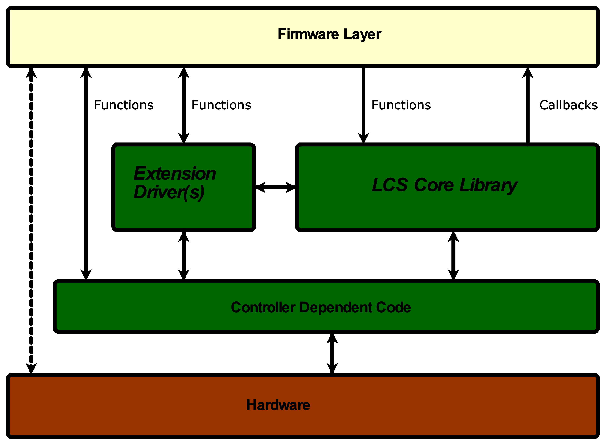

Using the CDC layer does not mean that access to the bare bones controller chip is not possible. Any controller HW function can be accessed directly at the expense of that the code will most likely not be portable between different controller families. Still, here may be good reasons for the direct path. The following sections describe will now what the CDC library is offering across all controller platforms.

### *Configuring the pins*

The CDC library is rather low level hardware abstraction to give access to the pins which will work for the Atmega family and the Raspberry PI Pico and perhaps over time other controllers as well. The key identifier to access a hardware input/output is the pin number. Using the correct pin numbers according to the hardware developed is therefore very important. At the same time the upper layer code should not deal with these details. There needs to be a mapping of actual pin numbers and functions to the controller family and the hardware developed.

Each project therefore needs to define a structure containing some constants and pin number assignments that are used through the node firmware. For this purpose, the CDC library defines a structure with all the pin names and a sensible default setting for a particular controller. Think of the structure a the superset of all pins and HW functions that can be configured for any controller. Using the structure, all the firmware programmer has to do is to set the controller pin numbers of the particular hardware module design to the names predefined in that structure. The upper layer code then just uses these names. The following figure shows the CDC configuration structure.

```cpp

// ??? rework when done ....

struct CdcConfigInfo {

    uint8_t   CFG_STATUS;

    uint8_t   PFAIL_PIN;
    uint8_t   EXT_INT_PIN;

    uint8_t   DIO_PIN_0;
    uint8_t   DIO_PIN_1;
    uint8_t   DIO_PIN_2;
    uint8_t   DIO_PIN_3;
    uint8_t   DIO_PIN_4;
    uint8_t   DIO_PIN_5;
    uint8_t   DIO_PIN_6;
    uint8_t   DIO_PIN_7;

    uint8_t   ADC_PIN_0;
    uint8_t   ADC_PIN_1;
    uint8_t   ADC_PIN_2;
    uint8_t   ADC_PIN_3;

    uint8_t   PWM_PIN_0;
    uint8_t   PWM_PIN_1;
    uint8_t   PWM_PIN_2;
    uint8_t   PWM_PIN_3;

    uint8_t   UART_RX_PIN_0;
    uint8_t   UART_TX_PIN_0;

    uint8_t   UART_RX_PIN_1;
    uint8_t   UART_TX_PIN_1;

    uint8_t   UART_RX_PIN_2;
    uint8_t   UART_TX_PIN_2;

    uint8_t   UART_RX_PIN_3;
    uint8_t   UART_TX_PIN_3;

    uint8_t   SPI_MOSI_PIN;
    uint8_t   SPI_MISO_PIN;
    uint8_t   SPI_SCLK_PIN;
    uint32_t  SPI_FREQUENCY;

    uint8_t   I2C_SCL_PIN_0;
    uint8_t   I2C_SDA_PIN_0;

    uint8_t   I2C_SCL_PIN_1;
    uint8_t   I2C_SDA_PIN_1;

    uint8_t   CAN_BUS_CTRL_MODE;
    uint8_t   CAN_BUS_SELECT_PIN;
    uint8_t   CAN_BUS_RX_PIN;
    uint8_t   CAN_BUS_TX_PIN;

    uint8_t   NVM_SELECT_PIN;
    uint8_t   NVM_CHIP_TYPE;

    uint8_t   READY_LED_PIN;
    uint8_t   ACTIVE_LED_PIN;
    uint8_t   BUTTON_PIN;

    uint8_t   CONTROLLER_FAMILY;
    uint8_t   MAJOR_VERSION;
    uint8_t   MINOR_VERSION;
    uint16_t  PATCH_LEVEL;
  };
```

While the whole idea of the CDC is isolating the firmware programmer from the controller layer and board revisions, the pin assignments cannot be chosen arbitrarily on all supported processor families. An application uses the default configuration routine to obtain an initialized configuration structure with controller specific values set. The application will then fill in the assigned pins and other configuration values. Note that the default configuration setting only fills in what are the controller limitations and leaves all else undefined. An application takes this initial structure and fills in what are board version specific. Throughout the life of the application, this structure is the "single source of truth" for pins. Under their defined name all upper layers refer to the configured IO capabilities. Once all is set, the **init** configuration routine, described later, does the sanity check for the given controller family hardware. For example, on the Atmega the UART pins numbers are fixed if used. On the PICO the pin numbers can be assigned to a couple of different slots. Whatever can be checked is checked. There is however no absolute guarantee that the configuration structure is valid in any cases.

Most CDC routines use pins as one of their input argument. These arguments are not checked again at the level of the configuration validation. For performance reasons, just some quick sanity checks are performed.

For each part of the CDC library, there is a configuration routine. For example, the digital IO configuration will set a particular pin to be an input or output pin and so on. During this configuration only basic checking what a controller can support on that pin will be done. The ATmega is far more restrictive with respect to the IO pins used than the Raspberry. The CDC library will do whatever it can to do such checking. During actual usage of such a pin, i.e. the digital read or write in the example above, no further checking will take place. During initialization, the configuration structure is checked against what the controller is capable. This also includes the pins assigned to UART, SPI and I2C pins.

### *CDC Library setup*

To the firmware programmer, the library is a set of functions in the name space CDC. A call to any of the routines typically has the form "CDC::xxx". Of course, the name space can be declared upfront so the prefix is not needed. The example shown below will just show the fully qualified signature. The very first thing a node firmware should do is to set up the controller dependent library. If for some reason access to the lower layer is required before the LCS library is initialized, the calls can be made directly from the node firmware. There is also a convenience routine to print the content of the configuration structure.

```cpp
   CdcConfigInfo getConfigDefault( );
   CdcConfigInfo *getConfigActual( );

   uint8_t       init( CdcConfigInfo *ci );
   void          printCfgInfo( CdcConfigInfo *ci );
```

### *General Controller Attributes and Functions*

The CDC layer provides a set of common low level functions. There is a function that creates a unique ID for the controller board. It is primarily used when a node needs a hardware module unique identifier. The controller internal memory and any internal EEPROM sizes return the hardware capabilities of processor and installed NVM. The NVM select pin is used for the VNVM memory SPI addressing. Finally, the CANBus controller needs to know the SPI bus select pin and the mode, i.e. baud rate and controller frequency. The library also offers the timestamp routines for milliseconds and microseconds since start.

```cpp
   const char    *versionInfo( );
   uint32_t      createUid( );
   uint32_t      chipMemSize( );
   uint32_t      chipNvmSize( );
   uint32_t      cpuFrequency( );
   uint32_t      getMillis( );
   uint32_t      getMicros( );
```

Some of the routines can also be found in the Arduino IDE and its libraries for the Arduino. As this project perhaps may also be implemented in an non-Arduino environment, this dependency is also hidden behind the CDC layer.

### *Power Fail detect*

The main controller board features optional power failure detection. The power supply provides a signal line to the controller which goes low when power drops. The power fail input pin is set in the configuration structure and just passed as an input to the configure routine. 


// ??? has changed...


### *External Interrupt*

The CDC library offers a set of routines for handling an external interrupt. While a controller typically allows for interrupts on almost any IO pin, there are one some controllers dedicated IO pins which offer an interrupt input with flexible setting and high resolution timing. A callback needs to be registered for this interrupt.

// ??? has changed ...


### *Status LEDs*

The main controller board features two LEDs. They are the ready and the activity LED. They are accessed via the **writeDio** routine. The LCS core library will use the ready LED to indicate that the node is ready. The activity LED is used to show library activities such as receiving a LCS message. The recommended colors for the LEDs are a green for the READY LED and yellow for the ACTIVE LED. The following just shows an example how to control the LEDs.

// ??? this is done via nodeControl calls ...


### *Timer*

Although the LCS core library itself does not make use of a timer, having a general timer with a callback routine interface is an essential component. The DCC signal generation for example makes intensive use of timers to generate that signal. The timer is a repeating timer and accepts a timer value measured in microseconds. In addition, the timer already starts again counting in parallel to the timer interrupt handler code. Finally, the timer limit, i.e. the timer when the next interrupt would occur, can be set without disturbing the already active count.

```cpp
   typedef void ( *TimerCallback ) ( uint32_t timerVal );

   void          onTimerEvent( TimerCallback functionId );
   void          startRepeatingTimer( uint32_t val );
   void          setRepeatingTimerLimit( uint32_t val );
   uint32_t      getRepeatingTimerLimit( );
   void          stopRepeatingTimer( );
```

Timers work slightly different on Atmega and PICO. Nevertheless, both versions allow to set the new limit, i.e. the timer value when the next interrupt would occur, while already counting toward the limit. Care needs to be taken however to set the new limit while the counter is below this limit. If the new limit value is below the timer counter value, we have passed the limit point already and the counter would simply continue to count and wrap around before hitting the new limit. Any carefully designed timer signal is gone. Again, better be quick in the interrupt handler.

### *Digital IO*

The digital IO routines offer an interface to plain digital input and output operations. If it is an input channel, the input can be set to active low or high input. Also, there is an option to enable the controller internal input pull-up resistor. For configured output pins, two pins can be set in pairs if supported by the actual hardware configuration, i.e. the two IO pins are on the same controller output port. This feature enables the simultaneous setting the two pins. A typical use case is the DCC signal where the two signal levels are set in one call.

// ??? add the interrupt stuff...

```cpp
   uint8_t       configureDio( uint8_t dioPin, uint8_t Mode = IN );
   bool          readDio( uint8_t dioPin );
   uint8_t       writeDio( uint8_t dioPin, bool val );
   uint8_t       writeDio( uint8_t dioPin1, bool val1, uint8_t dioPin2, bool val2 );
   uint8_t       toggleDio( uint8_t dioPin );
```

### *Analog Input*

Analog input configures the respective controller input ports for reading an analog value. The read method offers an asynchronous way in just starting the analog input conversion process and a hardware interrupt when the conversion completes. The registered call back is then passed the value of the conversion process. The **adcRead** function is a blocking ADC measurement call.

```cpp
   typedef void ( *AdcReadCallback ) ( uint8_t adcPin, uint16_t val );

   uint8_t       configureAdc( uint8_t adcPin );
   uint16_t      readAdc( uint8_t adcPin );
```

The analog to digital converter system for the Raspberry PI PICO is compared to the Atmega really fast. A typical 12-bit conversion takes about 2 microseconds. The PICO ADC unit resolution will be scaled down to 1024 to match the Atmega resolution.

### *PWM Output*

Depending on the controller, some digital pins can be configured with a time period and pulse width ratio. The capabilities of the underlying processor also determine what kind of PWM is possible. For example, in the main controller board Atmega1284 processor version, Timer 2 is used, allowing for two separate channels. Both channels can be set to either a fast PWM where the timer just counts up, or a phase correct mode, where the timer counts up and then down, essentially dividing the PWM period by two. Since the PWM channels are configured as two independent channels, the PWM period can only be set according to the processor clock frequency divided by the pre-scaler fixed values.

```cpp
   uint8_t       configurePwm( uint8_t   pwmPin,
                               uint32_t  pwmFreqency,
                               bool      phaseCorrect  = true,
                               bool      inverted      = false
                               );

   uint8_t       writePwm( uint8_t pwmPin, uint8_t dutyCycle );
```
The pre-scale options for the Atmega are limited to what the particular timer allows. In other words, the frequency can only be set to the nearest value of what the pre-scale option will allow. Thee PICO is again far more flexible allowing for a true frequency setting.

### *UART Interface*

The UART interface is used to offer a serial communication channel. This is required for the RailCom feature. Currently this interface implements only an asynchronous read into a local data buffer. However, the configuration routine allows to set more parameters that are needed for the current usage. One day, even a write capability may be needed.

```cpp
   uint8_t       configureUart( uint8_t rxPin, uint8_t txPin, uint32_t baudRate, UartMode mode );
   uint8_t       startUartRead( uint8_t rxPin );
   uint8_t       stopUartRead( uint8_t rxPin );
   uint8_t       getUartBuffer( uint8_t rxPin, uint8_t *buf, uint8_t bufLen );
```

The Raspberry PI Pico offers to implement the UART channel on one of the PIO state machines. This allows for more than the two UART blocks of the controller. The **UartMode** parameter selects what kind of UART HW is actually used.

### I2C

Controller offers a serial wire IO block. The I2C will need two pins for clock and data. There is one I2C port on the Atmega1284, and two hardware blocks on the Raspberry Pi Pico. The CDC layer offers an interface to read and write a byte.

```cpp
   uint8_t       configureI2C( uint8_t sclPin, uint8_t sdaPin );
   uint8_t       i2cBeginTransmission( uint8_t i2cAdr );
   uint8_t       i2cEndTransmission( );
   uint8_t       i2cRequestFrom( uint8_t i2cAdr, uint8_t len, bool stop = true );
   uint8_t       i2cWrite( uint8_t arg );
   uint8_t       i2cRead( );
```

### SPI

SPI is the bus used for connecting NVM and CAN controller chips. The CDC library will validate that the configured pins are actually available for the SPI IO block in the respective controller. By nature, the SPI communication exchanges a data item with between two entities. A master sends a byte and in return receives a byte from the slave. To avoid surprises such as filling a buffer sent with whatever is returned from the slave, the transfer routines available will NOT overwrite a buffer sent with whatever data returned. A future version may change this behavior and offer dedicated routines to do a write or read with the transfer semantics.

```cpp
   uint8_t       configureSPI( uint8_t sclkPin, uint8_t mosiPin, uint8_t misoPin );
   uint8_t       spiBeginTransaction( uint8_t csPin );
   uint8_t       spiEndTransaction( uint8_t csPin );
   uint8_t       spiTransfer( uint8_t dataByte );
   void          spiTransfer( void *buf, uint32_t len );

   uint8_t       readSpi( uint8_t *buf, uint32_t len );
   uint8_t       writeSpi( uint8_t *buf, uint32_t len );
```


### *Extension Connector and hardware pins*

The routines described have been implemented fairly flexible and their main purpose is to shield the upper library and firmware from the controller specific implementation methods. The same routines are also used to control the pins of the extension connector. If you recall, there are two ADC channels, a digital channels and an I2C communication channel available. The first two digital pins can be overlaid with an UART interface, and the last two digital pins allow a PWM capability.

The configuration descriptor structure uses predefined names for the pins of the controller. If the hardware exports these pins via the extension connector, the connector pins can be accessed by these names. However, not all pins need to be provided to the extension connector. If for example, the digital pins DIO 0 .. 4 are used local to the board, the pins are left open on the extension connector. The only mandatory pins available on any extension connector are Power, ground, I2C, reset and E-Stop.

### *Summary*

The controller dependent code library is the lowest layer in the LCS node software stack. Its purpose is to shield the firmware programmer from the underlying pin assignments and some of the intricacies of the particular controller. At the same time, the layer needs to be rather thin so that it adds very little to the overall path length for performance critical signal management. For special cases, there is always the possibility to access the underlying hardware directly. However, this coding my not be that portable then.


<!--------------------------------------------------------------------------------------------------------->
<!--------------------------------------------------------------------------------------------------------->
<!-- Chapter - LCS Node Firmware Design ------------------------------------------------------------------->
<!--------------------------------------------------------------------------------------------------------->
<!--------------------------------------------------------------------------------------------------------->

<div style="page-break-before: always;"></div>

## *LCS Node Firmware Design*

The previous chapters introduced the overall Layout Control System architecture, the communication concepts and how an LCS node could be implemented. The hardware design chapter also presented the main controller and extension concept for splitting up the work between the generic controller and a specific extension. We are about to embark on designing specific LCS nodes such as a base station or a block controller. Before we do that, this chapter will outline how in general one does write firmware for the layout control system. This chapter will not focus on the how to use the library. This was explained before in small examples, and the major modules firmware code to follow in the next chapters contains good larger examples for firmware designs. This chapter will rather focus on how you go about designing a firmware for a node and give guidelines and recommendations.

### *General Thoughts - Nodes, Ports and Events*

It is the general philosophy of any software system to find a good balance between what is coded or written in firmware and what is done with setting configuration values. Without a concept how to enter configuration values, even a simple change would result in downloading the firmware with the changed data. Clearly, we need a better way. The idea should be to update the firmware only when there are new features, fixes to bugs, and new installations of hardware capabilities of the node. This first of all means that each hardware capability is accessible through user defined port and node control and info items. That was a key reason why there is a range if user definable items for these attributes. A configuration system can query and set defined attributes and also execute functions mapped behind a node or port item.

Just using the ability to send messages to a node and port allows already for a very capable control system. Similar to the DCC CV variables, nodes and ports have a set of variables that can be queried and modified form any node. The addition of callbacks in the path of accessing such a variable, allows to implement for example querying a hardware resource and return the result via the variable associated with it. In addition, the firmware designer can define custom items that will invoke a callback function. This function now can do all kind of things. It is completely up to the firmware designer what this function will do on that node. Just using the node and port item concept, a control system could be implemented with a central station containing buttons, switches and status LEDs that send these messages to node which then set the turnout direction acknowledgement, which in turn set the LED. This way we know the turnout direction setting. A central concept, but with few wires. Only the bus lines go across the layout. But that alone would just mean a more economic wiring approach. And the central bus bus load would perhaps be considerable for larger layouts. A CAN bus frame is between 58 and 114 bits. With a baud rate of 500Kbits and an assumed average packet length of 6 bytes, roughly 5000 frames per second are the limit.

The addition of an eventing system allows for all nodes to react on events broadcasted by any other node. A setting of a turnout, for example, could result in broadcasting an event for all other nodes to see. The central station mentioned before could use this event to set an LED light on the control panel to show the turnout setting. Instead of periodically polling the turnout setting, we now just process the respective event. Furthermore, since all nodes can see all events, many nodes can react to an event sent. All that needs to be done is to configure the port to react on the given event though invoking a callback. Events provide a great flexibility on top of the query and set scheme outlined before.

Let's take the common example of setting a route. This would involve a node where there is some button or other way to broadcast the "set route" event. Each node that has a turnout belonging to the route was configured to act on this event and the port representing the turnout would then take action via the callback. A simple "event delay" capability allows to set one turnout after the other and not all at once. The nice thing about the event driven approach is that the ports need not be on the same node. And, more importantly, the callback functions are just controlling a piece of hardware and the need for updating the node firmware would only be needed for entire new capabilities, firmware update or bug correction. In short, there is a fine line with what the firmware should do and what is delegated to configuring ports and events.

It would be tempting to also offer a kind of macro capability to execute a macro instead of actual code. Upon receiving an event, the macro would be executed. And going this route we are just about to invent yet another language. Right now, the jury is out whether this is really needed. The whole philosophy of the Layout Control system is that events are produced and visible for all nodes and each port on a node can act on this event. Node local processing just concerns the sensors and actors belonging to that node. If on a node more than one port is registered for an event the ports are triggered in ascending order. It really depends what the callback functions associated with the port are executing.

### *General thoughts - Software layers*

The layout control system will over time contain many hardware and software components. The software therefore needs to be structured in a way that the firmware designer just will focus on the the tasks at hand and all else is being taken care of by the core library. Well, almost. The great variety of hardware requires a slightly more detailed picture.


Besides whatever the node is designed for, there are the common firmware layers. It all starts with the **controller dependent code**, that shields the actual controller family from the rest of the library. This does not mean that any special hardware feature of the controller is not available it just means that the common capabilities to be found across the implementations are available via a common layer. Examples are the routines to mange a digital I/O pin, the analog input, hardware timers and so on. The **non-volatile memory** CDC library part implements a simple memory that is used by the node firmware but also the firmware designer. Some controllers do have a non volatile memory area, often an EEPROM, others don't. The library offers a simple abstraction for storing non volatile data. The ** CAN Bus** CDC library part is responsible for implementing the CAN bus interface, which is either implemented as a separate hardware chip or implemented in software using the controller special capabilities, such as the Raspberry Pi Pico programmable IO blocks.

At the heart of all node specific firmware is the **LCS node library**. It itself uses the aforementioned CDC libraries where needed. The LCS library actually implements the event loop where events and message are handled and manages the node data. Any firmware written for a node sits on top of this library, but still has access to the underlaying hardware. Extension boards need their own piece of software to manage whatever the extension board implements. We will call this a **extension driver**. A driver is access using a defined set of routines available through the node library. Firmware programmers think of such a board as a peripheral device that is access though a set of control, info, read and write functions. The core library contains a set of functions to manage the driver subsystem. Examples are extension board discovery and address mapping.

Finally, there is the **node specific firmware**. This part is written by the firmware designer, i.e. you. It communicates with the lower layers through the set of defined APIs and the set of defined callbacks. In fact, a great deal of firmware specific code development is just writing the callback handlers for the core library and calls to the respective extension driver API.  The main routine of a node just consists of call to initialize the library, registers the callbacks and let the library loop do its work. Throughout the chapters that implement specific nodes, you will see this basic structure.

### *Node Functions and Attributes*

A key idea of designing the firmware is that there is no need to update the firmware every time configuration or other parameters change. It is in a sense quite similar to a DCC decoder which offers a large set of variables that can be set with values that the decoder firmware interprets. LCS nodes have a concept of attributes that is very similar to these variables. A node variable can be queried and set from any other node.

Node variables are accessed via "items". An item is just a number that refers to the variable. Besides a set of fixed, i.e. reserved, items that the system itself offers, a set of items allow to access a variable in memory or NVM. Any values that you want to keep across a power cycle can be stored in these variables. The idea is that during startup the values are simply copied form NVM to memory for usage. In the opposite way, there is a set of items that when used, will store a new value in memory and NVM. So, while the memory value can change quite a bit during operation, startup always used a known fixed value.

A node has up to 64 such variables. That is not a lot, you might say. Well, not quite. The item range has a set of 64 user definable items. These are items that when accessed will result in a callback to the node firmware. And in such a callback function, you can do anything you like, including accessing these local attributes of course. Beyond this way of using a user definable callback, these callbacks offers a very flexible to directly access firmware functions without going through kludges of writing a value to a variable that is interpreted as a functions. Since accessing local attributes is such a common scenario, you will find in the reserved item section also items that allows to directly read and write to local attributes.

Finally, think about where these variable values would come from. There will be the day where a hardware piece breaks down and needs to be restored. It is rather easy to load the node variables and attributes from a central database, as well as to first of all store these values in such a place.

### *Port Functions and Attributes*

Ports are the higher level endpoints on a node. They too features variables accessible via the items already presented. There are just no local attributes related to a port. But what is a port actually used for? When designing a node firmware, the designer should use ports to group functions that are accessible by a combination of node and port identifiers. As seen in the concepts chapter, they together form a 16-bit value. A good example is a block controller that has four channels to manage a block on the layout. Each block, you guessed it, can be represented as a port. When talking to the block, just the node and port ID is enough to address it.

But ports are also the endpoint for events. Remember each node can broadcast an event observable by all nodes on the system. Events are created to represent an, well, event that somebody would be interested in. For example a track power shortage. Or a block section is occupied event. Or whatever you see as a reasonable event to broadcast to the world. And again these the event map data can be queried and loaded from another node.

When configuring a node, that node can register its interest in an event by adding an event ID / port ID combo to the event map. How to do this? Well, there is a reserved item function to just do that. A matching incoming event will result in a callback registered for the port. A node offers up to 15 ports. Since they also serve as a logical grouping of physical things on the layout, having 15 ports is a good compromise between number and resources needed by a port. When designing a firmware, the first thinking should be what a node manages and what ports will mange portions controlled by that node.

### *Command Line and Display*

The LCS library already offers a command line interface. It provides commands for the basic commands to manage a node and access its data. This interface, while not used in regular operation, is very useful for node firmware testing and debugging. All commands are also available via LCS messages, so that troubleshooting and monitoring can be done when the node is already installed. Following this philosophy, implementing node specific commands are a good idea. Writing your own serial commands is just writing a command line callback and registering it at node startup.

### *Event handling*

The layout control system is an event driven system. A large part of layout configuration consist of creating an event Id, i.e. picking a number, and associating a port with the event. Upon event detection, the port callback is invoked. Configuration is therefore just entering the event/port pair in the node event table. The other direction, a situation at the node results in broadcasting an event, requires that the event ID is known. A good practice is to define port or node attributes that contain the event Id to use. This attribute can be set during node configuration. The LCS core library offers a periodic callback where the firmware designer can implement to manage the local sensor hardware data and decide to broadcast an event.

### *Periodic Tasks*

Since the core library implement the outer loop, tasks that need to run periodically need to be implemented as callback for the core library to invoke. As always, one can write timer code and management outside of the core library, but this comes at the expense of being dependent on a particular controller hardware. For most cases, a simple callback, it does net even have to be precise to the microsecond, is sufficient. A good example is the checking for power consumption on a track. A firmware designer would provide a callback that is invoked periodically and would make use of the driver interface to obtain the actual data. If the the consumption is outside defined bounds, an event owl  due raised and the track turned ff. 

### *Configuration*

Configuration comes in two parts. There are all the items that need to be handled of ramping the hardware actually perform, and there are the items that are at the higher level of configuring a node for its purpose. A great of how to configure the hardware was already presented in the chapter on the CDC layer. At this layer the hardware setup was place and all capabilities are setup to be used. As a firmware designer, unless you directly access hardware, you may not have to go that deep, the CDC library / Core library will have the configuration data that maps the actual hardware. 

What is left is from a low level perspective are the extension boards and their inner workings. These concepts will be explained in great detail in the chapter on the extension board designs. Right now it is sufficient to know that using the driver interface, some setup and configuration needs to be implemented. For example, setting an I/O pin on a GPIO extension board to be an output port, is a typical configuration task. Again, more on this later.

What is left is the high level configuration, which means to set node and port attributes. This task is comparable to a DCC locomotive decoder. It is has tons of variables  that can be set. The firmware designer is responsible to make all relevant items of the node firmware configurable by exporting them as node and port attributes. When w look at the first larger node example, the base station, this concept becomes clearer.

### *The main code*

The main code is just a set of firmware specific code and callback routines that do the firmware specific work. During initialization, register the necessary callbacks and then delegate control to the LCS loop. This scheme is common to all nodes. For smaller nodes, the setup code and callback routines can be all in one file, for example the "main.cpp" file. Larger node firmware will perhaps split the code into several files. The C\+\+ classes or structures are a good way of structuring your code. There is one caveat though. Callbacks are technically just procedure labels and need to be at either the main code, the file local portion of a separate file or a static methods in a C++ class. In other words, they cannot be object instance methods.

### *Summary*

This chapter gave a brief overview how one would go after writing node firmware. In short it is writing functions that can be registered as callbacks to the core library and that will in turn use the core library functions for implementing their purpose. It also introduced a more detailed picture of the overall software layers. The heavy lifting of message handling, event handling, node data management, extension board management and overall processing is handled by the LCS library. All the firmware programmer has to do is to write the node and specific functions. 


// ??? GitHub has all the source code of the nodes i wrote ...


The following chapters will give several examples of how the firmware for the common nodes such as a base station, a cab handheld and a block controller is designed using the principles and guidelines mentioned in this chapter.


<!--------------------------------------------------------------------------------------------------------->
<!--------------------------------------------------------------------------------------------------------->
<!-- Chapter - Power Module Design ------------------------------------------------------------------------>
<!--------------------------------------------------------------------------------------------------------->
<!--------------------------------------------------------------------------------------------------------->

<div style="page-break-before: always;"></div>

## *Power Module Design*

LCS hardware modules generally consist of two parts. The first is the main controller portion where the processing is done. The second part typically implements special functions to complete the LCS node. One such function is the power module for the DCC subsystem. This chapter will present the basic components necessary for building the power generation part for a base station or booster and block controller module.

###*DCC Track Power Modules*

A layout control system needs a form of DCC signal generator. They can be directly integrated with the base station to form one hardware module or be at the heart of a separated booster module. Depending on the model railroad scale, there are different voltages and maximum current considerations. A Gauge N layout has a different power requirement than a Gauge G layout. The NMRA standard defines the voltage ranges for the different gauges. Our assumption is that the layout system has a form of power supply that delivers the voltage and current requirements to the power module. For convenience, all hardware module node local power supplies for the controller and other chips should be able to handle a voltage range between 7V and 24V when drawing power form this power supply. Switching supplies are quite interesting, they do not produce that much heat compared to their analog counterparts. The main task of the DCC track power module is to provide the DCC signal to the track. DCC signals are square wave signals with a defined duty cycle period. A duty cycle of 58 microseconds represents a "DCC one", a duty cycle of 116 microseconds a "DCC zero" bit. A typical solution to this task is a H-Bridge design. The following figure shows the H-Bridge signal convention for LCS power modules.


While a power module can vary in capacity and technology components, our logical design expect to send the same digital signals to a power module, no matter what it's design. It is a key requirements to derive from the DCC signal on the bus connector the state "+", "-" and "short circuit". The latter is needed for the cutout option. There is also the need to detect a logic "one" on both signal inputs and interpret this as setting the bridge to a high impedance state. This requirement comes primarily from the capability to also issue PWM signals, which will depending in the direction alternate between a positive or negative voltage and the high impedance state. There is a whole family of H-Bridge ICs and breakout boards. If a particular H-Bridge IC does not map the inputs to the table below, some gate logic needs to be added. The following table depicts the power module digital input management signals. The table below fits the L6205 H-Bridge nicely.

|Enable|DCC-Sig-1|DCC-Sig-2|Meaning|
|:-:|:-:|:-:|:--|
|1|0|0| Cutout period. The track will be short circuited. Out1 and Ou2 are connected.|
|1|1|0| The track is polarized "+". Out1 is connected to VS, Out2 is is connected to GND.|
|1|0|1| The track is polarized "-". Out1 is connected to GND, Out2 is is connected to VS.|
|X|1|1| The track is put into high impedance, i.e. not connected. |
|0|X|X| The track is put into high impedance, i.e. not connected. |

The standards also specify which side of the track is the positive side, i.e. OUT1 in the table above. The right hand track side, usually connected with a red cable is the positive side, the left track side, connected with a black cabe, is the negative side. If the H-Bridge is enabled, sending a "DCC One" will mean to raise the digital output of the controller port DCC-SIG-1 to HIGH and controller port DCC-SIG-2 to LOW for 58 microseconds, followed by the reverse bit setting for another 58 microseconds. The DCC packet is broken down, bit by bit and the digital signal is produced. The H-Bridge hardware then takes the zero and ones and essentially reverses the track polarity accordingly to digital zeroes and ones.

If the power bridge is used for the PWM mode, a "FWD" means to raise  the DCC-SIG-1 to HIGH and the controller port DCC-SIG-2 to LOW for the active part of the duty cycle length. The remainder of the duty cycle, the port signals will be both set to a HIGH, which puts the bridge into the high impedance state. Not all H-Bridge ICs follow the same control signal level standard. Any difference in H-Bridge control signals inout logic need to be masked accordingly. The following figure shows the H-Bridge signal standard. All power modules and connectors to the track follow this convention.

All power modules are expected to deliver a voltage proportional to the power consumption of the H-Bridge. This is typically done by putting a shunt resistor between ground and the lower part of the H-bridge. For a better accuracy, the rather low voltage signal is amplified before delivered to the analog input of a controller. Note that most H-Bridge ICs offer short circuit and over temperature protection already as a built-in feature. Based on the analog voltage signal analysis, current protection features such as sending a power overload event can be implemented.

Power consumption measurement is necessary for another important DCC requirement. A DCC decoder in programming mode will raise its power consumption to acknowledge an operation with a raise by about 60mA. This short rise needs to be detected as well. It requires to calibrate the actual power consumption of the decoder, build a base of typical consumption and then detect the temporary raise. With the basics in place now, the next section will show different designs for a power module using the L6205 chip for the implementation. As always, there are other H-Bridges and also breakout boards that could also be used as the heart of a power module building block.

### *Dual Power Module - L6205*

The representative schematic for a power unit uses the L6205 dual H-Bride IC for a dual power module unit. There is a serial resistor on bridge ground side to measure the current consumption. The voltage drop over this resistor is amplified and will be passed to an analog controller pin. Both bridges deliver up to 2.8A, which is sufficient for scales up to HO Scale.

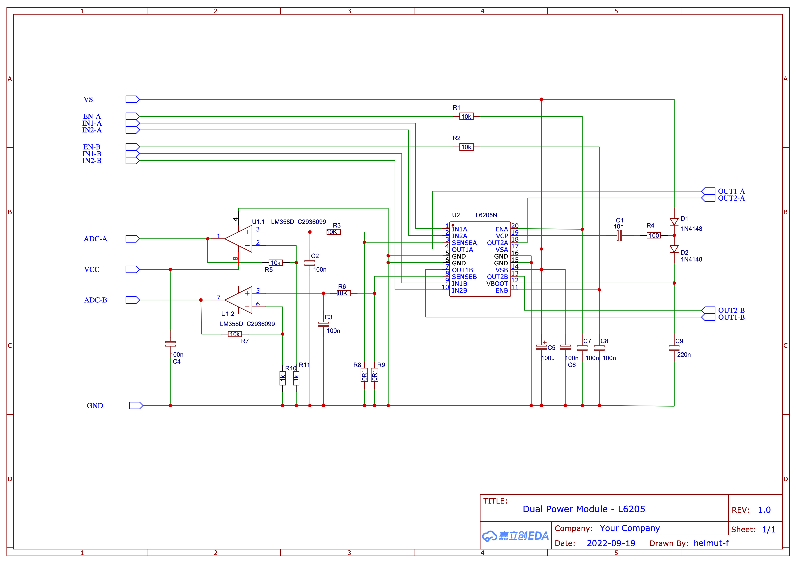

When building a base station, one h-bridge is used or the main track and the other for the programming track. The programming track that actually would need a much lower current, why use a design with two equally powered H-bridges? One answer is that you can get such an ICs with two H-Bridges inside. The other answer is that a design with two equal H-Bridges would allow for an interesting feature. Imagine you could feed the main track signal to both the MAIN and the PROG track. A locomotive could drive under its own power onto the PROG track, which is acting as a MAIN track section. Then the DCC signal is switched back from MAIN to PROG and the locomotive configuration can begin. Now, the same could also be accomplished with some relay based logic, but wouldn't this be an elegant approach? More on this idea in the base station chapter.

### *Mono Power Module - L6205*

The L6205 dual bridge can also be used for a DCC booster hardware module with a higher amperage output. By now, the basic parts of the schematic shown below should be familiar at a high level. The L6205 chip allows to combine the two H-Bridges to deliver up to 5.6Amps. All else is fairly identical to the dual design discussed before.

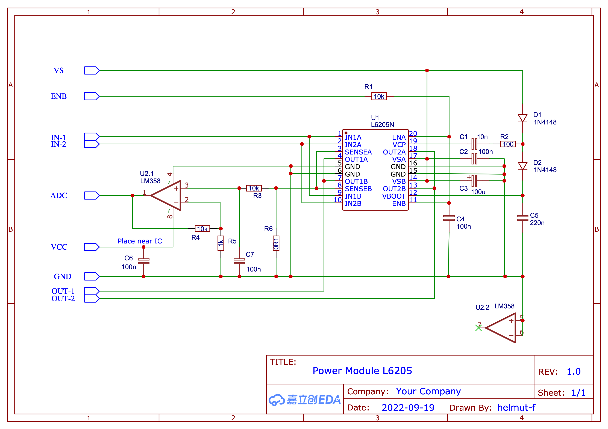

There is a smaller cousin, the L6225, which delivers two times 1.4 Amps or 2.8 if the two bridges are combined. The electrical control signals and the Pin layout are identical, so it is a good candidate for a smaller mono or dual power module.

### *Power Module - Breakout Boards*

There are a lot of power module boards readily available. There is a popular Arduino shield version built around the L298 chip that can directly put on top of an Arduino UNO or MEGA. Just to name one. There are also breakout boards that deliver really high power levels, easily up to 10 or more Amps, at a very low cost. There is one very popular bridge out there built upon the BTS7960 half bridge, which is rated up to 30A. There is even a Arduino UNO shield available using the BTS7960 chips. Well, 30A is perhaps a bit too much for a model railroad unless you want to weld engines to the tracks in case of a short circuit. Depending on the breakout board used, some "glue" logic to match our DCC signal standard and a current consumption measurement logic needs to be added. The appendix has a section that describes the PCB layout for an empty board with just the connectors. This board can be used to piggyback a power module breakout board on top.

### *Summary*

This chapter presented a basic track power module designs. It contains a H-Bridge and a means to return a voltage proportional the current consumption. Depending on the model scale and the layout size, power modules are found in base stations, boosters and block controllers. For interoperability, a power module building block is expected to accept the control signals commands via the digital control lines defined. Any new H-Bridge design needs to make sure that it supports the defined control signals.


<!--------------------------------------------------------------------------------------------------------->
<!--------------------------------------------------------------------------------------------------------->
<!-- Chapter - Railcom Signal Detector -------------------------------------------------------------------->
<!--------------------------------------------------------------------------------------------------------->
<!--------------------------------------------------------------------------------------------------------->

<div style="page-break-before: always;"></div>

## *Railcom Signal Detector*

Although a standalone component, the RailCom detector is typically a part of the power section. It sits between the power module and the track. DCC is a broadcasting protocol. To address programming engines on the MAIN track the problem of providing a back channel had to be solved. First, the DCC signal generator needs to be able to include a cutout period in the bitstream. As shown in the DCC subsystem chapter, the cutout period happens right after the last bit of a packet sent as part of the preamble section of the next packet. The power module short circuits the track during this period. The decoder uses the period to send a short bit stream which in turn is detected by the RailCom detector. This section will just discuss the hardware part for receiving the RailCom bitstream in the cutout period. There is of course a software part that receives and decodes the RailCom datagrams. The details of RailCom message processing are described in the base station chapter.

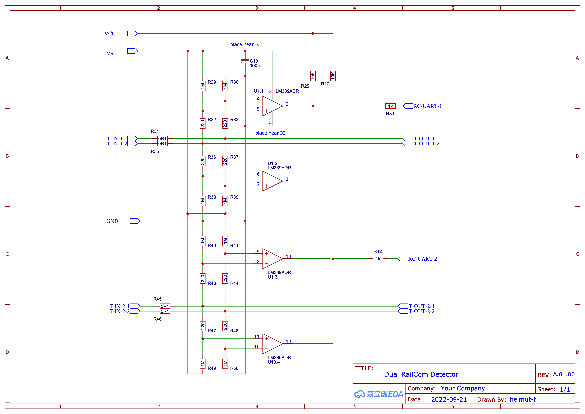

The above schematic shows a dual RailCom detector. As we will see in the block controller chapter, there is the requirement to have two or even four such detectors on one board. This allows for using chips that have four comparators, as shown here. If only one channel is required, a schematic with for example an LM393 would be the solution. The principle of operation is the same. All the examples will rest on the cutout capability of the power module and the detector circuitry shown here.

### *Summary*

The RailCom channel was an important addition to the DCC standard. With RailCom capable decoders data can be queried and set while the engine is on the main track. This chapter showed a simple building block that allows to detect a RailCom stream. It is actually a very modest hardware addition, so that each H-Bridge delivering DCC signals should be equipped with such a detector. We will make use of this building block for all power modules found in the base station and block controller designs.

<!--------------------------------------------------------------------------------------------------------->
<!--------------------------------------------------------------------------------------------------------->
<!-- Chapter - The Base Station --------------------------------------------------------------------------->
<!--------------------------------------------------------------------------------------------------------->
<!--------------------------------------------------------------------------------------------------------->

<div style="page-break-before: always;"></div>

## *The Base Station*

Take a deep breath. We are about to put together out first major LCS hardware module. The previous chapters introduced the message format and protocols and the core library for implementing the event system as well as the running equipment based on the DCC signal standards. Next, we took a closer look on the major hardware building blocks and power module designs. Just like the LCS core library allows to build a node specific firmware on top, the hardware building blocks are the foundation to build the required hardware modules. We also looked at how one would go after designing the node firmware in general. So here is the first and most important hardware module putting it all together. The base station. Every layout needs to have some kind of a base station that acts as the central place for layout control and signal generation.

Looking at the market, there are plenty of so called base stations. They typically offer support for several standards and communication protocols, such as DCC, mfx, LocoNet, a Can Bus, a S88 sensor bus, and so on. Most base station also have the power module directly integrated. They support the configuration of locomotive and stationary decoders. In short, a one stop all round solution. Their price range is around few hundred Euros. With the advent of Arduino, Raspberry and other controllers there are numerous do it yourself solutions. Just to name one, the DCC\+\+ Arduino base station with a motor shield as a power unit, gets you a base station for well under hundred Euros. The excellent work of the JMRI community to provide a DCC\+\+ interface for configuration software and other utilities to use this inexpensive base station hardware. The DCC-EX group extended and stabilized the original DCC\+\+ work for a wider range of controllers but also with new capabilities. There are many such great projects. The appendix provides some links and pointers to this work.

### *Key Requirements*

Our base station needs to deliver the following capabilities. At first it needs to be able to assemble the DCC packets and generate the respective DCC hardware signals. This work is split into the base station producing the signal content and the power section driving the hardware. Furthermore, the base station needs to provide a way to manage several locomotive sessions. For each active session the current state of the locomotive is maintained and the DCC packets are produced. When a new locomotive session is established, a dictionary of locomotives could be consulted about the particular locomotive to get the initial function settings, and so on.

A base station implementing locomotive session and track management should also implement a serial command interface for managing a session or sending commands to a locomotive. Although not really necessary, it is very beneficial for testing and debugging. But also, programming DCC decoders will need some form of getting the configuration data to the decoder. There are great openSource tools out there which make use of an ASCII interface to send their commands. An example is DecoderPro from the JMRI teams. It features among other protocols the DCC\+\+ ASCII interface to send and receive commands. Our base station will therefore implement the relevant DCC\+\+ commands.

All configuration settings, such as the number of concurrent sessions or the current consumption limit for a track, should be available as attributes on the node itself and ports. A track should be represented by a port, so there will be a port for controlling the MAIN track output, and a port for controlling the PROG tack output.

Finally, the firmware for the base station could also host LCS management functions, such as a configuration database or display data about layout operations. This is not per se a function of the base station, but as each layout needs to have a base station and perhaps display high level status data, it is a convenient place to put central functionality there as well. this subject will be discussed in another chapter, this chapter will focus on the core base station features.

### Module hardware

The base station is essentially based on a main controller board and a dual power module unit shown in previous chapters. We will use the PICO controller version and the dual H-Bridge building block. Add the RailCom detectors and stir the whole soup for a while. The extension connector of the base station would still export the I2C interface and the DCC signal produced by the base station. So, adding an I2C based extension board for display, switches, etc. is of course still possible. Here is the schematic for the base station. The individual building blocks should be familiar by now. The first page shows the main controller parts. Note that it needs fewer level shifters, as most of the signals are consumed internal to the board.


The Raspberry PI Pico has enough capacity to implement the CAN bus protocol directly using one of the cores. As a result, only the line driver is necessary to implement the CAN bus interface. There are the level shifters for the I2C bus and a few other external signals. The Power supply needs to have a method to detect that there is an USB cable connected to the PICO and ensure that there is no conflict between the power sources. Like any LCS node, the controller needs a non-volatile memory. The base station features two chip slots with each slot hosting an I2C type NVM with up to 128Kbytes. The key reason for such a high capacity is that a base station might store a lit of data for each engine that it can manage.

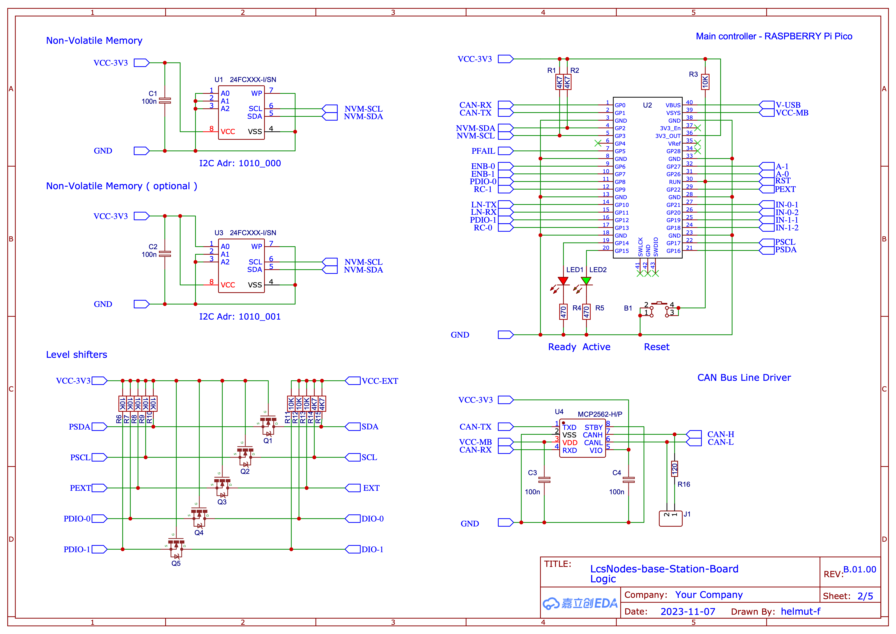

The next part shows the power module and RailCom detector unit. The power module exports the DCC signals via the external track power connectors and also as part of the LCS message bus connector connector. The track power extension connector is used by extension boards that directly use the H-Bridge output. A good example is an occupancy detector board which takes the DCC outputs and routes them to different sections, each equipped with a detectors for power consumption on the track. The power module unit features two identical channels. They are labelled "MAIN" and "PROG". Although the "PROG" channel would not need to deliver a high amperage, the dual H-Bridge is there anyway. And as said before, it would be nice to dynamically treat the PROG track as a type MAIN track too. Both channels therefore also feature a RailCom detector. Refer to the base station firmware chapter on what we actually do with a RailCom detector.

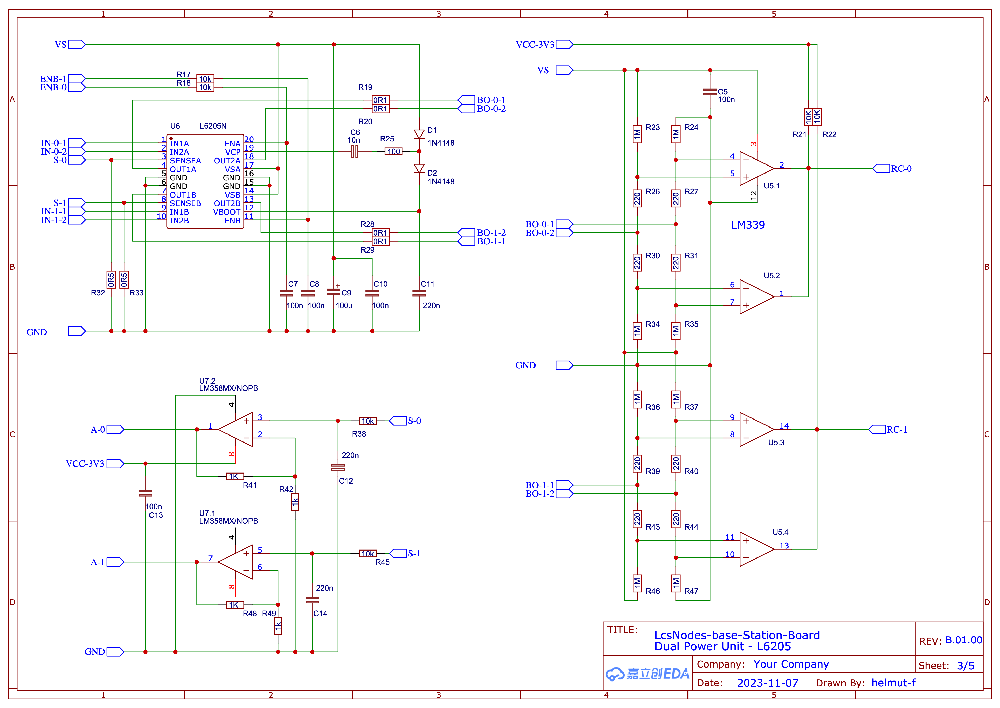

The base station will also offer an optional LocoNet interface. One day. LocoNet is very popular communication network for model railroads and there are a lot of devices such as Cab Handhelds that connect to the LocNet bus. Wouldn't it be nice to just connect these handhelds and alike via the LocoNet bus such that they can be used as well ? I guess it would. Right now, this is work in progress, but let's already reserve the the space on the board. Here is a first sketch of the interface.

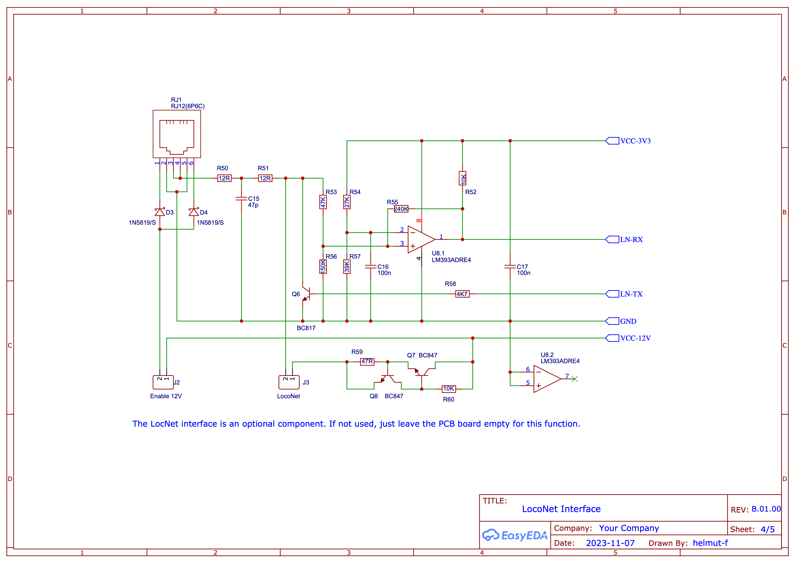

Finally, there are the connectors and the power supplies. While the LCS node runs with 5V as before, the LocoNet interface will offer 12V on its bus to connected devices. This part is also optional if LocNot is not implemented. In addition to the basic connectors that we have as part of the LCS node design, there are also two power connectors for the two tracks.

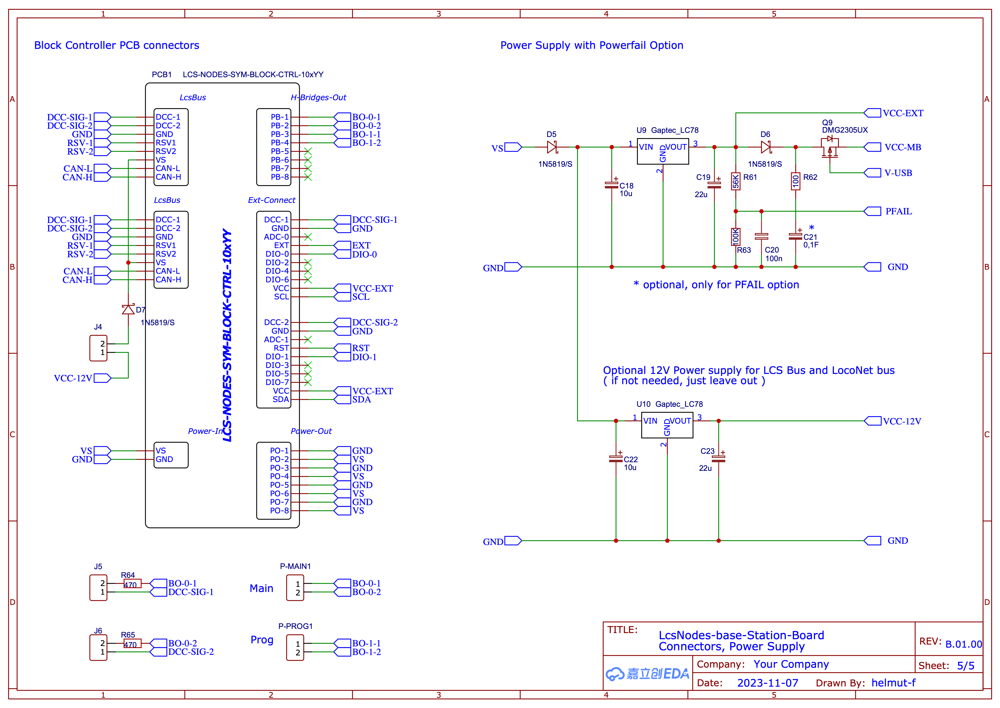

Like the main controller, the monolithic base station board makes extensive use of SMD parts. While the previous boards have already been using passive SMD parts such as capacitors and resistors, this board also make use of SMD ICs. The exception is of course the Raspberry PI PICO board and the Dual H-Bridge IC L6205. The H-Bridge is a high power part and in case of a hardware problem it can easily be replaced as a DIP version.

### *Base Station PCB*

The following picture shows the PCB for the monolithic base station. It is a 12cm by 10cm board, with the standard connectors in the usual place. As said, the LocoNet Interface is optional. Each LCS node needs at least one NVM chip. The second is optional too.

<!-- using specific picture size goes like this ... -->
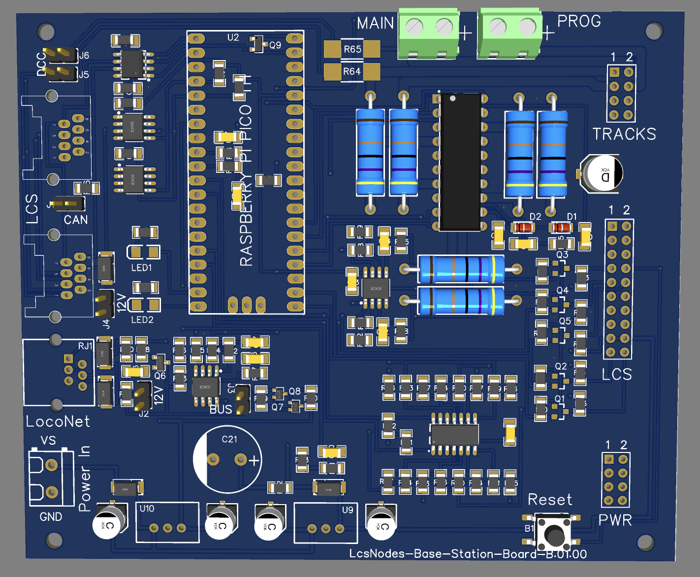

### *Summary*

The base station, no matter how it is implemented, is a key component in any digital layout. It is primarily responsible for the locomotive session management and track signal generation. There could be designs where the base station is a device in a nice housing with a display, switches and so on. Other designs just put the LCS node somewhere on the layout. All these options will work just fine. And just like any other LCS node, the base station firmware offers through node and port attributes status and control functions.

The base station was also the first major LCS node with a considerable amount of hardware and software and thus went to several iterations and a considerable amount of learning curves. The very first version started with an Arduino Mega and Motor driver breakout board. The software was the original DCC++ software. The next versions actually were just a refactoring effort and work on the software. I learned a great deal on how all this works. The next base station version was a single board with all possible interfaces on an experimental PCB. It already featured CAN BUS, dual H-Bridges, and a controller, the Atmega 1284. This board served a long time for software development and further experiments. The next version of the base station was built with a main controller PCB described in the earlier chapters and a dual power unit, that also featured the RailCom detector. And again further software refactoring, refinement and learning. Finally, after a switch to the Raspberry Pi Pico controller, first on breadboard  then on PCBs, the base station shown in this chapter is the current version. The lessons learned proved to be very valuable for the overall concept development and hardware design. And in addition, there was a great deal of reading on chip specifications and, very importantly, the DCC standards. The appendix contains a list of material and web links. I highly recommend to read the electrical and DCC related standards published by the RailCommunity organization.


<!--------------------------------------------------------------------------------------------------------->
<!--------------------------------------------------------------------------------------------------------->
<!-- Chapter - Base Station Firmware ---------------------------------------------------------------------->
<!--------------------------------------------------------------------------------------------------------->
<!--------------------------------------------------------------------------------------------------------->

<div style="page-break-before: always;"></div>

## *Base Station Firmware*

With the base station hardware in place, let's look at the firmware. First of all, the base station is just another LCS node and rests on the LCS runtime library. On top there is the locomotive session management, the DCC track power management, the DCC signal generation logic, and finally the RailCom communication interface. Being an LCS node, there are attributes and functions to control the base station through node and port items.

The base station is rather complex node. Especially the DCC signal generation requires the node to be very close to the controller chip capabilities. The individual parts will be described in the following sections. From an overall firmware perspective, the base station does its work in a functions that is called periodically from the LCS core library. The difference to other nodes is that the key work of producing the DCC signal is interrupt driven. There is a central timer that interrupts whenever the signals need to change their value is the central heartbeat of the node. Also, analog values are read with a start routine and an interrupt completer. The same is the case for the RailCom UART input. Everything that is part of the interrupt driven signal path will also just use interrupts for asynchronous execution. All else takes place outside the interrupt routines and is rather straightforward.

The base station module firmware is divided into a couple of key software modules. Let's start with locomotive session management.

### *Locomotive Session Management*

The base station maintains a list of all active locomotives. Before controlling a locomotive or a consist, a session needs go be established. Once the session is place, LCS DCC commands such as set speed, direction and functions, are translated to the respective DCC packets according to standard. In addition, the standards require a periodic refresh of this data. The base station session management code will just run through the active sessions and issue the necessary DCC commands. Another key part of the base station functionality is the ability to configure a DCC decoder. Typically, the locomotive is put alone on special section of track. The configuration command will set CV values in the decoder. To configure a locomotive on the programming track, no session is actually required. As programming an engine is in the end also just a matter of sending DCC packets, the functionality is part of the session management object.

Locomotive session management is closely interacting with the DCC track management object. The primary task is to put the DCC packets generated out on the track. Also, for programming a DCC decoder, the CV value configuration requires the detection of a change in track power current consumption. The design separates the signal generation from session management. The key linkage is the submission of a packet. As we will see in the track management section, the signal generation is a typical timer interrupt driven game. Whenever a new bit should be sent to the tracks, the interrupt handler sets the signal lines which drive the power module and sets the timer values when to become active next. There are designs out there that let the interrupt handler also directly interact with the session table to get the next bit from the current packet. Our route is a clear separation of both parts. All locomotive session management does is to produce the packets and submit them. Putting bits out from a DCC packet is the duty of the companion module DCC track management.

As the layout and the number of running engines grows, the DCC bus may reach its limits. There are roughly about 100 DCC messages that can be sent to the track per second. Using the DCC track just for running engines already helps greatly. But if the base station has to deal with hundreds of locomotives, a priority management of what packets go in which order is perhaps required. The simple approach of the locomotive session just sending out the DCC command needs to be replaced with a more clever refresh scheme. For example, deceleration commands need to be given a higher priority than acceleration commands. It is more important to stop an engine than to accelerate one. The function refresh option needs to interleave speed and function group refresh commands to guarantee that the speed command is repeated often. A loco with a speed of zero, has rather low priority, the engine is not considered active. The DCC standards require that each active decoder, i.e. a decoder with a loco that has a non-zero speed, is refreshed at least every 2.5 seconds.

In general, base stations are required to send a valid DCC packet every 30 milliseconds to indicate that the DCC protocol is still active. Further more, there should be a time gap of at least 5 milliseconds between two packets addressing the same decoder. The base station itself is required to send every 5 seconds what its capabilities are. For example, the base station can broadcast that it supports 128-step speed setting. There are also attributes for stationary decoders as well. Finally, the base station broadcasts a "layout" time. This can be used by all decoders to simulate timing aspects of their features.

// ??? **note** update the following paragraph when the session management refresh work is implemented... we need a more global approach to periodic work in the code ...

Right now, the scheme is simple. A DCC management LCS message directly results in the DCC command sent to the track. The refresh function just advances through the session map and emits a DCC refresh packet for each active session. More experience with a really large layout is needed before changing this simple approach.

### *Base Station Global Functions*

In addition to locomotive session management and the DCC track management, a base station is also responsible for global data such as the system data and time. Each decoder can make use of this "layout" time. The base station is required to send out this information periodically. Furthermore, the base station needs to broadcast what global capabilities and configuration options are available. For example, the base station will communicate which standards are supported, whether it supports a 128-step speed setting or not, wether  programming on the main track is enabled and on on. The base station is required to send this kind of information every 5 seconds.

### *Locomotive Session Management Attributes and Functions*

Locomotive session management presents itself through a set of node attributes and functions.

// **note** fill in what we can access through the node/port interfaces

|Item|Arguments|Purpose|
|:--|:--|:--|
| ... | ... | ... |

### *DCC Track management*

Here we are with a stream of DCC packets send by the locomotive session management. To get the DCC packet actually onto the track, DCC track management component has two key functions. There is the signal generation part and the track power management part.

#### DCC Track Signal Management

The base station produces for the main track and programming track the DCC signal. To recap, the DCC ONE bit is a square wave signal with a period of 58 microseconds, the DCC ZERO bit a square wave signal with a period of 116 microseconds. A signal generation logic could thus think in "ticks" of 58 microseconds. However, when implementing RailCom support a cutout period needs to be added. This period starts with a 29us ONE followed by the cutout period itself, followed by 29us ZERO to complete the cutout. Luckily, 29 is two times 58. A DCC "ONE" is therefore two ticks of 29us "+" follow by two ticks of "-" on the signal generation lines.

// ??? **note** repeat the DCC picture here ? NO. make a new picture... ( signal, cut, Z-blackout, etc ).

The software implementation used in the base station consists of a track signal state machine and one timer that can be scheduled to interrupt in multiple of 29 microseconds. Whenever the interrupt happens  the interrupt logic first sets the new signal levels and then computes the next interrupt timer value in ticks. Since we have two tracks and control both state machines with one timer, the next time to interrupt is the smaller number of ticks for the two tracks. For example, if one track is scheduled to change the signal level in 2 ticks, the other track in 4 ticks, the interrupt timer is set to interrupt again in 2 ticks. At that time, the track that wants to be interrupt in 4 ticks, does nothing but to decrement the tick interrupt count to 2.

Running both state machines with one timer also requires that we split the work of the state machine in two parts. First, each state machine takes care of setting the hardware signal levels. It is essential that both tracks get their signal marching orders as soon as possible to maintain an accurate DCC signal timing. But there is more work to do. Each track state machine can therefore might request some further work. For example, we need to get the next DCC packet bit and if all bits are processed the next DCC packet lined up for transmission. Once both state machines have set their signal levels, the follow up actions are processed.

In addition to getting the next bit or packet, there is the requirement to measure the actual power consumption. Power consumption measurement is essentially measuring a voltage using the ADC hardware the controller. The AtMega does have multiple ADC channels, but can use only one channel at a time. The DCC track signal state machine will thus in a conflict prefer to measure the main track. There are a couple of ways where this measurement can be done. The easiest is to just sample the current consumption in sync with the DCC signal and store it away. The LCS base station power module does this during a DCC ZERO bit in the middle of the first half wave period. The value is stored in the DCC track object, overwritten each time there is a measurement. Depending on the packets content a few hundred sample will be taken per second.

While this approach will work fairly reasonable, there is a hidden challenge though. The measurement will sample what the current consumption is. And this consumption depends on the actual power drawn by the decoder. Since decoders typically drive the engine motor with a PWM signal, it matters when the measurement is taken. With a decoder with a low PWM frequency there is a good chance to measure during the "off" period of the PWN signal. It will be therefore be important to measure very often and compute a mean value, for example a Root Mean Square" value, across a significant sample of measurements. However, we need to make sure that the controller is not overwhelmed with all the processing that needs to be done. Our approach is to measure quite often and store the digital values. Short circuit detection and also a simple high water mark computation can be be done with little overhead. Only when an RMS value is needed, the square root of the sum of squares of our samples is computed and converted to milliAmps. Note that that the RMS computation is done using 16-bit unsigned integers. This is little less precise compared to a floating point value computation, but the performance gain from using integer math justify this moderate imprecision.

#### Track Signal management using Raspberry Pi Picos features

The Raspberry PI Pico has a very powerful feature, which are the PIO state machines. Rather than offering various IO interfaces and protocols in dedicated silicon blocks, the PIO state  machines are programmable IO controllers. One idea is to just implement the DCC output though a PIO program. A tempting project.

However, right now the SW state machine described before will just work fine and do the job for both controller families. May some time later.

#### Track Power Management

In addition to the signal generation state machine, there is a track power state machine. This state machine runs periodically and checks for power overload. When the power consumption exceeds the configured limit, the track is shut down. After a short period of time restart is attempted. If the restart leads again to a power overload and this happens for several attempts, the track is shut down permanently. Manual action is necessary.

For the programming track, the power consumption measurement plays another very important role. A decoder to be programmed using the CV value access DCC packets can only answer with a temporary raise of its own power consumption. The standards defines a raised current consumption by 60mA for 5 to 7 milliseconds as a positive acknowledgement. Accessing a CV variable consists of sending a sequence of DCC packets. First there is a set of RESET packets, followed by the CV commands, followed by RESET packets. During the first RESET packets, the power consumption is measured and a baseline for a "normal" decoder power consumption is established. When the decoder later answers to a request by raising its power consumption this baseline is used to detect it.

With RailCom implemented, a decoder can also be configured using the programming on the main (POM) DCC commands with status and data reply via RailCom datagrams. More on this in a later section.

#### Base Station Dictionary

Another software component typically found in base stations is a dictionary. For each locomotive there is a dictionary entry that describes this locomotive. When a session for that locomotive is allocated, this entry is consulted and initial values for speed, direction and other functions are set.

// ??? **note** we just do locos. How to put data in and read data out ?

|Item|Arguments|Purpose|
|:--|:--|:--|
| ... | ... | ... |

### *DCC Track Management Attributes and Functions*

// **note** fill in what we can access through the node/port interfaces

|Item|Arguments|Purpose|
|:--|:--|:--|
| ... | ... | ... |

### *RailCom Support*

For RailCom support the power module is directed to short circuit the track for a defined period before working on the next packet. The DCC decoder in the locomotive will detect this short circuit or cutout period and send a RailCom datagram. During this period the controller attempts to read in the datagram bytes from the serial I/O input line. Both analog measurement as well as serial I/O reading for RailCom are implemented as a setup the request routine followed by an interrupt routine that processes the results in as little as possible time. After all, our key priority is the correct DCC signal timing.

### *RailCom Support Attributes and Functions*

// **note** fill in what we can access through the node/port interfaces
// **note** channel one will always fill a port variable with what ever the loco ID currently is. Can be read by all nodes...
// **note** channel two will essentially invoke a callback to deal with the data received on a POM/XPOM request.


|Item|Arguments|Purpose|
|:--|:--|:--|
| ... | ... | ... |

### *LocoNet Support*

// ??? **note** under investigation. We would need a library to send and receive the locoNet messages. We also would need a higher level piece to "understand" these messages and translate them to LCS messages. From a HW perspective, perhaps one PIO block of the PICO is needed to implement a UART, as the two UARTS are used for RailCom already... in other words a bigger research project :-).

### *Base Station Serial Commands*

In addition to the LCS core library serial commands available to any node, the base station implements a serial command interface which accepts a subset of the DCC\+\+ / DCC-EX commands. As a short introduction, DCC\+\+ was an implementation of a DCC base station using an Arduino Uno and a motor shield. For a very small budget and with little effort, the world of DCC opened up to everyone. Part of the DCC\+\+ system is an ASCII interface to send commends to the base station. Not only is this command line feature useful for debugging the base station code, it is really valuable when interfacing to tools such as Decoder Pro provided by the JMRI organization, which implemented an ACCI interface to DCC\+\+. The command listed in the table below are an accurate implementation of the original DCC++ commands. In addition some commands have been added.

| Command | Arguments | Reply | Operation |
|:--|:--|:--|:--|
| O | cabId | | allocate a session for the cab|
| K | sessionId | | release a session |
| t | sessionId cabId speed direction>| | set cab speed / direction|
| f | cabId funcId val | | set cab function value, function group DCC format |
| v | sessionId funcId val| | set cab function value, individual |
| R | cvId callbacknum callbacksub | | read CV byte on the programming track |
| W | cvId val callbacknum callbacksub | | write CV byte on the programming track |
| B | cvId bitPos bitVal callbacknum callbacksub | | write CV bit on the programming track |
| b | cabId cvId bitPos bitVal | | write CV bit on the programming track |
| w | cabId cvId val | | write CV byte on the operations track |
| M | sessionId byte1 byte2 [ byte3 ... byte10 ] | | send DCC packet on operations track |
| P | sessionId byte1 byte2 [ byte3 ... byte10 ] | | send DCC packet on programming track |
| X | | | emergency stop all |
| 0 | | | turn operations and programming track power off |
| 1 | | | turn operations and programming track power on |
| 2 | | | turn operations power on |
| 3 | | | turn programming track power on |
| a | [ opt ] | | list current consumption, where opt=0 -> MAIN (default ), opt=1 -> PROG, opt=2 -> both |
| C | [ option ] | | set options for the track. 0 -> set service track in operations mode, 1 - > set service track in service mode, 2 -> enable RailCom, 3 -> disable RailCom |
| s | [ level ] | | list status at detail level, default is summary. 0 -> summary, 1 -> configuration,  2 -> session map |
| S | | | list base station configuration |
| L | | | list base station session table |
| D | | | enter diagnostics mode - need to restart later! |
| ? | | | list this help |

### *Summary*

// ??? **note** wrap it up ..

Just like any other LCS node, the base station firmware offers through node and port attributes status and control functions. However, there is only one on the layout.

The base station was also the first major LCS node with a considerable amount of hardware and software. Initial work started with the main controller and power module extension board based on the Atmega processor family. From there, a monolithic version using the Raspberry PI PICO was developed and that is the latest base station offering.

What is next ?. Well, we have a base station and with the simple command interface it is possible to open a loco session and control that engine. But this command interface is rather for software development and debugging. What we really want is of course a handheld of some form with buttons and levers. So, before building boosters, block controller and extension boards and firmware, the next chapters will develop a handheld. 


<!--------------------------------------------------------------------------------------------------------->
<!--------------------------------------------------------------------------------------------------------->
<!-- Chapter - The Cab Handheld --------------------------------------------------------------------------->
<!--------------------------------------------------------------------------------------------------------->
<!--------------------------------------------------------------------------------------------------------->

<div style="page-break-before: always;"></div>

## *The Cab Handheld*

Cab handhelds are used to control a locomotive. Depending on the other capabilities they can also configure a decoder device or set a turnout. Handhelds are connected to the bus, for example LocoNet, sometimes there is a separate bus for just the handhelds. Traditionally a cable connects the handheld to access points on the layout. Just like it is the case for base stations and boosters there is no shortage of cab handhelds. Lately, wireless handhelds have become very popular. And not to forget, some base station integrate handhelds directly in their front panel.

This chapter will describe a general handheld to just control locomotives. It directly connects via cable to the LCS bus and provides the generic elements to specify the locomotive to operate, set the speed and direction as well as the function keys. Implementing a base station and a handheld is all you would need to run an engine and finally see something for your hard work of building a layout system. The cab handheld described first is a board for developing the firmware. Nevertheless it can be used as a full functioning cab handheld. Later version will build upon the firmware but use a more handy form factor.

### *Requirements*

A cab handheld needs to be able to control the loco. This implies that there is a local non-volatile memory that allows to remember locomotives once controlled. This way one can easily switch between a small set of locomotives and their characteristics. A display will show the actual state of cab handheld and allows together with the configuration buttons to configure the cab handheld. Looking at commercially available handhelds, they all seem to resemble TV controls. A numeric keyboard, some up and down buttons and the speed knob. ( No offense ). In all fairness, they are built to control not only the engines but also the rest of the layout.

But how about a cab handheld that features instead of all the functions to control an entire layout just the features to control an engine. Our cab handheld will have dedicated buttons and levers for let's say a horn or whistle, a bell, and so on. There are also configuration buttons, dedicated buttons and switches, and a very small set of buttons to map to loco specific functions. Furthermore, there is of course the rotary knob for setting the locomotive speed. The following figure shows a rough sketch of the cab handheld elements.

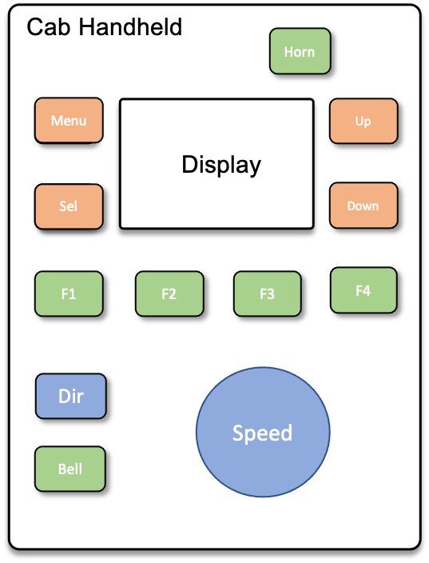

Configuration and part of operation takes place with four buttons. The MENU button allows to toggle through the menus defined. To select a menu, the SELECT button is used. The menu toggle and select scheme can be nested. Within a menu screen, the MENU, UP and DOWN buttons are used screen specific and the SELECT button typically confirms the selected action. The direction switch ( REV-NEUTRAL-FWD ) and the SPEED knob set the speed and direction of the locomotive or consist. F1 to F4 are four general buttons that can be mapped to special functions of the particular locomotive. The Horn and Bell button are rounding up the initial design.

<!--------------------------------------------------------------------------------------------------------->
<!--------------------------------------------------------------------------------------------------------->
<!-- Chapter - Cab Handheld Firmware Development Platform ------------------------------------------------->
<!--------------------------------------------------------------------------------------------------------->
<!--------------------------------------------------------------------------------------------------------->

<div style="page-break-before: always;"></div>

## *Cab Handheld Firmware Development Platform*

A cab handheld as shown in the sketch above consists of the controller portion and a set of buttons and dials. Usually, for the very first steps in firmware design a breadboard implementation of the hardware is used. But why not just create a PCB with all the user elements on it? From experience with breadboards, this setup is by far more robust and you will not chase firmware bugs that turn out to be just a loose connection on a breadboard. This is by the way a lesson learned. With the very reasonable prices for a PCB board, it is almost easier to build a PCB rather early in the design phase and if it has an error, just correct it and order another set of PCBs. Although one could also build the module on a an experimental PCB board, having the schematics done, it is a small step to a dedicated PCB. Definitively worth the small extra effort of making a robust prototype PCB. The following schematic shows the extension board developed for the can handheld firmware development. First, here is the block diagram.

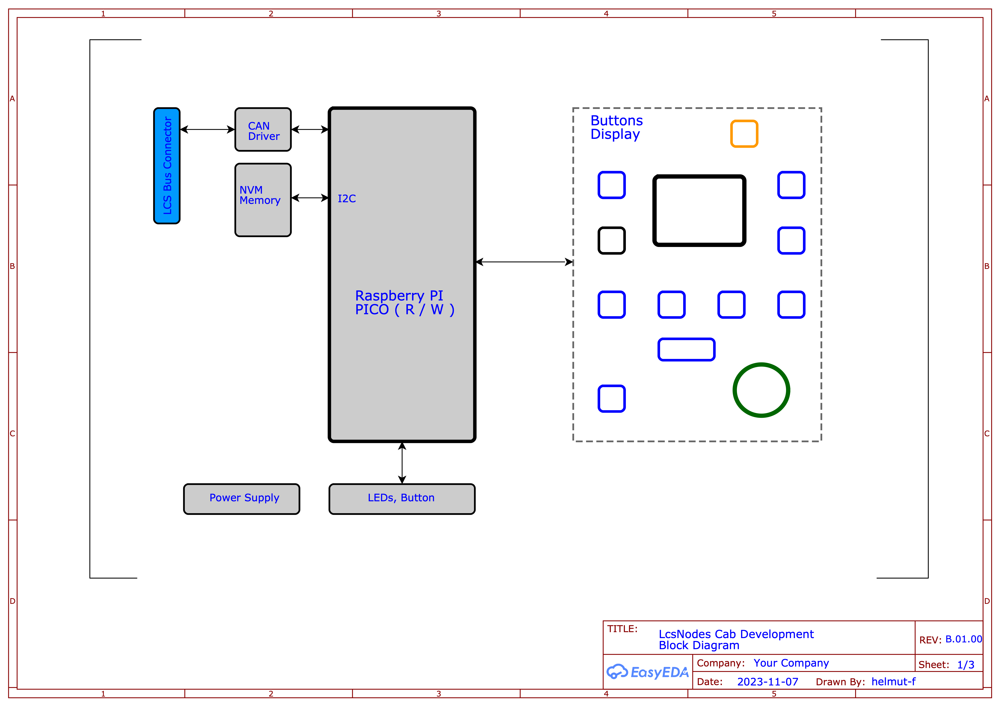

There is essentially a main controller part with the Raspberry Pi Pico, a CAN bus interface and the non-volatile memory. This part should be very familiar by now. Besides the two I2C connections and the CAN bus pins, almost all GPIO pins are dedicated to a button or encoder. Since the GPIOs can be configured with internal pull-up, no external resistors are necessary. The power supply will be fed from the LCS bus. The whole board can also be fed from the USB port of the PICO. Again, this is very handy for initial debugging the firmware. The LCS Bus connector will connect the cab handheld to the LCS layout. We use only the CAN Bus lines and optional the power line input.

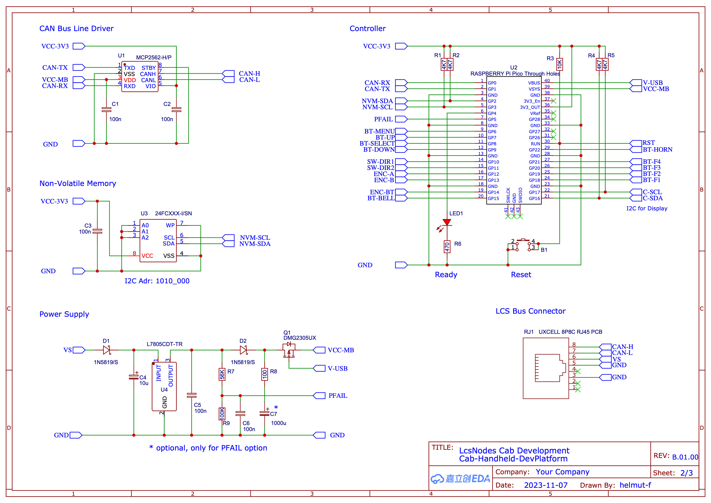

Finally, there is the part with all the buttons, encoders and the OLED Display. The following schematic completes the cap handheld schematic for firmware development.

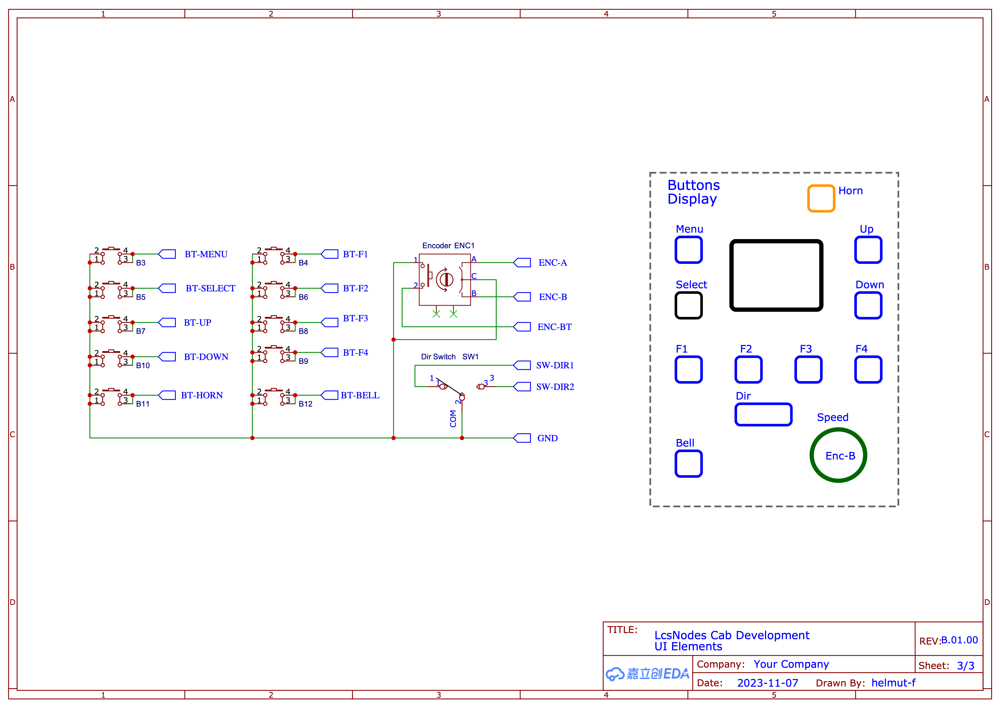

Granted, it is not really a cab handheld to hold in your hands. Although the final version will have pretty much the same hardware ingredients, the form factor needs to be different. But for development, the setup will be quite helpful and robust. You will avoid chasing software problems that turn out to be just a loose connection on a breadboard. The following figure shows the development cab handheld as a nice 3D picture to show the components.

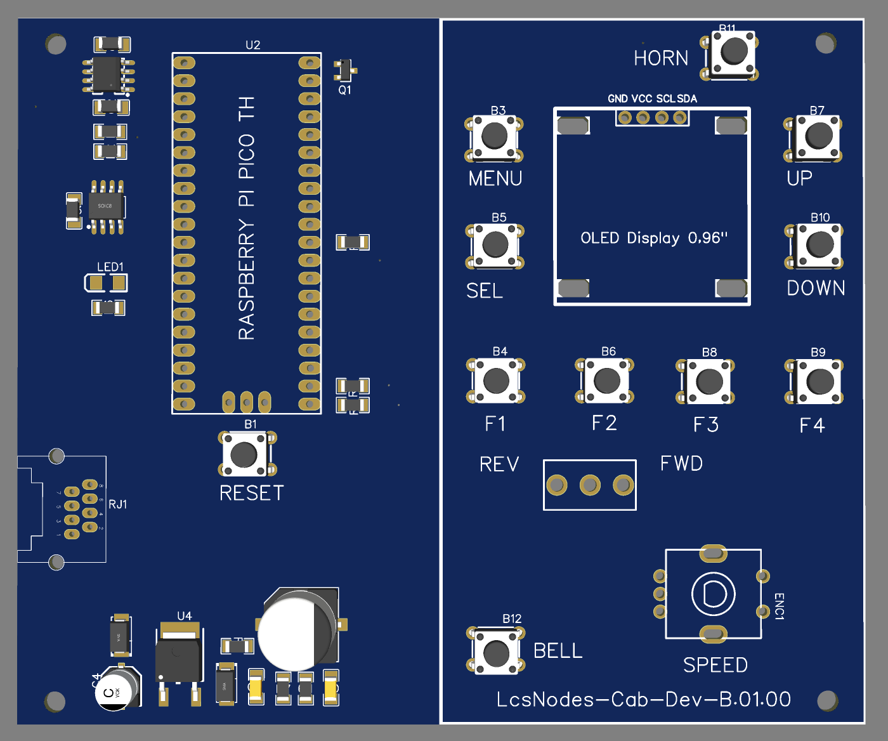

The board is a 12x10cm PCB with all the necessary buttons and switches and resembles roughly the initial sketch shown before. The right side contains the electronics and the left side arranges the elements just like a handheld would roughly look like. All elements are labelled with their function. Again, it is a full functioning cab handheld, although a bit clumsy for holding in our hands. The next section will show how the cab handheld truly becomes a handheld device.

<!--------------------------------------------------------------------------------------------------------->
<!--------------------------------------------------------------------------------------------------------->
<!-- Chapter - A basic Cab Handheld ----------------------------------------------------------------------->
<!--------------------------------------------------------------------------------------------------------->
<!--------------------------------------------------------------------------------------------------------->

<div style="page-break-before: always;"></div>

## *A basic Cab Handheld*

As the name already suggests, the cab handheld is a handheld device with several buttons and a display. To keep it a compact design, we will use both sides of the PCB. The upper side contains the buttons, switches and display, the lower side contains the controller components. The cab handheld will connect via a cable to the LCS bus. Power comes from the LCS bus power lines and the CAN bus interface is used to transmit the messages. Perhaps a later version will also add some WLAN capabilities. While WLAN would come pretty much for free with the PICO W, the power supply side needs to include a battery.

- a 8x12cm board, used from both sides (?)
- block diagram...
- power supply from the LCS bus lines
- controller, a PICO
- small display
- rotary encoder, switches, buttons, etc.
- a subset for analog ?

// ??? **note** to do ..... focus on the firmware first ...

### *Summary*

As always, there are many options to build a cab handheld. Although this version connects via cable to the LCS Bus, a wireless version is not hard to build. Having more buttons or fewer buttons, having a set of numeric keypad style input, are all quite valid options. It is a matter of what is preferred. Currently, the cab handheld will not offer any controls for accessories, such as turnouts. This is a subject better left to the layout control panels and controlling software. Our cab handheld favors the approach to model more of a locomotive control stand rather than a TV remote style handheld. Since this is a matter of taste and preference, go build your own.

There is certainly the option to connect commercially available handhelds. This would require to provide a gateway from let's say a LocoNet protocol based handheld to the LCS protocol. Refer to the base station part where is shows an optional LocoNet interface. Well, one day you should be able to connect such handhelds via the LocoNet bus. But right now the topic is on the backlog list.

<!--------------------------------------------------------------------------------------------------------->
<!--------------------------------------------------------------------------------------------------------->
<!-- Chapter - Cab Handheld Firmware ---------------------------------------------------------------------->
<!--------------------------------------------------------------------------------------------------------->
<!--------------------------------------------------------------------------------------------------------->

<div style="page-break-before: always;"></div>

## *Cab Handheld Firmware*

Now that the development platform is in place, lets have a look at the firmware design. As you perhaps have guessed it, the hardware was already developed with a certain mode in mind. First of all, a cab handheld is nothing else than just another node on the LCS bus. The firmware sits on top of the LCS core library. In addition, there is another key library we have not talked about yet. A cab handheld and also any other device that allows for users to interact, needs software to work with buttons, encoders, displays and so on. This the tasks of the **UI Elements ** library. We will look at this library in a later chapter in great detail.

// ??? note perhaps a picture ?

- SW architecture on top of the LCS library
- UI is key to build a handheld
- firmware to handle the buttons, switches, display, etc. Refer to UIElements.
- issues LCS messages to the base station for speed, direction and functions
- menu descriptions

### Concepts

- a current cab and a stack of cabs to select from
- base station has the ultimate data about a cab, loaded into the cab handheld
- CabHandheld functions and DCC functions

### Screen Layout

- display has 4 lines up to 16 characters. Two fonts
- four navigation buttons, use top and bottom line, 8x8 font
- two data lines between, 8x16 font.

### Screen Navigation

- inherent in the UI Elements Screen Object design
- MENU
- SELECT
- UP
- DOWN

### Operate Screen

- main screen, workhorse
- speed, dir, functions

### Engine On/off Screen

- for diesels only

### Engine Lights Screen

- front and back lights...

### New Cab Screen

There needs to be a way to set an engine cab number. The NEW CAB screen is used to enter a cab Id and engine type. We will display 4 digits and the engine type among we can toggle with the MENU button. The UP/DOWN buttons advance the current digit position. The encoder knob offers a fast way to scroll a digit. The high value digit allows to set an "S" instead of the number to indicate a short loco DCC address. The SELECT button completes the number entering and the current cab becomes this new cab. Note, that it would need to be explicitly saved.

- works on current cab setting

### Select Cab Screen

A cab handheld maintains a stack of known cabs. That is cabs the handheld has used before and saved in the cab stack. This menu will toggle through them and select the new current cab. The UP/DOWN button is used to scroll around. In addition, the encoder knob allows to scroll a bit faster. The SELECT button will make the entry shown the current loco.

- SELECT scrolls through the cab stack and sets the cab selected as current cab.

### Save Cab Screen

The current cab can be saved in the cab stack. This menu will toggle through them and select the cab slot for saving the current cab data. The UP/DOWN button is used to scroll around. In addition, the encoder knob allows to scroll a bit faster. The SELECT button will perform the action.

- SAVE scrolls through the cab stack and saves the current cab to this slot.
- any previous entry used for the same cabId is cleared.

### Set DCC Function

The DCC standard defines a list of 69 functions, F0 to F68.

- allows to set any DCC function ( F0 to F68 )
- encoder knob for fast scrolling

### Config Cab Handheld Functions

- connects a cab handheld function to a DCC function

### Options

- all kinds of screen for configuration settings

### Diag

- all kinds of screen for technical checks and tests

### *Summary*

Phew. The cab handheld is another big step toward controlling a layout. After all, a layout control system without some form cab handhelds is not very useful. As said, there are many ways to build a cab.

- design of UI elements and firmware was greatly influenced by a handheld called ***Protothrottle***.
- The next chapter will present a diesel cab handheld that resembles a diesel cab stand from the 1950s.


<!--------------------------------------------------------------------------------------------------------->
<!--------------------------------------------------------------------------------------------------------->
<!-- Chapter - The Diesel Cab Handheld -------------------------------------------------------------------->
<!--------------------------------------------------------------------------------------------------------->
<!--------------------------------------------------------------------------------------------------------->

<div style="page-break-before: always;"></div>

##*The Diesel Cab Handheld*

The general handheld for controlling a locomotive is just one possible implementation. There is a company, Iowa Scale Engineering, that has built a handled called the ***Protothrottle***. This wireless handheld implements as the control elements the cab of a diesel engine. Wow. There is a lever for the diesel engine prime mover, a level for the direction and one for the brakes. You operate the engine with setting the prime mover notch, release the brakes and then the engine moves. When putting the prime mover to "idle", the engine just roll until you apply the brakes. In short, a much more realistic way to operate a diesel locomotive.

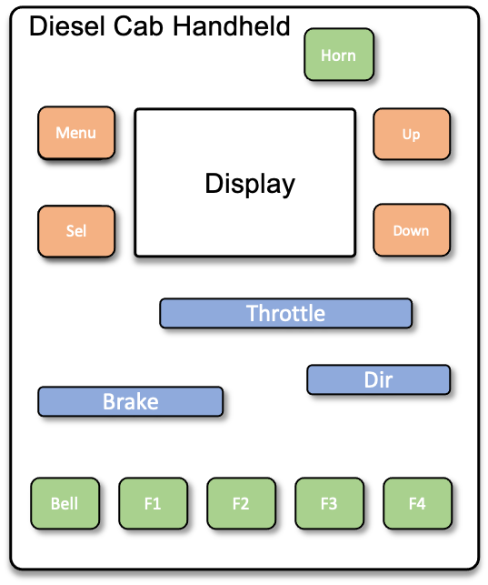

Leveraging the cab handheld hardware from the previous chapter, the diesel cab handheld just differs in the lever for throttle and brake instead of the speed knob. All else is fairly the same. Let's get started.

### *Requirements*

- Very similar to the previous cab handheld ( see the red line ? :-) )
- instead of speed knob, it features throttle and brake.
- all else is about the same...

### *Module hardware*

- Leverage the generic cab handheld
- Controller with CanBus interface
- power supply from the LCS bus lines
- small display
- rotary encoder, buttons, etc.

### *Module firmware*

- UI elements are key again, leverage many screen built before
- new part is how throttle and brake interplay to run the engine


### *Summary*

- now we have a generic cab handheld and a diesel cab handheld.
- one could come up with a steam or electric engine handheld. 
- the firmware already goes a long way to quickly realize further cab handhelds.

- would we ever build a handheld with other non-engine functionality... who knows... not right now.
- would we build a version that can be integrated into a "Stellwerk" table ? perhaps... just a main controller and an cab UI Elements extension


<!--------------------------------------------------------------------------------------------------------->
<!--------------------------------------------------------------------------------------------------------->
<!-- Chapter - Signaling Block Control -------------------------------------------------------------------->
<!--------------------------------------------------------------------------------------------------------->
<!--------------------------------------------------------------------------------------------------------->

<div style="page-break-before: always;"></div>

## *Signaling Block Control*

The previous chapters got us to understand the LCS concepts, to build LCS nodes and power units on different hardware platforms. It all resulted in building an essential piece necessary for any layout, the LCS base station. So far so good. The next big part to address is to build hardware and software to control devices such as signal, turnouts, and so on. Also, we would need to get feedback from the layout where trains exactly and what the currently do. After all, a trains needs to safely get from A to B. Before diving into block controllers, sensors and actors, here is a brief chapter on where the journey will go.

Safely getting a train from point A to B is the basic unit of work for a railway. In contrast to let's say a car, trains run on orders and there is a planned schedule. It is a planned movement. A train is also different to a car in that it cannot react rather quick to events such as a blocking signal. Try stopping a 15000 ton freight train half mile long. As a consequence, there is a concept of train authorization and train movement. The authorization represents the train order and the train movement gets the train safely from A to B obeying the rules of the signaling system. In the early days, there was one train moving from A to B and the authorization instance just authorized the train movement from A to B. A follow-on train moving from station A to station B had to wait for the complete route cleared over many miles as for a train moving in the opposite direction on a single line. With rising traffic the throughput was limited and new concepts were needed. One obvious solution was higher train speed and using two lines.

To increase track utilization, the real railways developed the concept of **signaling block control**. A route is divided into several blocks. A block has signals that indicate the state of the block ahead, if the block is occupied, the signal tells the following train to stop until the train ahead cleared the block. This way trains are protected from running into each other. In the early days the block signals where controlled manually by man living with their families in small houses built along the line, communicating the status of their block to their neighbor blocks by Telegraph. Trains had to carry red flags or lights on the last car so that man watching the passing train was sure that no car has been left in his block due to a broken coupler. Today automated block occupancy detectors are used.

With increased speed however, the status of the block signal has to be communicated to the engineer ahead, so he can  securely on the block signal. In Europe this is done by a breaking signal usually one kilometer ahead from the main signal. In the US the status of the block following the actual block is indicated by a multi aspect signal so that the engineer is alerted to expect a red signal after the green one right ahead. With modern state of the art systems the physical signals along the route have been replaced of the status of the line ahead directly to the engineers cab by radio transmission.

So in general, a route from A to B is a series of blocks each governed by a signal, which shows the state of the block ahead. A train will not enter a block that is occupied by another train. Since a train movement is a planned movement, there needs to be an authorization system that locks the rote and sends the train. Sounds straightforward for a single line between A and B. But consider a block with a turnout. In that case there are two follow on blocks, depending on the setting of the turnout. Inside a station or freight yard, this can get even more complex. On the other hand, a lot of safety is introduced into the operations of a layout. Typically, the track lines between stations are under a block control while a station or freight yard form one block under manual control. On a model railroad, such a block system does not only prevent trains from crushing into each other on track segments which can’t be seen by the operator in tunnels or "shadow yards“, but also allows a basic "automation mode" for both DCC ad DC where you just can watch one train following the other, especially for European stile main lines with a dedicated track for each direction.

This chapter will present the signaling block concepts and gives an overview how they are implemented for the layout control system at a high level. The appendix contains further references to detailed literature about the subject. A later chapter will discuss the block controller hardware and firmware.

### *Requirements*

As discussed already, a layout is divided into blocks, and a block further divided into subsections. Once the layout is built and configured the relation between the blocks, i.e. which blocks to enter from and to leave top are fixed. There is a static relation and a dynamic one, called routes. Consider a block with an entry and a turnout at the other end. The entry block is fixed and the two exit block too. The actual turnout setting determines which is the follow-on block. Since a block can possibly be entered from both directions, the fundamental block is a piece of track with an optional turnout at each end.

Blocks needs to be uniquely identifiable across the layout, so the configuration tool can describe the overall layout in terms of blocks as the unit of control. The block has a state. At a high level, there are free, locked and occupied blocks. Consider a train in Block A on route from block A to B to C. Block A is marked "occupied". The follow on block B will be marked "locked" and block C is "free". Once the train has left block A into block B, block A will be marked free after a short delay, block B is "occupied" and block C is "locked". Trains always look ahead two blocks, if not more.

Each block has attributes for current speed and direction of a train occupying the block. Each block further needs an attribute that specifies the entry speed when moving into this block. A speed of zero means that this block is occupied and a follow-on train cannot enter the block. If for example block C in our example is occupied, a train being in block A needs to enter block B at reduced speed. The algorithms will be described in a further section of this chapter.

A block is divided into one more subsections. While they all share the same power module, power consumption can be measured to determine in which subsection the current train is. A block should have at least two subsection if unidirectional, and three, better four, when trains can go in both directions.

A block is guarded by signals. They indicate information to the locomotive engineer about the state of the blocks ahead. The setting of the signals is a consequence of the block events broadcasted among the blocks about trains, speed and direction. Also, blocks broadcast the actual setting of entry or exit turnouts if there are any. A layout control tool needs to be able to set the turnouts as part of setting a route across several blocks.

### *Block Element Concept*

A block is the fundamental element of the block signaling system. The following figure shows the possible configuration of a block  element.

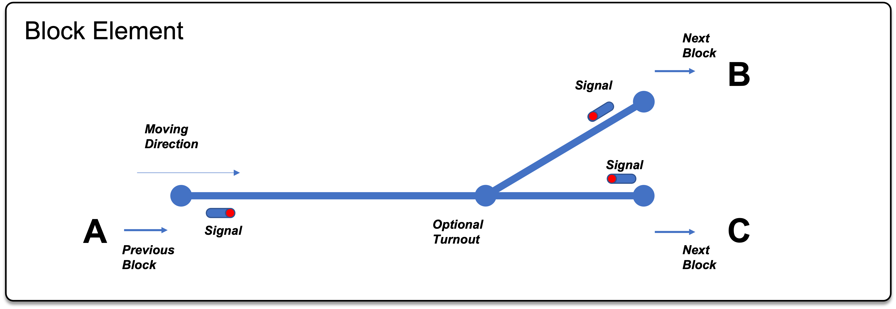

From a moving direction viewpoint, each block can be seen as having exactly one entry point and optional two exits, depending whether a turnout is par of the block or not. If there is a turn out it is typically the last subsection of the block element. A block that can be entered from both directions potentially has a turnout at each end. In theory, any possible layout can be realized with this block element. The layout configuration and block control software will thus center around this basic element.

### *Turnouts*

At a maximum, there are two possible turnouts for a block element. A block can have no turnouts, a turnout when entered in forward direction, and a turnout when entered in backward direction. Each turnout position, **ahead** and **turn** leads to another block. While the dependency between neighboring blocks are statically configured without turnouts (called switches in the UK), these dependency will become dynamic as soon there is a turnout at the beginning or end of a block. If there is a turnout (or group of turnouts) at the beginning of the block, the status of the block determines if the signal of the block the turnout is pointing can show red or green while the signal from the other direction have to show red by default. The same is true for a turnout at the end respectively. What the signal can display depends always on the status of the block the turnout points to.

### *Signals*

Signals, also called semaphores in the US, communicate to the train engineer what is ahead. There are two kind of signals, the main signal at the end of a section and a distant signal associated with the main signal. The distant signals is placed in breaking distance seen from the associated main signal. Besides the usual red for „stop“ and green for „full steam ahead“ there can be a additional yellow light for go ahead at lower speed indicating there will be a turnout pointing to a siding.

### *ABS and APB*

With the basic elements  block, subsection, turnouts and signals in place, there are several ways to implement a block control system. The first algorithms is the **Automated Block System** ( ***ABS*** ). In an ABS system the route is divided into blocks, each of which can at least hold the train length. A signal at the beginning controls whether that block can be entered at what speed. For example, a halt signal means that the train speed to enter the block is zero. The condition will is also shown with the distant signal. A distant signal is the signal ahead of the main signal that indicated the state of the main signal in breaking distance for the trains. So, a distant signal indicating a "slow" condition shows the condition of main signal ahead, which is the condition to enter the block ahead. The distance between the distance signal and the main signal is called the approach indication. Another variant is to just have main signals, one for each block entry. The approach indication in this case is the length of the block , the signal is the main signal of the block before. This variant can often be found in American railways.

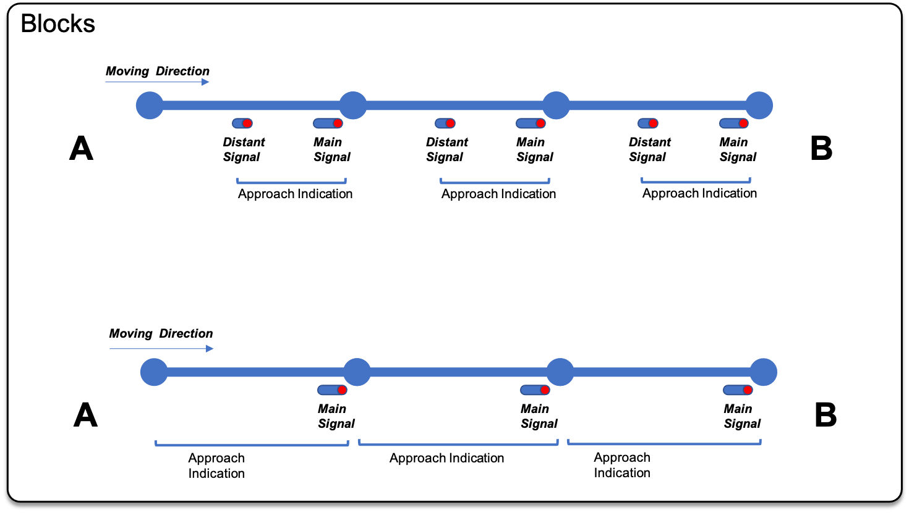

So far, the signals refer to the series of blocks in one direction. Multiple trains can follow each each other in one direction. If the route is to be used in both directions, signals need to be placed also in the other direction. Also the route needs to be reserved, such that two trains do not enter the route from both ends. When a train is moving from A to B, signals guarding the route B to A will all show a halt condition and are cleared on a block by block fashion according to the movement of the train from block to block. To avoid that two trains enter a line from both directions and then have to stop in the middle, a kind of reservation system is needed to manage the current route direction. This system is called **Absolute Permissive Blocks** ( ***APB*** ).

Both ABS and APB still have a fixed block length that accommodates the largest train length. But consider longer and shorter trains. Consider their speed. One approach go further traffic density would be to build a kind of moving block around the trains with a safety distance length at the rear and a breaking distance length at the front. A train following a train ahead is at least the own breaking distance and the safety distance f the train ahead away from that train. Such a system, called **Communication Based Train Control** ( ***CBTC*** ) requires to know the precise location and speed of each train. Also, there is a central control center that authorizes and monitors the movements of all trains. Signals are no longer necessary.

// ??? **note** this is the general concept. Can we come up with a scheme that uses less blocks ? On a train station for example there are many turnouts on entry and exit and individual lanes in between them. Perhaps the turnouts can be combined to one block at the price of blocking the whole field when a train is entering or leaving ...

### *Block Control Algorithms*

/// ??? **note** fill in ...

#### *Single Direction Line*

Imagine a single direction line with several blocks. The control element is the speed at which the train can enter to block ahead. If for example the block speed is zero, the train cannot enter this block. The following tasks need to be done periodically for each block.

- If the block is occupied, the block target speed to enter the block is zero. If not, the target speed is the target block speed currently specified.
- If the target speed to enter the block is greater than zero, the next block is checked. If the target speed of the next block is lower than the target speed of this block, the target speed of this block is set to lower value of either the target speed of the next block plus an increment or the allowed maximum speed.
- The entrance signal to this block is set according to the new target speed. If the target speed is lower than the previous one, the signal is set immediately. Otherwise, set the signal is set after a short delay time.

#### *Double Direction Line*

// ??? **note** fill in ...

#### *Absolute Permissive Blocks*

/// ??? **note** fill in ...

### *Summary*

This chapter gave a brief overview on block signaling control concepts and the key algorithms to implement. Our block signaling system will implement single direction ABS, single line ABS and APB using signals on the line. The layout will be divided into blocks with subsections. The length of the block accommodates the largest train length and subsections are granularity of knowing where the trains actually is. Each block is managed by a block controller node, which manages the train hosted, associated signal and turnouts for the block. It also manages communicates the state to the other block controls and the central train authorization system. ( CTC ).


<!--------------------------------------------------------------------------------------------------------->
<!--------------------------------------------------------------------------------------------------------->
<!-- Chapter - The Block Controller Node Hardware --------------------------------------------------------->
<!--------------------------------------------------------------------------------------------------------->
<!--------------------------------------------------------------------------------------------------------->

<div style="page-break-before: always;"></div>

## *The Block Controller Node Hardware*

So far, we covered a lot of ground. The Layout Control System rests on the concept of a node with ports and a common bus for nodes to communicate with each other. There are specialized nodes, one of them being the base station responsible for managing the locomotive sessions and generating the DCC signals. The base station is as the name suggest a central piece in a layout. The base station node shown in the previous chapter featured two track outputs, MAIN and PROG. The MAIN track is what powers the layout. However, the base station power module unit allowed for about 2.5 Amps and hence only smaller layouts will just do fine with one base station. For larger layouts, help to power several track sections is needed.

A common approach is to divide the layout in several sections or blocks and power them individually with a booster or block controller. Such a booster or block controller would be very similar to a base station in that it provides control about the track, current consumption limits and so on. In contrast to a base station a booster or block controller would not produce its own DCC signal or manage a locomotive session but rather use the signal distributed via the LCS bus. Being an LCS node, the block controller will offer a rich set of attributes to manage and query the state and configuration. Again, wherever the functionality is the same that can be found on the base station, there will be the same attributes and functions.

But there is more to it. For a safe and automated operation, dividing the layout on to track blocks with block sections, and block signaling concepts are necessary. A train movement is always a planned movement and hence the track route needed for the movement is authorized from a central operations place. The chapter on block signaling control provided a high level overview on the block signaling concepts. This chapter will provide a big step into automating a layout by introducing the block controller.

Conceptually, a booster and a block controller have very much in common. They both handle a section or block, they both need power modules to generate the track power, they both need to offer basic sensor and control capabilities to manage a track section or block. Our concept will just unify these two modules types and we will call them block controller from now on. A block controller is a LCS node that manages a track. There are versions with one channel, i.e. one block, and two channels. Support for track occupancy detection, an essential feature for block control, is optional since simple boosters would not need it if they just manage one block with no sections. The text will just use the term block controller and only mention boosters explicitly when needed. Let's get started with the overall requirements.

### *Requirements*

Traditionally, block control in a layout system was implemented with central control electronics and/or relays. This introduced not only a significant amount of cabling but also a high complexity in building a block control system. A centralized place for all the parts of a block system also results in long cable connections running in parallel which act like antennas resulting in face signals. As a general rule, cable connections on a model railroad should be as short as possible. With a decentralized concept where each block or a small number of blocks are managed by a dedicated controller, the lines to tracks, detectors and signals can be much shorter. There may be still a central base station, but the cables to track, switches and signals are just connected to local booster units located next to them. Over the years, the rise of digital control helped to simplify the configuration and building but the central approach still dominates most designs along with the high cabling effort. A digital system, for example, will still need the track occupancy network, perhaps RailCom detectors and a network of boosters to control the layout sections.

As discussed before a large part of the hardware building blocks to run analog and digital equipment in a block system are identical. Both need the same track sections with occupancy detectors and a H-bride as a power module. All the rest can be done in software. If the engine-ID indicate an analog engine the H-bridge will power the track via PWM signals, in case of a digital engine the H-bridge power the track with DCC signals. So, running trains with analog and digital behind each other is just a question of software and without need for additional hardware. You just can’t mix analog and digital on the same block.

A layout is divided into blocks and each block has several sections. For each block and each section in that block a way needs to be found to feed either analog PWM style signals or digital DDC or other protocol based signals along with the safety mechanisms for engines of either type moving from block to block. A key requirement for our block controller is to accommodate this mixed mode running engines. A block is the unit of control on a layout with block signaling. For configuration purposes it has a unique ID, the block Id. Since a layout is fixed once built, the linkages between blocks is too. A block has as the most important attribute the block entry speed. For example, a block occupied has an entry speed of zero. That is an engine following needs to stop at the signal guarding the entry to the occupied block. Block speed can of course vary. For a free block it is the configured maximum block speed, for an occupied block it is zero, and otherwise anything in between depending on the state of the following block and the type and speed of the train.

Blocks can be entered from only one or both directions. While this requirement does not change the basic mechanism of block section occupancy detection, it will change the algorithms implemented. The block algorithm for bi-directional mode routes needs to put at least two stop blocks ahead of them between two trains entering a route to avoid a head on collision. Still, for a bidirectional line, the route direction needs to be set to avoid two trains entering that route in the first place. Our controller needs to be able to be part of a route configuration process. When talking about routes the key requirements is that each block and possible a turnout in the block can be managed centrally from a control panel. All blocks need to offer stair state on demand. The signals along the route are entirely controlled by the state, i.e entry speed, of the block.They are just indicators. Modern block signaling systems do not even have signals, but most model railroader will have signals just to make the layout more interesting. But imagine a staging yard where the block control algorithms will still be there but no signals are there.

Both analog and digital block modes need a way to know where the train actually is within the block and a way to manage the speed change. For example, when the next block is having an entry speed of zero, the train needs to be decelerated to that speed, i.e. it needs to halt at the end of the block. Whether analog or digital, it will translate to either sending digital commands to the engine, or to reducing the track voltage for analog systems. A key requirement is therefore either knowing exactly where the train is within the block or having a way to measure the actual speed to change it accordingly. This topic is explained further in the firmware section of this chapter.

Blocks can have an optional turnout on the entry and the exit. In other words, there are up to two entries to a block and up to two exits. This basic element forms the building block for a layout. The actual setting of the turnout and track occupancy influences the route checking and need also to be broadcasted to all interested parties. The requirement is that the neighbor blocks and as well as any control panel need to receive these events and act accordingly. During power up or restart after a power failure, the setting of the turnout need to be recreated. The requirement is either that the actual setting can be queried or that the last setting is stored in a non-volatile memory so that after a restart the turnout can just be set. However, the safest way is to have sensors for detecting the actual turnout setting.

For digital operations, there is also the requirement for supporting RailCom. A block controller extension should have the optional capability to include a RailCom detector. This detector is also used to identify the actual engine occupying the block. For analog operations the block controller can only detect that there is an engine. Other ways of identifying the engine are needed. It is not a key requirement per se that analog and digital operations are possible simultaneously. But as described in the analog operations chapter there are good reasons to support both modes in one layout. If implemented, the overall layout control needs to manage the type of engine occupying a block and ensure that the next block to enter has the same mode. More on this in the firmware section of this chapter.

### *Overall hardware module design*

For the design of the hardware module, there are two basic ways. As said, one way is to implement a central approach to the management of all the blocks, the other is a decentralized approach where each block is managed separately. Our block control system implements the latter. It is a decentralized system where a block controller manages two, perhaps four blocks. There is no real limit, but the more blocks are managed by one block controller, the more cabling is required, up to having one block controller managing all blocks, and thus we are back to a central approach. The requirements for a decentralized approach are that all components required to manage a block are bundled in the block controller and perhaps extension board.

Each **block controller board** will have a main controller based board with the power module circuitry and RailCom detectors. This board alone will also cover all features needed for a booster node. In addition, the** block controller extension board** will cover the needs for occupancy detection, turnout and signal control. Depending on the hardware types, there are different turnouts and signal drivers. Again, we could design a separate extension board for the track occupancy and another one for the turnout and signal control. Both can be connected to the block controller main board.

While all this may sound like a hardware overkill, the occupancy detectors the turnout and signals drivers need to be in place anyhow. So are the boosters. There are only the number of power modules, one per block, instead of few boosters along the layout required. But having a power module for each bock gives us a good way to manage analog and digital blocks in one layout. And the prices for a H-Bridge chip that controls two blocks is quite reasonable so far.

### *Summary*

- we favor the block controller node approach
- next chapters will present HW and then SW

<!--------------------------------------------------------------------------------------------------------->
<!--------------------------------------------------------------------------------------------------------->
<!-- Chapter - Block Controller Board --------------------------------------------------------------------->
<!--------------------------------------------------------------------------------------------------------->
<!--------------------------------------------------------------------------------------------------------->

<div style="page-break-before: always;"></div>

## *Block Controller Board*


// ??? we have a combo and a quad controller .... how to best present them ?

This chapter presents a quad block controller board. It can manage as the name suggests four blocks. While not every layout will favor a quad block controller, scaling the design down to two or even one block is rather straightforward. The following figure introduces the quad controller overall design. It is built around the Raspberry PI Pico and the L6205 dual H-Bridge. The block controller is also the first module that will not run on an Atmega platform. There are simply not enough features to build such a complex module.

The following schematics show the block controller board for the quad block version. First, there is the main controller part with the connectors, the Raspberry PI PICO, the non-volatile memory, the CAN Bus line driver and the level shifters for the external connector pins used. Note that all the digital pins DIO0 to DIO7 are not exported, they are used on the board itself. The block controller also make use of the track lane connector, which routes the track power signals from the block controller board to the extension board. This way, no extra cables need to be wired from block controller to extension board for this purpose. The connector features four track channels, each for a nominal amperage of 3 Amps. This version of the block controller sends the first block track power on channel 1 and 2 and the second block track power on channel 3 and 4. Depending on future designs, the channel could be combined for a higher amperage or kept separate for up to four blocks.

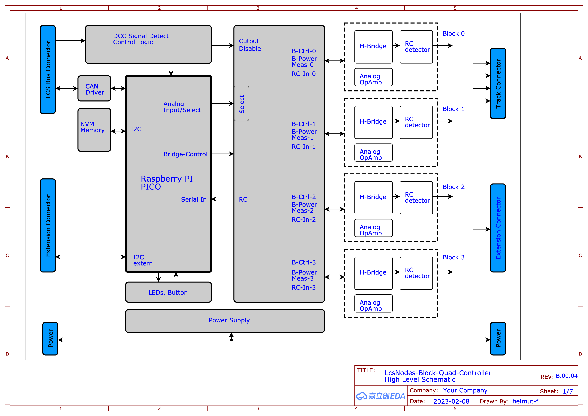

The first schematic shows the main controller Raspberry PI Pico, the level shifters required for the extension connector pins, the CAN bus driver and the non-volatile memory. This part is very similar to the main controller board shown in the previous chapters.

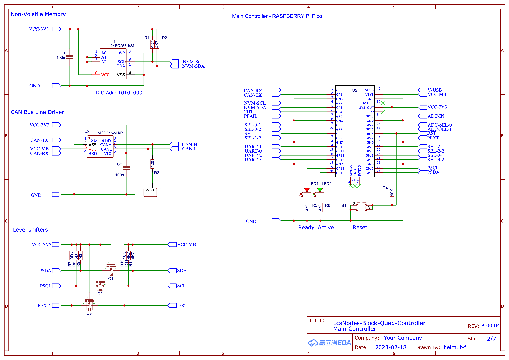

The following schematic shows the control logic for the four H-Bridges. All decoding logic for the power unit control is done with dual 4-1 selectors and a couple of OR/AND gates to produce the enable signal. There are four command to control the H-bridge.

| SEL-x-1 | SEL-x-2 | IN-x-1 | IN-x-2 | ENB-x | Comment |
|:---:|:---:|:---:|:---:|:---:|:---|
| 0 | 0 | GND | GND | GND | The H-bridge is put into high impedance state. |
| 1 | 0 | VS | GND | PWM | The PWM signal drives a "+" H-Bridge signal, the passive part of the duty cycle puts the bridge into high impedance state. |
| 0 | 1 | GND | VS | PWM | The PWM signal drives a "-" H-Bridge signal, the passive part of the duty cycle puts the bridge into high impedance state. |
| 1 | 1 | DCC1| DCC2 | BLK | The DCC signal drives the H-Bridge halves. The BLK signal will put the H-Bridge into the high-impedance state around the cutout period. |

All decoding logic for the power unit control is done with dual 4-1 selectors. The signal from the opto-coupler is actually inverted, the wires need to be crossed for DCC signal input. All other signals are active high signals. The bridge overall state, i.e. whether active or disconnected is controlled by an OR/AND gate, which will disable the bridge when both control signals are zero. For PWM mode, one side of the bridge will be at the zero level while the other will be the PWM signal. The PWM mode output of the bridge will thus be either a voltage for the high" phase or disconnected for the low" phase of the PWM signal.

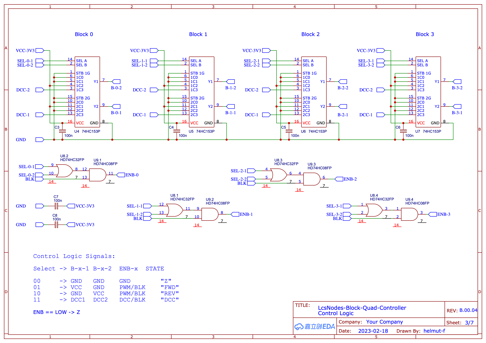

Next is the power unit. The workings have already been described in the chapter on power units. The power unit is a H-Bridge with a current consumption measurement. The analog voltage across the shunt resistor is amplified and read in by the controller. Four H-Bridges need four analog inputs on the controller which we don't have on the PICO. All analog input signals are multiplexed to one analog input. We can thus read only one current measurement at a time.

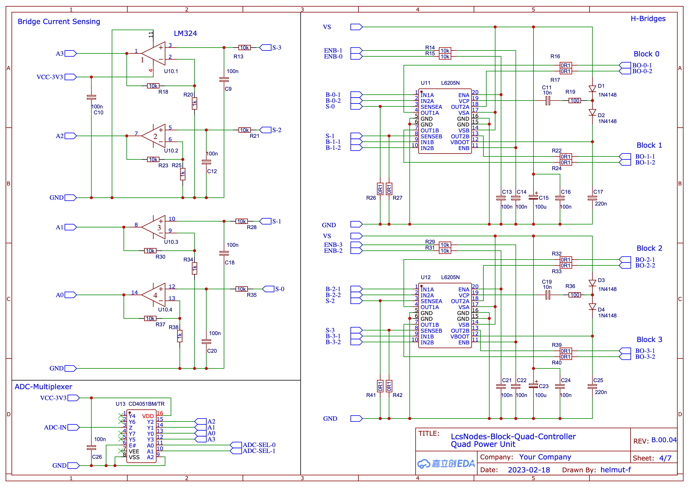

For DCC Railcom support, the schematic shown below is the RailCom signal detector part. As explained in the DCC chapter, when Railcom is enabled, the decoders will put Railcom datagrams onto the track, which are detected by the circuitry shown below. The controller will just read in the serial communication and decode the datagrams. Although the component is optional, it should be on the board in any case, just to be flexible.

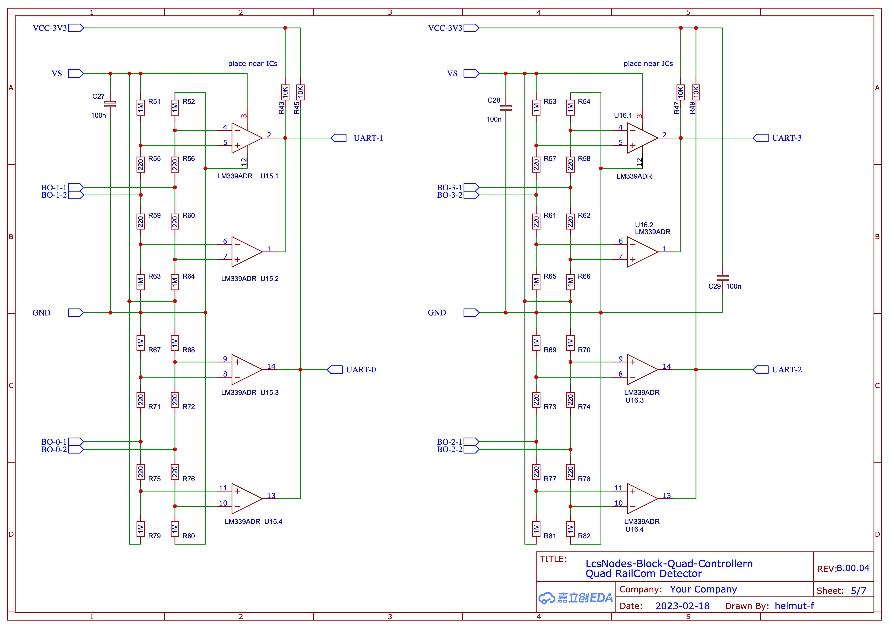

The next schematic shows the DCC signal receiver for the DCC signal coming from the base station. The block controller will take the DCC signal and eventually feed it to the H-Bridge power module. The DCC signal itself is also the mechanism to synchronize other signals such as the PWM signal generated locally on the block controller board. Since the DCC signal lines are decoupled from the rest of the logic via an OptoCoupler, all that we receive via the incoming signals are a zero state, i.e both lines are short circuited already or simply not powered, or in "+" or "-" signal state. Note that we cannot distinguish between a cutout signal and no power on the signal lines. The enabling and disabling of the power module needs to come from dedicated LCS messages to the node and cannot be derived from the DCC signal lines.

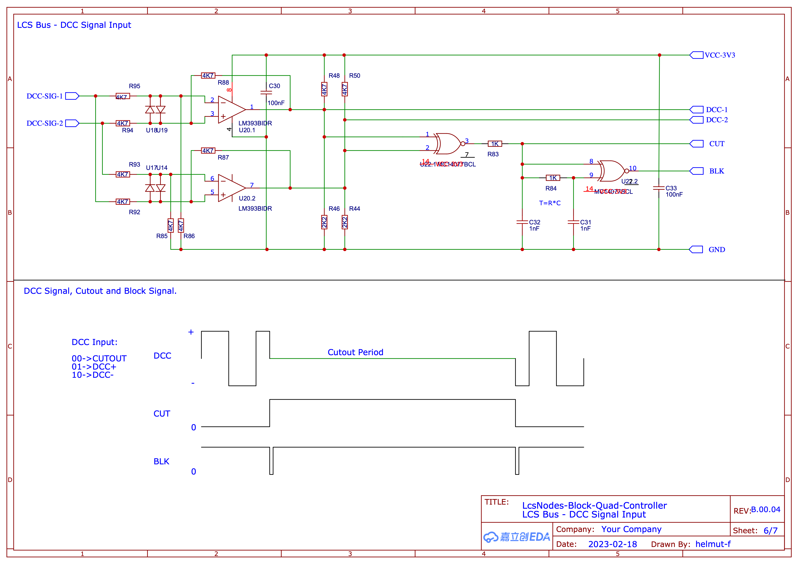

In addition to recognizing the DCC cutout situation, we need to worry about several block controllers receiving that signal. Not all will switch into cutout mode at exactly the same time. This could potentially become a short circuit problem if block N is still powered, and block N + 1 already in cutout mode. A locomotive crossing from a still powered track to an already short circuited track will short circuit the powered track. To address this issue, the signal detector will generate a short window of about four microseconds where the power module input signal is put in the "high impedance" state when detecting a change into the short circuit state. And likewise, at the end of the cutout, there is the same window before leaving the cutout state. For PWM signals, the active part of the duty cycle drives the H-bridge to either a positive or negative output, the passive part will put the bridge into high-impedance.

And last but not least, there is a power supply and the connectors for the quad block controller board.

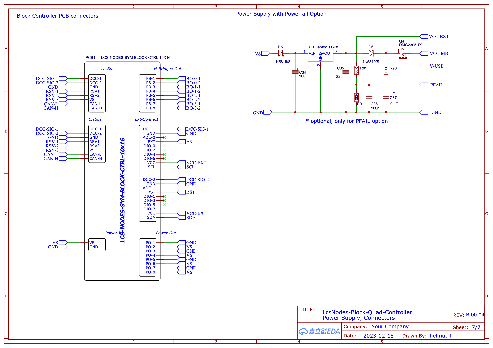

Well, that is the block controller. It is so to speak a maximum configuration. When designing a block controller with just two blocks, just take out one H-Bridge mode decoder and one Railcom detector. Furthermore, the L6205 dual H-Bridge can be configured to deliver twice the amperage. For larger scales a version of the block controller needs to be available that delivers on two blocks 5.6 Amps. There could also be a board that just has one block, which would be a classical booster. There could also be a board that has a power H-Bridge piggybacked on top, and so on. This chapter showed a full fledged four channel version, other combinations would still rest on the same core building blocks described.

### *Block Controller PCB*

The quad controller is implemented on a 10x16cm board layout. As you can see, it is a dense board. Even the place below the PICO board is used. Without SMD parts, this board would for sure not fit onto a 10x16Cm layout.


### *Summary*

Well, the design of the quad block controller, although simple in the individual components, was a champions league effort when it came to the PCB board design. It is the most complex board of all the board described in this book.

// ??? note wrap it up, summarize the concepts...


<!--------------------------------------------------------------------------------------------------------->
<!--------------------------------------------------------------------------------------------------------->
<!-- Chapter - Block Controller Firmware ------------------------------------------------------------------>
<!--------------------------------------------------------------------------------------------------------->
<!--------------------------------------------------------------------------------------------------------->

<div style="page-break-before: always;"></div>

## *Block Controller Firmware*

// ??? **note** this chapter should come after the extension chapters ... ???

A block controller is an LCS node that can manage one more blocks, each with one or more sections. This chapter will describe the firmware developed for the block controller. The block controller features several ports for the blocks and associated turnouts, signals and so on.

First, each block must be uniquely defined in the layout. A block controller ID consists of the node ID and a portId resenting that block. A layout could have theoretically 4095 nodes with 4 blocks each. In reality, we need nodes also for other purposes, bit still this number is large enough even for really large layouts. Let'S first look a t what ports are needed.

### *Block Controller Ports Overview*

A node can have up to 15 ports, portID zero refers to the node itself. For the block controller, portId 1 to 4 are reserved for the blocks that the node can manage. The quad block controller introduced before, will use all four ports. Again, the combination of nodeID and port will uniquely identify that block in the layout. These ports are called **Block Port** in the text to follow.

Next, there needs to be a port to provide information and control access to the individual H-Brides or the block controller board. Up to four H-Bridges must be managed. Examples for H-Bridge information are the actual current consumption and current limit setting. Examples for control data is the mode of the H-bridge, i.e. whether DCC or analog mode, output turned or off and so on. Up to four entries can be found on that **H-Bridge Port**.

Blocks have sections. Each block consist of up to four sections. The **Section Port** contains information about the individual sections. Example are whether a section is occupied or not.

Associated with a block are turnouts and signals. A block can have up to two turnouts, one on each entry. The **Turnout Port** contains an entry for each turnout defined in one of the blocks of the block controller node. Information about the turnout are for example the electrical type of turnout and the actual setting. Block can have several signals, typically one main signal at each end. The **Signal Port** will contain an entry for each signal with information about the  type of signal and the current setting.

Local to the node ports refer to each other. For example the block controller port would refer to its signals with the entry index into the array of signals described and managed by the signal port.

When configuring a layout the blocks need to be configured, which means to set all the values in the port data map for the ports outlined above. With the exception of actual values, such current consumption or turnout setting, this data is kept in the non-volatile memory of the node.

The block controller will define many items that refer to node and pot map attributes as well as user defined items specific to the block controller.

### *Block Port*

- block state ( free, used, running, locked, etc. )
- block actual direction
- neighbor blocks
- block part of a route ( route ID )
- block default direction after restart
- train ID of train in block( also to be broadcasted )
- actual speed and direction of train in block ( DCC or analog )
- timestamp of entry and exit
- block entry speed
- block target speed computed, max speed of block ( or sections ? )
- associated sections and order
- associated turnouts( indices into turnout port data entries )
- associated signals ( indices into turnout signal data entries )
- periodic events to fire

| Node Info Item | comment |
|--------|--------|
| ... | |

| Node Control Item | comment |
|--------|--------|
| ... | |

### *Section Port*

- associated block port
- section type ( normal section, brake section, etc. )
- timestamp on entry
- timestamp on exit
- physical length of section
- "daylights saving section" :-)
- "daylights saving sound" :-)
- events to fire on section entry and exit
- periodic events to fire
- hardware address information for extension board addressing ( tbd )

| Node Info Item | comment |
|--------|--------|
| ... | |

| Node Control Item | comment |
|--------|--------|
| ... | |

### *H-Bridge Port*

- actual power consumption
- actual current consumption limit
- initial current consumption limit at restart
- maximum H-Bridge current limit
- bridge mode ( OFF, DCC, PWM-F, PWM-B )
- events to fire on limit overflow
- periodic events to fire

| Node Info Item | comment |
|--------|--------|
| ... | |

| Node Control Item | comment |
|--------|--------|
| ... | |


### *Turnout Port*

- actual turnout setting
- initial setting after restart
- turnout hardware type ( servo, magnet, etc. )
- turnout feedback for actual turnout setting
- hardware address information for extension board addressing ( tbd )
- periodic events to fire on turnout setting

| Node Info Item | comment |
|--------|--------|
| ... | |

| Node Control Item | comment |
|--------|--------|
| ... | |

### *Signal Port*

- actual signal state
- delays for setting "STOP" or "GO" a signal after command has been received
- initial setting after restart
- hardware address information for extension board addressing ( tbd )

| Node Info Item | comment |
|--------|--------|
| ... | |

| Node Control Item | comment |
|--------|--------|
| ... | |


### *Block Controller Node*

- global data for the block controller
- nodeId and node type
- number of blocks

| Node Info Item | comment |
|--------|--------|
| ... | |

| Node Control Item | comment |
|--------|--------|
| ... | |


### *Info, Control and Events*

- events are the key mechanism to broadcast the block state. when an engine is entering a block, the event is broadcasted. The configured previous block and the follow-on block are interested in this event and react. In addition, the status can be queried from other nodes anytime.

- a central station does not control the actual sections of a block. It will do rather the high level setting of turnouts that build the actual chain of blocks.

- setting of turnouts and actual block occupancy are non-volatile data to be recovered at restart or after power fail. At restart, block occupancy and turnouts direction are set from this data.

### *To think about*

- layout turn on: what setting for each engine ? automatic ramp up to previous speed levels ?
- layout turn off: what setting for each engine ? automatic ramp down to previous speed levels ?
- layout emergency stop: ...
- automatism for speed acceleration or deceleration based on block entry speed...
- short rains and block sections, a train should perhaps stop in the middle if desired...

### *Summary*

- a rather complex firmware with a lot of functions.
- blocks largely work with events to each other.
- any block, turnout, signal etc. can be access manually.
- events produced can be consumed by any other node, e.g. a central switch board, etc.
- detection of a train loosing some of its cars... ( previous block not released after some time )


<!--------------------------------------------------------------------------------------------------------->
<!--------------------------------------------------------------------------------------------------------->
<!-- Chapter - Sensors and Actors ------------------------------------------------------------------------->
<!--------------------------------------------------------------------------------------------------------->
<!--------------------------------------------------------------------------------------------------------->

<div style="page-break-before: always;"></div>

## *Sensors and Actors*

Sensors and Actors are the eyes, ears and hands for any layout system. The requirements and options are numerous and the list of desired features needed is perhaps never complete. Sensors, the eyes and ears, are mainly the event producers. A block occupancy detection, a power overload detection, but also a push of a button on a layout control panel are good examples. The counterpart to sensors  are actors. Actors, the hands, are the family of LCS nodes and special hardware that control turnouts, signals and whatever else there is. This chapter will present the most common actors and sensor nodes found on a layout. Building upon the concept of main controller, base station, block controller and extensions board concepts, this chapter will present how the pieces that make up a node can be put together from the basic building blocks.

### *Requirements*

With so many sensors and actors, a key requirement is to implement a concept where most of the functional parts can be used in different combinations. The chapter on hardware design already presented the main controller and extensions concept. A key reason for this concept were exactly the large variety of sensors and actors.

- main controller
- block controller
- base station

The main controller portion, common to all, will feature the processor, the message interface for the LCS bus, and the power supply for the board and the extensions. Some LCS nodes need a larger NVM storage. The main controller board will allow an optional installation of a NVM chip. Furthermore, the power supply, intended for generating the power for main controller board as well as the VCC power for the extensions, will also feature an optional installation of power failure detection.

Extension boards implements the hardware for the particular sensor or actor type. All extension boards need to feature the connectors, so that more than one extension board can share the same controller board. However, only the first board will benefit from the availability of all extension bus signal lines. It is not a requirement that the second extension board will get the same signals. IT is also not a requirement that an extension board does have the decoding logic described in the extension hardware design chapter. For example, the power module unit which together with main controller is a base station, does not have that logic. It expects to be connected directly to the main controller board. The power module board will however still route power, DCC and I2C signals. The I2C bus plays a key role in communicating with an I2C type extension board. Each I2C based extension board will have the extension board decoding logic, which is essential for proper addressing that board.


### *Extension Boards*

Before going into the detailed extension board designs, what boards would be need? Here is a brief look ahead of the boards to come.

- **Occupancy Detector**. The occupancy detector extension board is a companion to the block controller board. It will offer 4 channels, i.e. tracks that match the block controller output, with a set of detectors on each channel.
- **Turnout**. The turnout extension board features a set of turnouts with frog polarization. Similar to the occupancy detector the boards is designed to go with the block controller board.
- **Servo**. The servo extension board is a universal board, which can be connected to any controller board presented. It features a set of general servo outputs.
- **GPIO**. The GPIO extension boards is a universal digital input / output output board. It is typically used for input such as switches or push buttons a well as LEDs connected. Care has to be taken to match the the number of output consumers with the what the individual output pins can drive.
- **Signal**. The signal extension bard is another general purpose board designed for driving the LED equipped signals. It is able to not only match the power requirements but also allow for dimming and / or blinking the individual lights.
- **Relays**. The relay extension board is a general purpose board intended to drive a set of relays. The relays, which are not part of the board, can be driven with different voltage levels.
- **Cab Control**. The cab handhelds as well as stationary cab control devices are also just an extension. There is no reason why this extension could for example not be connected to a base station and build a complete control station fort a smaller layout.
- **Prototyping**. It is often useful to just do a quick sketch of a function desired for an extension board. So, how about an extension board with the extension address resolution logic and just room for building your own HW designs.

### *Summary*

This chapter gave a brief introduction to the extension boards. Although they all have the same connector layout, not all extension boards can be freely combined with the controllers presented so far. The turnout extension and the occupancy detector extension are designed to match the 4-channel arrangement of the block controller. All other extension can be combined with all controller type boards. Now that the concepts are clear and described at a high level, we are ready to build our extension boards.

Ready ? Here we go.

<!--------------------------------------------------------------------------------------------------------->
<!--------------------------------------------------------------------------------------------------------->
<!-- Chapter - Hardware Extension Module Design ----------------------------------------------------------->
<!--------------------------------------------------------------------------------------------------------->
<!--------------------------------------------------------------------------------------------------------->

<div style="page-break-before: always;"></div>

## *Hardware Extension Module Design*

LCS hardware modules typically consist of a controller portion and an extension portion. Welcome to the extension part of hardware module design. To recap, controller boards features an extension connector that contains signal lines to the extension board. This connector provides among other lines an I2C bus, which is the communication bus to elements on the extension boards.

Each hardware module almost certainly has additional requirements. Depending on the module type there will be a great variety of extensions. A good example is the sensor and actor hardware for managing the respective turnouts, signals, and so on. A solution to these family of modules is to use the I2C communication bus and a few more controller lines between controller main board and extensions. Rather than exporting as many as possible pins of the controller via an extension connector, the extension connector presented is hopefully a reasonable compromise when it comes to numbers of pins and capabilities. For complex extension boards with many controller interaction points, a monolithic approach, i.e. controller and extension functionality on one board, would perhaps be the better choice. Such boards could still export the basic functions such as I2C via the extension connector to less complex extension boards for providing additional capabilities. Before we discuss any particular extension board, this chapter will present the hardware and firmware foundation for addressing an extension board.

### *Requirements*

As with any LCS library part presented, the key goal is to unify and simplify access to an extension board, while still allowing for great flexibility in actual extension board design. We want to be able to connect pretty much any extension board to a main controller, base station and block controller, as well as connecting several extension boards. For example, take the block controller. As shown before, the block controller exports the track power lines and the extension connector. We would like to be able to connect an extension board that implements the track occupancy detectors. We would also like to connect a further extension board that implements the turnout and signal drivers. And of course we want to connect boards then combine one or many of these functions. A key requirement is therefore to communicate to the main controller what is actually connected and how to access the available functions.


Typical electronic modules found for digital model railroad control offers configuration options via software and perhaps a set of DIP switches or on board jumpers. As extension boards become more rich in the features they offers and also the combination of more than one board, a methods is needed to uniquely identify and address a board on the extension connectors and a methods to interrogate the capabilities of that particular board.

We already talked about the ability to connect more than one extension board. When this is the case, the order of connected boards should not matter as long as they are uniquely identified. A method is needed for the main controller to automatically identify all extension boards at startup along with their capabilities, ie.e the functions they offer. Other than the methods describing what the board can actually do, the extension board will not have any non-volatile state.

Because of the large variety of extension boards a software layer is needed that unifies how the individual access points such as a digital input or output is accessed by the LCS node firmware. There should be an easy and uniform way to address these endpoints, i.e. there should be some kind of an **extension library** interface common to all extension boards designed.

The upper layer, i.e. the extension library interface, is complemented by the lower layer which is actually the piece of code that know the extension hardware and translates a higher lever library call into the sequence of actions on the particular extension board. This piece of code will be called **extension driver**. For each extension board or family of alike boards there is at least one such driver.

### *Concepts*

To accommodate the requirements, each extension board has to a hardware mechanism that uniquely identifies the board and its capabilities. It is a not a requirement that such a board has processing power or retains any state. This is the responsibility of the controller board. When power is applied to the main controller the reset or restart sequence will attempt to discover all extension boards connected. For this to work, each board has a non-volatile memory structure that describes the board capabilities. And this memory needs to be at a known place, i.e. I2C address, such that this information can be read without knowing any further details. For this purpose, extension boards will have a NVM chip, that contains the board description.

The NVM chip is "programmed" by writing the relevant data to the chip. A write-enable jumper is used to allow writing and then disable all further changes during operation. There is no need for a special programmer, any main controller board can do this via the I2C lines of the extension connector. With using the NV chip, there is no need to have any further DIP switches or alike on the board. In fact, a memory chip allows for even more precise options to configure. And it is cheaper that even a 4-DIP switch.

After programming the NVM chip will contains all information needed to address the extension board functions. Typically, one or more I2C addressable chips are on the board and the NVM tells us what their address is. Combining the chip foxed I2C address portion, the board address portion and the individual chip select portion, an I2C bus unique address is formed. 

The software library can now access a chip. However, chips vary greatly in their functions and how they are controlled by software. A concept is needed to communicate with these chops at  higher abstraction level. Think of a driver in operating systems. A driver offers a set of routines, such as open, read, write and close and takes care of the underlying details how to talk to the physical object. We will go a similar route. There is a high level library, the extension library that offers a high level view of extension board capabilities. Upon node reset and restart, the controller board will query the NVM chips on the extension bod and dynamically configure the driver code for this board.

In addition to the board address a large variety of inputs, outputs and perhaps functions need to be address too. We will call them endpoints. Consider  16-port digital IO chip, such as the MCP23017. It will have 16 IO pins, which we call 16 endpoints. Uniquely identifying an and point is to know the board ID and the endpoint Id on that board. Again, all this information is stored in the NVM  chip at extension board conjuration time. An endpoint could be a variety of things. For example a plan digital output, a servo output, and analog input, and so on. An endpoint could also be a logical entity that groups multiple pins or issue a series of commands to the extension board.

For a new board design, the development process is therefore to define the NVM data that represent the hardware capabilities  and to provide a driver for the board capabilities. From thereon, the firmware designer can use the extension boards with simple but powerful commands. How does this all map to LCS nodes and ports ? Well, the firmware designer has to provide the code that makes the respective driver calls when receiving node and port control commands and events.

### *I2C Addressing*

An extension board design assumes that the key ICs on the board are I2C addressable chips. As already mentioned, I2C ICs have a fixed I2C address part and a some address bits that can be set by hardware. Most of the I2C chips used in our designs have a four bit fixed address portion and a configurable portion to be supplied via address pins of the chip. We will use the configurable portion to identify the board, from A2 to A1 and reserve the last bit A0 for selecting two chips of the same kind on an extension board.

| IC | A6 | A5 | A4 | A3 | A2 | A1 | A0 | Comment |
|:---|:---|:---|:---|:---|:---|:---|:---|:---|
| MCP23017 | 0 | 1 | 0 | 0 | B1 | B0 | x | |
| PCA9685  | 1 | 1 | 1 | 1 | B1 | B0 | 0 | Set to "1100" as the upper four bits. |
| PCA9955  | 1 | 1 | 0 | 1 | B1 | B0 | 0 | Set to "1011" as the upper four bits. |
| PCA9555  | 0 | 1 | 0 | 0 | B1 | B0 | 0 | |
| ST24LC04 | 1 | 0 | 1 | 0 | B1 | B0 | 0 | |

The PCA 9955 and 9685 have a high number of address selection inputs. This allows to connect more than typically 8 chips on one I2C bus. We will not make use of this capability for now and assign a fixed 4-bit chip I2C address portion.

### *Multiple Extension Boards*

Now that we talked about I2C address, how does a board get a unique board address without jumpers or alike ? Each board must have a way to contribute to an I2C address its own portion. When an I2C address is sent on the bus, it will have a board ID, this ID is used in the final I2C address. Each extension board features a common set of circuitry for this purpose. The following schematic shows the connectors, the board address generation logic and the NMV chip.

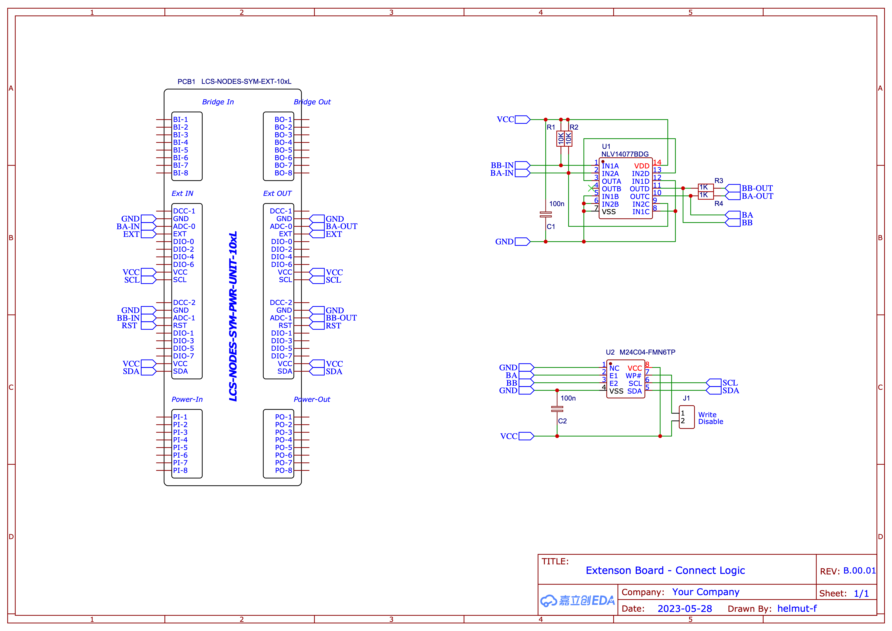

The design allows for up to four extension boards that can be connected to a controller. Two bits of the I2C address are therefore reserved for the board address. The extension connector pins for analog input 1 and 2 are used to pass on information about the board position in the connecting order. The address generation logic will simply provide the next address value. A "11" input results in a "01", a "01" in "10" and so on. The main controller pins ADC-0 and ADC1 will just not be connected and the pull-up resistors of the first extension board will produce the "00" for the board. The output of the address logic will provide a portion to the  local I2C chip address pins as well as pass it on to the next connected board. Easy and straight forward.

Now, there is always the case to need more pins, i.e. endpoints, that the ICs chosen for the board can deliver in an I2C addressable way. One solution to address the problem could be to spend three pins on the extension connector and implement a serial in/out for chips such as the 74Hc595 ( serial in, parallel out ). This way you could for example realize to drive many output pins, or with an 74HC165 many input pins. Note that this board would need to be connected as the first board to the controller. It is not a requirement for an extension to route through the connector inputs to the output side. As an alternative, there is always the option to use a second controller. Remember, for the layout it is all software in the end.

### *Extension library*

No LCS concept without a library. This section describes the LCS extension library to access the particular board. As said before, we would like top address each board in a uniform way, regardless what functions it offers. The piece of code that actually manages the board is the extension driver. For each board type to connect to a main controller the firmware needs to have a library loaded for the respective board. The driver exports a set of functions and internally issues the I2C calls to the board hardware. To recap the overall software picture, the firmware layer will make use of the core library and the individual drivers developed for each extension board.

The management of the drivers is part of the core library. This will be presented in a later section. First, let's look at how a driver presents itself to the firmware programmer. To the firmware designer, all boards are accessed to a small set of functions common to all boards using the board Id, an endpoint, which we call **pad**s.

```
struct LcsCoreLib {

   ...

   uint8_t drvInit( uint8_t boardId, uint16_t flags );
   uint8_t drvReset( uint8_t boardId, uint16_t flags );
   uint8_t drvControl( uint8_t boardId, uint8_t padId, uint8_t item, uint16_t arg1, uint16_t arg2 = 0 );
   uint8_t drvInfo( uint8_t boardId, uint8_t padId, uint8_t item, uint16_t *arg1, uint16_t *arg2 = nullptr );
   uint8_t drvRead( uint8_t boardId, uint8_t padId, uint16_t *arg );
   uint8_t drvWrite( uint8_t boardId, uint8_t padId, uint16_t arg );
   uint8_t drvRead( uint8_t boardId, uint8_t padId, uint8_t *buf, uint8_t *len );
   uint8_t drvWrite( uint8_t boardId, uint8_t padId, uint8_t *buf, uint8_t len );

   ...

   };
```

The core library will locate the board descriptor and the invoke the desired driver routine. That is it. For example, take a write operation. The firmware programmer would simply make a call with the board ID, endpoint ID and data to be written using the core library APIs. The library will locate the board and then call the driver write methods passing the data along. This pretty much sounds like every operations system would do. And in fact, the concept is very similar. While it may sound like an overkill for a simple embedded controller who just wants to make an LED blink, the concept of drivers and a common I/O library allows for building a family of extension boards with common software interfaces and operating concepts. But we also have to acknowledge that it does come with the demand for more processing power. Luckily the Raspberry PI Pico and alike do provide that power. For the Atmega platform that we started with, the limits are reached probably here.

As an idea for the next generation core library, one could imagine to also model the main controller components using the common I/O and driver concept. For example, the NVM on the main board as well as the CAN bus library could just be drivers that you access using the same interfaces as for extension boards. Sounds like, the core library would become more and more a general kind of operating system. Well, maybe one day.

### Board Discovery and Setup

How does a driver know all the details of the board? It has access to the extension board descriptor that was loaded from the board when the board was discovered. Each board has a NVM memory with a fixed i2C address that is computed for the IC base address and the board position. The core library simply tries to access a board using the address. If there is a board, the board descriptor is loaded into the core library data structures and validated. Up to four boards are possible. Once the board is located, the driver method for setting up the board with all initial data for the entry points is invoked. After that, the board is ready to be used using the extension library methods that in turn will just invoke the driver. Note that we could every tome we access the board just read the data needed for accessing a particular board function just read in the portion of the extension board memory. But that would perhaps not result in good performance and since the extension board data does not change, caching it during setup is the better design choice.

### *Extension Descriptor Memory*

OK, time to present the extension board memory. The LCS core library will simply build the I2C address of the NVM chip on a board and read in the memory data found. The data is rather simple There is a header section which contains information about the board type and how many endpoints are managed. The following code fragment shows the structure of the extension board memory layout.

```cpp
   struct LcsDrvBoardDesc {

      uint16_t  magicWord;
      uint16_t  boardType;
      uint32_t  boardUID;

      uint16_t  numOfChips;
      uint16_t  chipTabEntrySize;

      uint16_t  numOfEndPoints;
      uint16_t  endPointEntrySize;

      char      extBoardName[ 16 ];
    };
```

```cpp
   struct LcsDrvChipDesc {

     uint16_t chipType;
     uint16_t i2cAdr;
   };
```

```cpp
   struct LcsDrvEndpointDesc {

       uint16_t devType;
       uint16_t padId;
       uint16_t flags;
       uint16_t initVal;
   };
```


  - end point entry structure ( 8 bytes )
	- device type ( DIO out, DIO IN/PullUp, DIO general I/O,  AnalogIn, PWM, Servo, ...)
	- flags
	- initial value / state
	- I2C address

The entry point table is just a simple array with an entry for each in or out channel. For example, a digital IO pin on a general purpose IO extension board would describe each pin with an endpoint descriptor. IN addition. an endpoint could also represent a more complex channel. Take the GPIO board example again. The GPIO chip on such a board, e.g. an MCP23017, would allow to set values on all pins simultaneously. An endpoint could then represent with a 16-bit word all bits to set or read from the chip. It just depends what options the driver will support and what was configured in the extension board NVM.

### *Extension Board Driver*

Now, we not only know what boards are actually connected but also what software would be required to access the board. We will call this piece of software, essentially a library for each board type, **extension driver**. The following code fragment will show the common driver class that all actual drivers inherit from. We will see more of actual drivers when discussing a particular extension board implementation.

```cpp
struct LcsDrv {

   public:

      LcsDrv( );

      virtual uint8_t init( uint16_t flags ) = 0;
      virtual uint8_t config( uint8_t padId, uint8_t item, uint16_t arg1, uint16_t arg2 = 0 ) = 0;
      virtual uint8_t control( uint8_t padId, uint8_t item, uint16_t arg1, uint16_t arg2 = 0 ) = 0;
      virtual uint8_t info( uint8_t padId, uint8_t item, uint16_t *arg1, uint16_t *arg2 = nullptr ) = 0;
      virtual uint8_t read( uint8_t padId, uint16_t *arg ) = 0;
      virtual uint8_t write( uint8_t padId, uint16_t arg ) = 0;

      virtual uint8_t read( uint8_t padId, uint8_t *buf, uint8_t *bufLen ) = 0;
      virtual uint8_t write( uint8_t padId, uint8_t *buf, uint8_t bufLen ) = 0;

   private:

      LcsDrvData *dataPtr;
  };
```

// ??? **note** what could we do about "real" interrupts from an extension board ?

### *Utility for writing the NVM*

The structure on each extension board is from the extension library perspective a read-only structure. But of course initially it needs to be filled with valid data. The hardware offers a jumper on the board to enable writing to the NVM chip. Any main controller board could be used to just write to the extension board. This is accomplished with a little utility program or a set of commands implemented in the command line interface of the core library.

// ??? **note**  to be decided and implemented. I like the idea for simple commands on the core library level... easiest way to move quickly forward.

### Summary

LCS nodes consist of a main controller board and extension boards. That concept can be found throughout all what is presented in this book. This chapter gave an insight how many different extension boards are connected and managed. We are now read to look at actual extension board implementations in the chapters to come.


<!--------------------------------------------------------------------------------------------------------->
<!--------------------------------------------------------------------------------------------------------->
<!-- Chapter - Track Occupancy Detector Extension Board --------------------------------------------------->
<!--------------------------------------------------------------------------------------------------------->
<!--------------------------------------------------------------------------------------------------------->

<div style="page-break-before: always;"></div>

## *Track Occupancy Detector Extension Board*

Track occupancy detectors are essential for building any block control or layout automation. The key idea is to divide the track into sections and then monitor each section for current consumption. The basic principle has been described in the power module chapter. When a locomotive is on the track section a current is flowing and there is a voltage drop along the diodes which is translated to a signal. With a DCC signal on the line, this task is straightforward, there is always a current flowing. In an analog track section, a stopped loco does not draw current. In such cases a very small current is sent periodically, enough to trigger the sensors but not enough to move anything.****

### *Block Diagram*

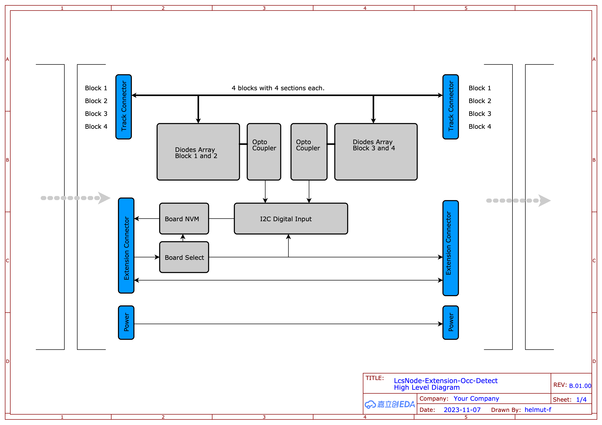

### *Connectors and Logic*

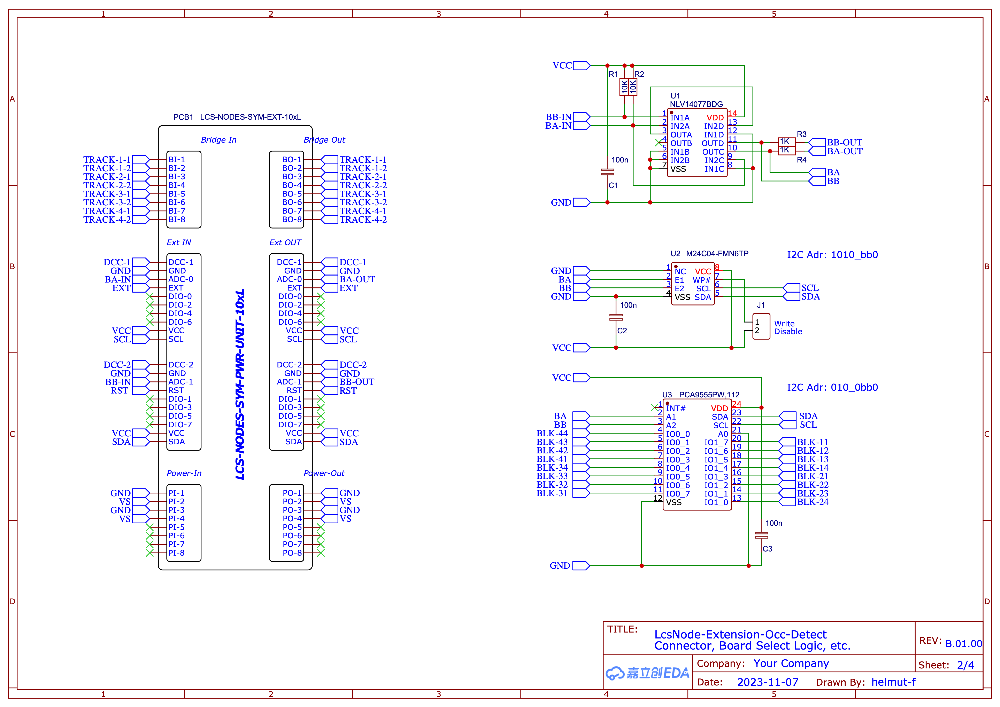

### *Detectors*

The sensor detector uses bridge rectifiers instead of discrete diodes. This allows for a rather dense packing. Bridge rectifiers are available for up to two Amps, which will be fine for a HO or smaller gauge layout. For the large scales the sensor needs to be built using discrete diodes, such as the SB560 Schottky Diode. Note also that the power for the track is not routed via the main controller board. The track power is directly connected to the extension board.

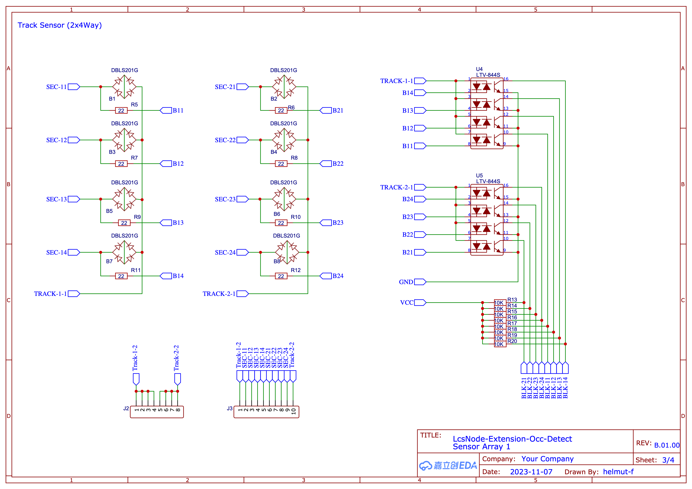

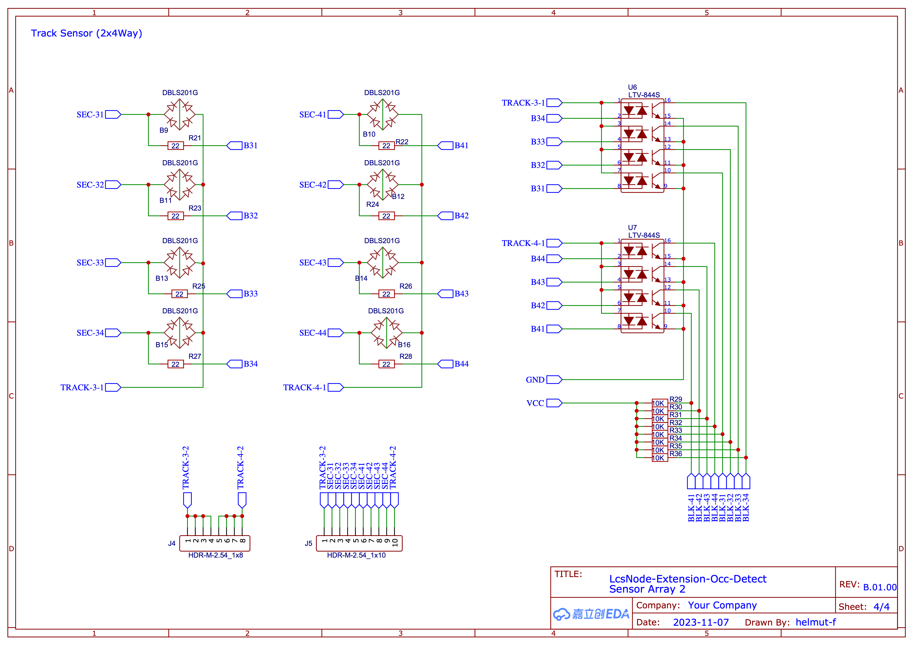

### *PCB*

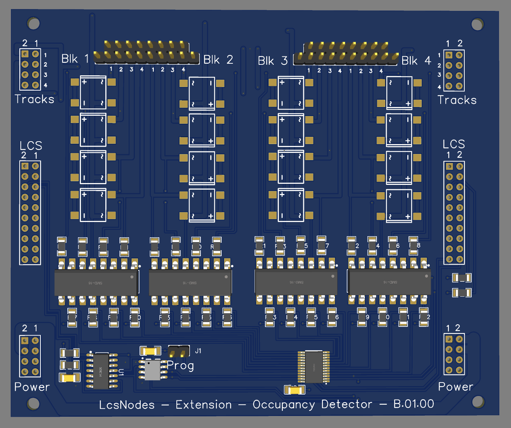


Firmware notes:

- I2C address considerations
- nodes and port attributes, which ones are common to all sensors ?
- periodically scan each section
- events could be fired
- control and info items to access, every group is one port


<!--------------------------------------------------------------------------------------------------------->
<!--------------------------------------------------------------------------------------------------------->
<!-- Chapter - Servo Extension Board ---------------------------------------------------------------------->
<!--------------------------------------------------------------------------------------------------------->
<!--------------------------------------------------------------------------------------------------------->

<div style="page-break-before: always;"></div>


## *Servo Extension Board*

With dramatically dropped RC servo motor prices they are often used to replace traditional magnetic coil drives for turnouts and semaphores (mechanical signals) on model railroads. Besides their advantages in price, they enable a much more realistic operation with smooth operation of turnout points and semaphore arms. However servo’s need a PWM (pulse wide modulation) to operate rather than the simple pushbutton to power up a coil. Also, a signal light can fade in and out a little to mimic more realistically a real light. The use of servos in a layout are endless. An extension board to generate such PWM signals for driving servos is needed. A servo is just a mechanical device that is controlled with a pulse width modulated (PWM) signal. A PWM high period of one millisecond will move the servo arm left ( 0 degrees ) and two milliseconds right ( 180 degrees ). The servo control extension could also be used to drive the signal light brightness and the slow raising from off to full on. Signals need more than one line to implement a signal with red/green/yellow lights. A 16 channel PWM is therefore a good starting point to address the above requirements. The following schematic shows an extension board based on the PCA9685 chip.

The PCA9685 chip is a SMD chip. As an alternative to designing an SMD component board, we could also use the very popular breakout board based on the PCA9685 chip. The breakout board interfaces via the I2C bus. A good solution is to build an extension board that just piggy backs the breakout board and connects to the I2C bus via the extension board connectors. As a first step, the breakout board is a good solution. The price again is very competitive.

### *Block Diagram*

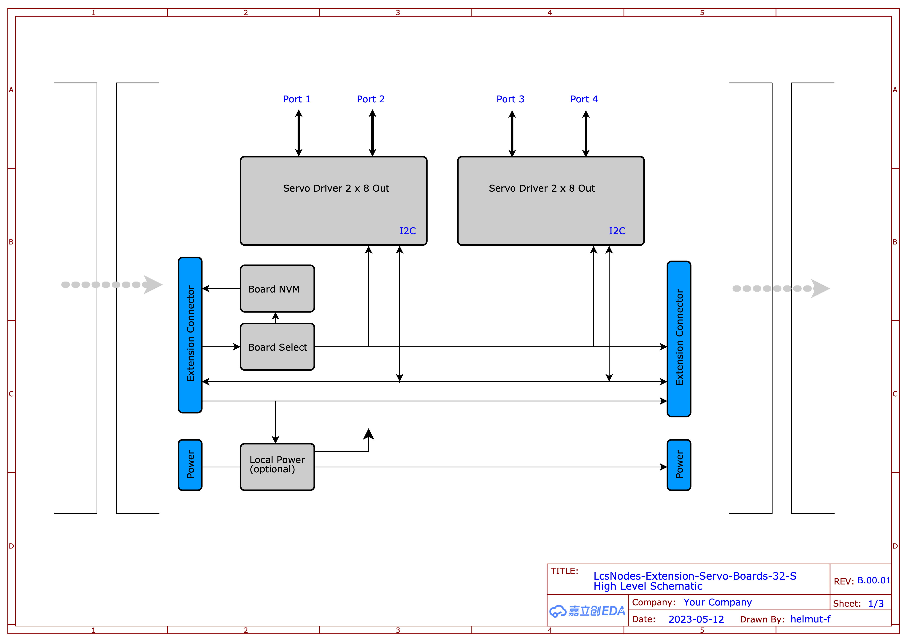

### *Connectors*

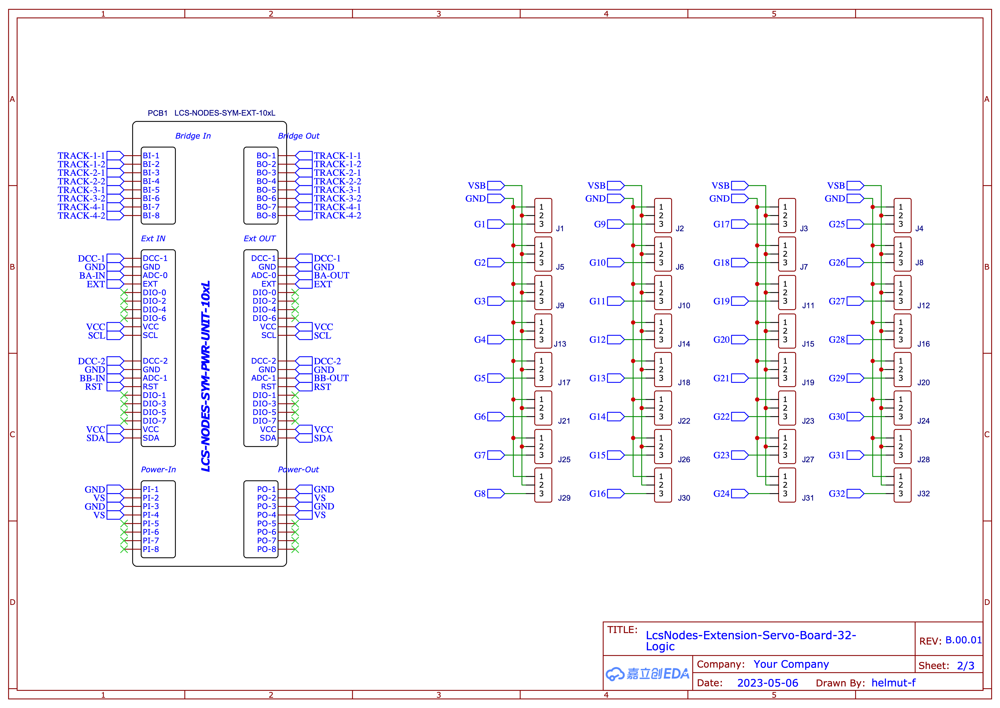

### *Logic*

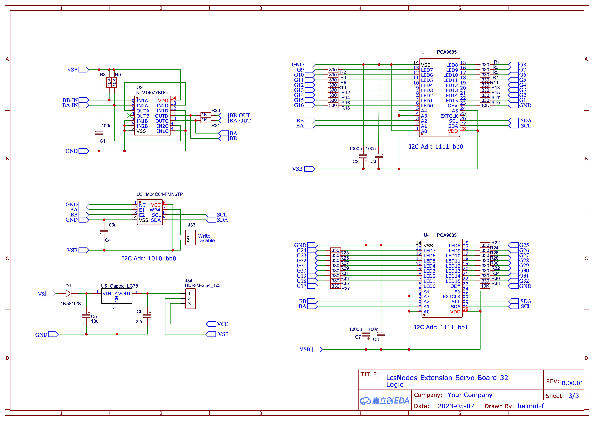

### *PCB*


### *Firmware*

The servo extension hardware is managed by the extension driver for a servo.

- servos can draw quite a bit of current.
- option 1: the 5V supply can be replaced by a 2A version, same footprint.
- along the pulses in a staggered period. Each servo channel start at another point in the overall PCA9685 period. To the servo it does not matter. However, the power consumption is spread and thus less than if all servo periods start at the same time.

- describe the items and functions of the driver.


<!--------------------------------------------------------------------------------------------------------->
<!--------------------------------------------------------------------------------------------------------->
<!-- Chapter - GPIO Extension Board ----------------------------------------------------------------------->
<!--------------------------------------------------------------------------------------------------------->
<!--------------------------------------------------------------------------------------------------------->

<div style="page-break-before: always;"></div>

## *GPIO Extension Board*

### *Block Diagram*

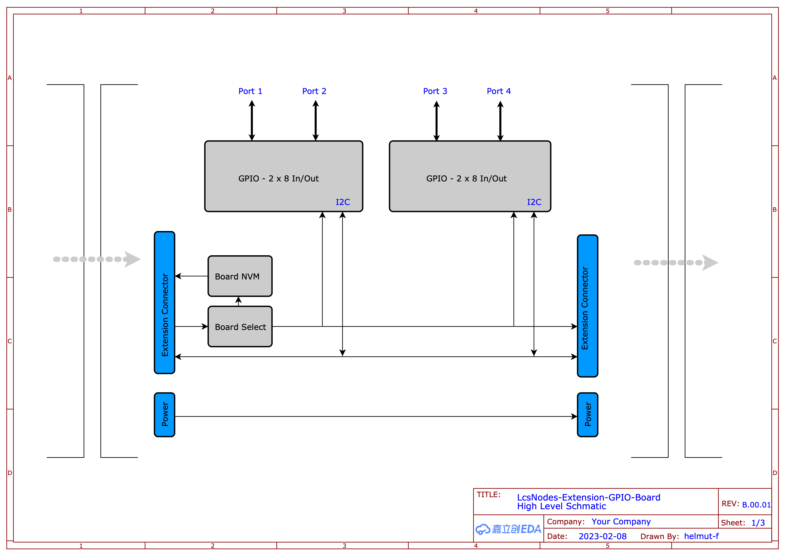

### *Connectors*


### *Logic*

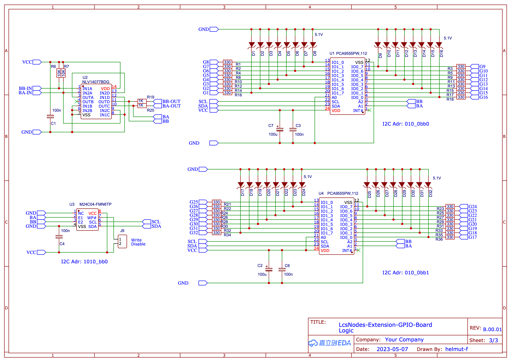

### *PCB*


<!--------------------------------------------------------------------------------------------------------->
<!--------------------------------------------------------------------------------------------------------->
<!-- Chapter - Signal Extension Board --------------------------------------------------------------------->
<!--------------------------------------------------------------------------------------------------------->
<!--------------------------------------------------------------------------------------------------------->

<div style="page-break-before: always;"></div>

## *Signal Extension Board*

### *Block Diagram*

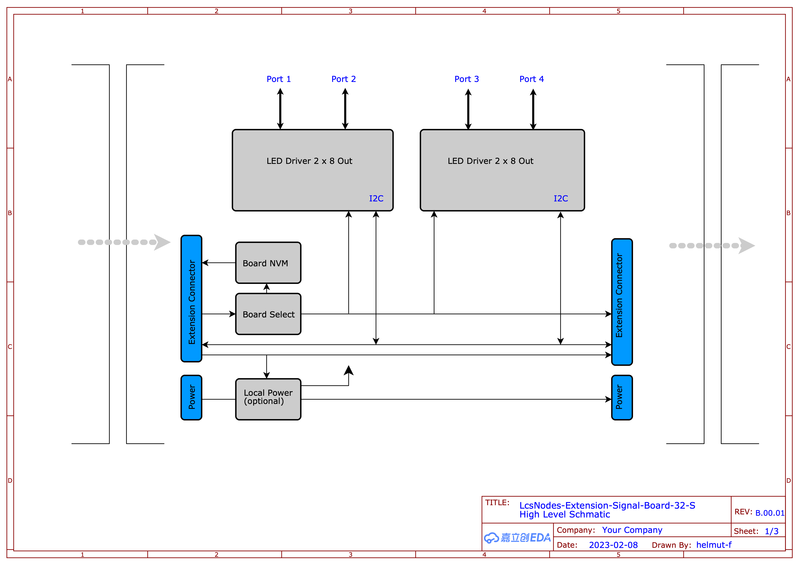

### *Connectors*

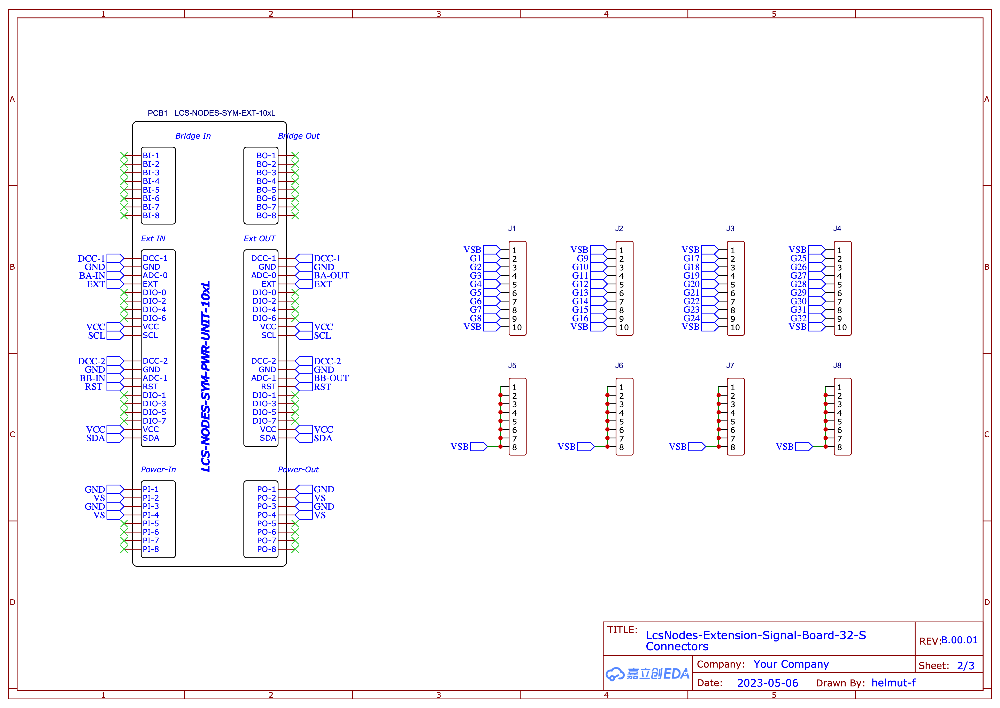

### *Logic*

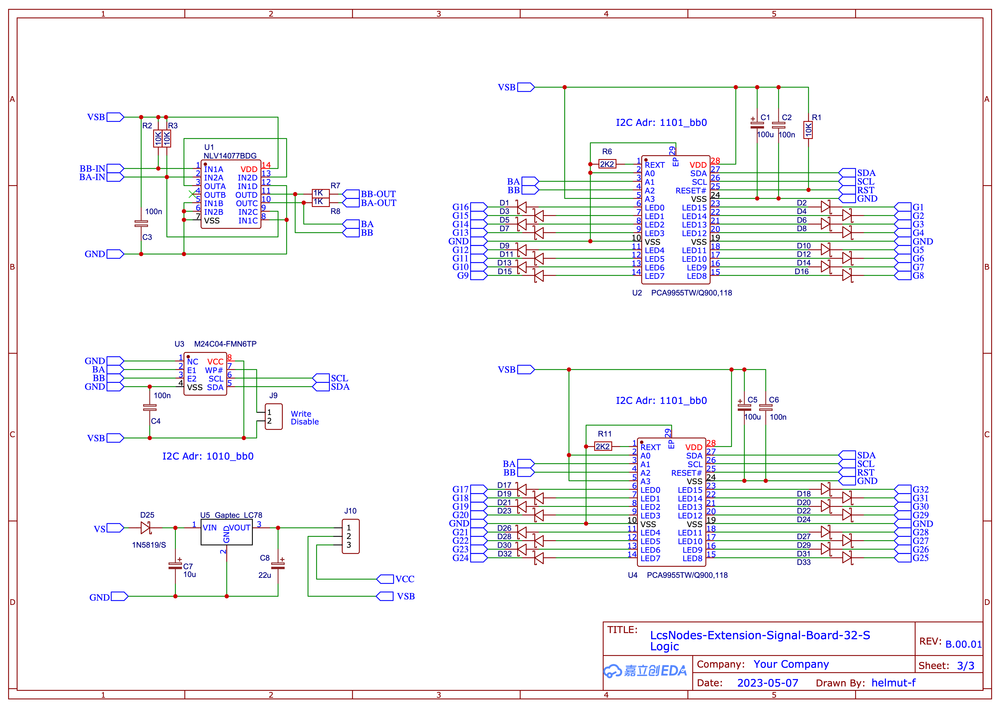

### *PCB*


### *Firmware*

The servo extension hardware is managed by the extension driver for a servo.

- describe the items and functions of the driver.


<!--------------------------------------------------------------------------------------------------------->
<!--------------------------------------------------------------------------------------------------------->
<!-- Chapter -Turnout Extension Board --------------------------------------------------------------------->
<!--------------------------------------------------------------------------------------------------------->
<!--------------------------------------------------------------------------------------------------------->

<div style="page-break-before: always;"></div>

<div style="page-break-before: always;"></div>

## *Turnout Extension Board*


// ??? **note** under construction ....


<!--------------------------------------------------------------------------------------------------------->
<!--------------------------------------------------------------------------------------------------------->
<!-- Chapter - Relay Extension Board ---------------------------------------------------------------------->
<!--------------------------------------------------------------------------------------------------------->
<!--------------------------------------------------------------------------------------------------------->

<div style="page-break-before: always;"></div>

## *Relay Extension Board*

Next in line are relays and their relatives, the traditional twin coil machine that power turnouts and mechanical signals before the advent of cheap servos. The relay extension boards is based on the plain digital input/output board with output drivers that directly drive the relays. There are many relays boards available on the market. One cannot beat the price on Ebay for such a board. These relays boards can be driven by a digital signal, such as as the plain input/output extension shown before generates. Instead of designing an own board, the combination of the plain IO extension and such a relays board is recommended.

The ULN2803 is a bread and butter high voltage, high-current darlington array consisting of eight channels. The drivers have an open Collector output, so that a load is required for expected voltage changes. The ULN2803 can be used for driving relays, motors and other items. The outputs are inverted. A high on the input results in the output going low.


Again, there is no limit what a modeler would do with a relays that can be turned on and off. One common use case is the control of a turnout with magnetic coils for switch movement. We would need two per turnout control to be really flexible. There should also be timers for a delayed turning on and turning off the relays in order to avoid damage to the magnetic coils.

### *Block Diagram*


### "Connectors"


### *Logic*

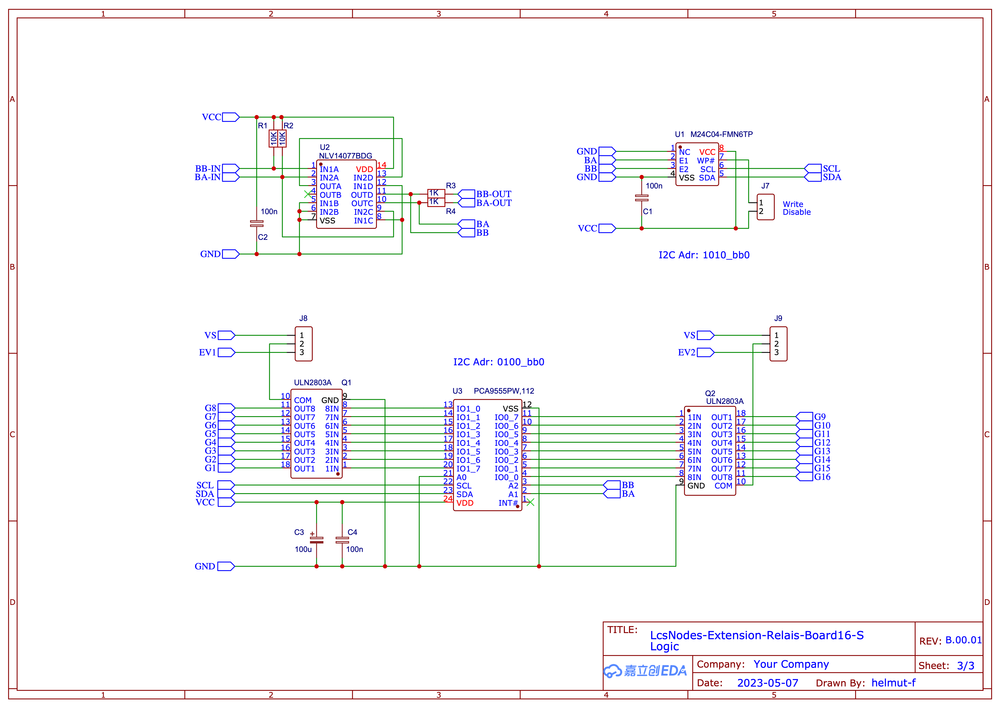

### *PCB*

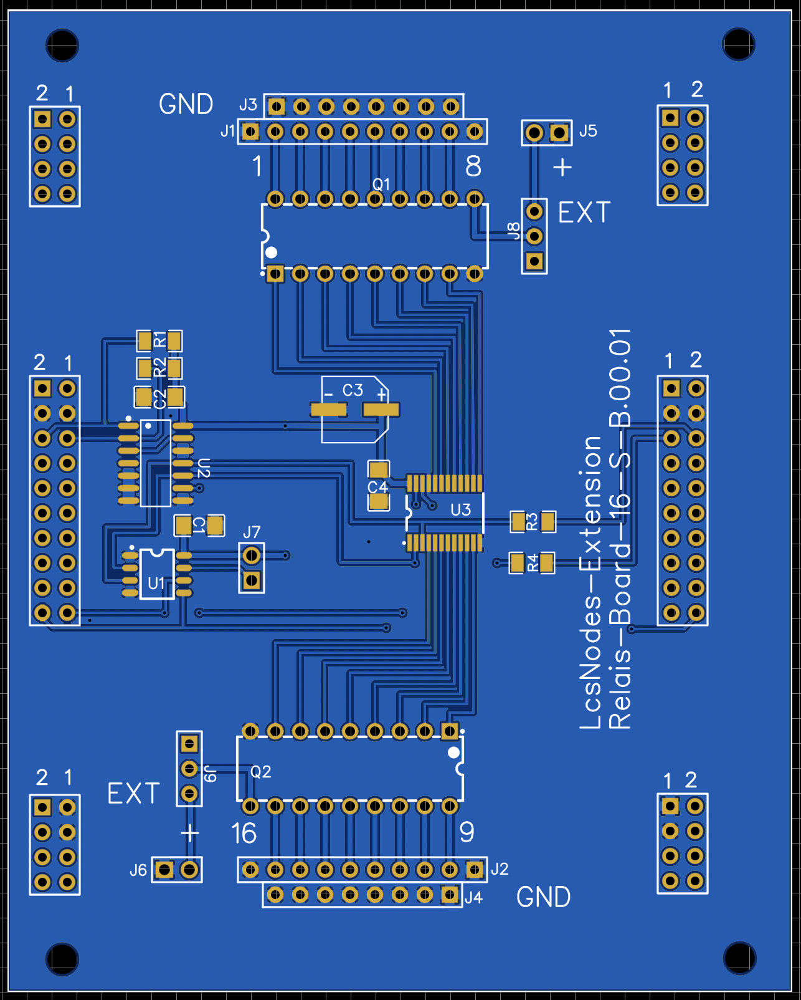

### *Firmware*


<!--------------------------------------------------------------------------------------------------------->
<!--------------------------------------------------------------------------------------------------------->
<!-- Chapter - Combo Extension Board ---------------------------------------------------------------------->
<!--------------------------------------------------------------------------------------------------------->
<!--------------------------------------------------------------------------------------------------------->

<div style="page-break-before: always;"></div>

## *Combo Extension Board*

// ??? **note** what can we combine from servo, signal and GPIO to have one board for cases where too many lines are not necessary ?

### *Block Diagram*

### "Connectors"

### *Logic*

### *PCB*

### *Firmware*

<!--------------------------------------------------------------------------------------------------------->
<!--------------------------------------------------------------------------------------------------------->
<!-- Chapter - Cab Control Extension Board ---------------------------------------------------------------->
<!--------------------------------------------------------------------------------------------------------->
<!--------------------------------------------------------------------------------------------------------->

<div style="page-break-before: always;"></div>

## *Cab Control Extension Board*

A cab control extension is essentially a cab handheld put in a stationary place. Consider a rail yard control stand with all the buttons and signals to manage that rail yard. There is no reason why for example one of two cab control stands could also be part of this control stand. All we need is a main controller board and an extension PCB that hosts the buttons and knobs for managing a locomotive. That's it.

### *Block Diagram*

The cab control extension board will contains the same arrangement of buttons, knobs and display as we have seen with the cab handheld. However, in contrast to the cab handheld, there is no controller directly managing these buttons and knobs. All there is, is the I2C bus to an extension board. The cab control extension therefore needs an I2C IO expander chip for the buttons and encoders.

// ??? **note** picture goes here...

### *Connectors and Logic*

// ??? **note** standard extension board connectors.

### *PCB*

An 8x10cm board, based on the extension board concept.

### *Firmware*

The firmware is almost actually identical to a cab handheld. The difference is just how we access the buttons and encoders. Instead of a plain digital IO pin, we now use the I2C bus to access them.

### Summary

// ??? **note** to be done later ...


<!--------------------------------------------------------------------------------------------------------->
<!--------------------------------------------------------------------------------------------------------->
<!-- Chapter - *Prototype Extension Board ----------------------------------------------------------------->
<!--------------------------------------------------------------------------------------------------------->
<!--------------------------------------------------------------------------------------------------------->

<div style="page-break-before: always;"></div>

## *Prototype Extension Board*

Sometimes it is very useful to build a first sketch of a new extension board design. Sometimes an extension board just offers a dedicated function special to a current project and it is not worth the effort to design and build a dedicated PCB for it. In all these cases a kind of prototyping board will come in very handy.

### *Block Diagram*

The block diagram shows the prototyping board components. All that there is, is the extension board decoding logic and the NVM for storing the configuration data. The board features all connectors, but will not route the track connectors. All in all a very simple board. Almost too simple for a block diagram.

...

### *Connectors and Logic*

The decoding logic and NVM ...
...

### *PCB*

The prototyping board is a 10cm x 12cm board with all connectors and a bread board style space for conventional components.
...

### *Firmware*

Actually, there is none. Nevertheless, the board decoding logic and the local NVM memory can be used according to the prototype needs.


<!--------------------------------------------------------------------------------------------------------->
<!--------------------------------------------------------------------------------------------------------->
<!-- Chapter - Layout Connector Panel --------------------------------------------------------------------->
<!--------------------------------------------------------------------------------------------------------->
<!--------------------------------------------------------------------------------------------------------->

<div style="page-break-before: always;"></div>

## *Layout Connector Panel*

There are situations where one would connect a mobile node to the LCS bus. A good example is a cab handheld which you would like to plug in close where the session operation currently is. Even though the world moves more and more to wireless, such a connector front panel installed around the layout is not a bad idea. The panel can also be used to feature an emergency stop button and perhaps some rudimentary power status indication.

### *Requirements*

A layout connector panel needs to provide two connectors for the LCS bus coming in and going out. The signal lines are just routed through with the exception of the power line. While these two connectors are behind the scene at the back of the front panel, two more connectors are exposed via the front panel. These are the connectors where for example a cab handheld would be plugged in. In addition to the two front panel connectors, there is an option to connect an emergency stop button. When pushed, the lines is drawn to ground and all nodes would detect the signal going low.

The power line is not directly routed to the front panel connectors. There should be an option to have an external power supply to provide the power to the nodes. It depends on the total power consumption we expect on the LCS bus. The central source will be a power supply that delivers about one amp to the lCS bus. To power a couple of handhelds or small sensors nodes, would not be a problem. As the power demand grows, a separate power supply such as shown on the schematic below will deliver the necessary power.

### *Implementation*

The following schematic shows the LCS connector panel schematic. The upper part contains all the connectors and the option to connect an external power source to the front panel. The lower part shows a simple power supply, which could directly be hosted on the connector PCB.

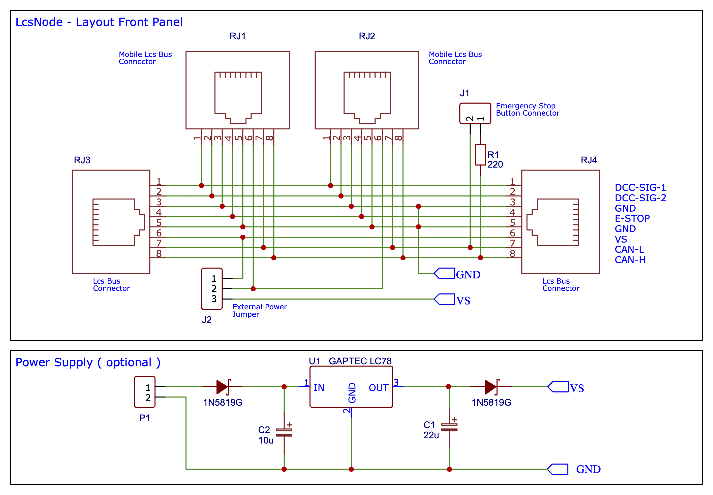

### *Summary*

This rather short chapter shows how a layout connector panel could be designed. Such panels are placed on strategic points around the layout. Besides connecting mobile devices to the LCS bus, there is also the option to feed these devices with an external power.  The panel is also a good spot to place emergency stop buttons around the layout.  The current panel is just connector routing panel.  Additional status information for power on, bus activity, and so on could also be put onto such a panel. However, anything more complex would require to put some controller logic on the panel as well.


<!--------------------------------------------------------------------------------------------------------->
<!--------------------------------------------------------------------------------------------------------->
<!-- Chapter - LCS Module - Gateways ---------------------------------------------------------------------->
<!--------------------------------------------------------------------------------------------------------->
<!--------------------------------------------------------------------------------------------------------->

<div style="page-break-before: always;"></div>

## *LCS Module - Gateways*

The layout system rests on the CAN Bus and all nodes connect to the bus. But this is only one way to built the foundation. The requirements to connect a computer can be handled via the USB bus of the base station. But also, as the protocol is not bound to the CAN Bus, there is an option to have a gateway to connect other devices via for example an Ethernet protocol. But right now, this is work on the to do list.

// ??? **note**  need to structure the chapter.

- LCS messages, different HW bus.
- LCS messages sent to a computer via USB or Ethernet
- LCS Messages WLAN
- protocol gateways for protocols such as LocoNet


<!--------------------------------------------------------------------------------------------------------->
<!--------------------------------------------------------------------------------------------------------->
<!-- Chapter - DCC Monitoring ----------------------------------------------------------------------------->
<!--------------------------------------------------------------------------------------------------------->
<!--------------------------------------------------------------------------------------------------------->

<div style="page-break-before: always;"></div>

## *DCC Monitoring*

When I started to build parts of the layout system, the DCC++ system was the starting point. An Arduino UNO and a breakout board power unit and the base station that accepts ASCII commands on the console interface was up and running. The parallel project was to build a snooping device that tells what the actual DCC packets are that are on the track. What a moment to see an IDLE packet on the track after power on. Not only for great moments, a DCC monitoring module is a very useful device for trouble shooting. What we would need is a DCC signal detector, a controller and the module firmware that displays what is found. The detector can also ensure that the track is connected with the right polarity and that there is cutout period of configured for RailCom support.

### *Requirements*

- not necessarily a LCS node, an Arduino Mega or Pico will do...
- perhaps an own PCB ?
- display a DCC packet in human readable form
- DCC packet formatter usable as part of the library
- signal timing
- cutout detection
- polarity detection

// ??? **note** what to leverage ? e.g. have a main controller and a monitoring extension board that hast the DCC signal detect logic ?

// ??? **note** should we be able to detect PWM signals as well ? DC signals ?


### *Module hardware*

- describe the hardware and building blocks used
- signal derived from the track
- no LCS component, just an Arduino Mega, etc.


### *Module firmware*

The DCC monitor consists of two main parts. The first is the signal detector, which monitors the actual DCC track signal taken directly from a track or the track signal line on the LCS bus. The result is a stream of bits from which the packets are formed. The second part is the packet analysis part and DCC packet payload formatting. Both parts are separated and could also be used in other projects. This is also right now the only module that does not use the LCS core library.

// ??? **note** describe how we detect polarity...

#### Signal detection

The hardware for signal detection is a simple optocoupler that takes the DCC signals and produces a stream of ones and zeroes from it. There is one challenge though. The detector can only detect power, i.e. a "DCC +" or "DCC -" and no power. While this does not matter for receiving a simple packet data stream, it has consequences for the cutout period. The following picture ( currently hand drawn ) shows the incoming DCC signal and the result after the optocoupler for normal and reverse polarity.

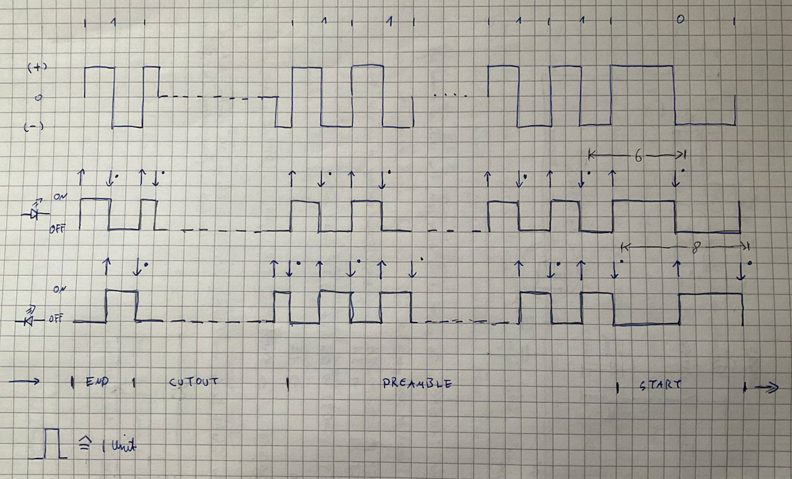

Fortunately, the signal timing differs with polarity. The DCC packet preamble ends with a ZERO bit as part of the first data byte. On a "positive" wired analyzer, the distance between measurement of the first half of the IBE bit to the first half of the following ZERO bit is 58 + 116 = 174 microseconds. If the wiring is reverse, the distance becomes 232 microseconds. Furthermore, we can detect on a "positive" wiring the 29 microseconds start of a cutout period, on the reverse wiring we detect the end, which does not help much.

// ??? **note** can we also figure out how to detect the RailCom data if present ? Would it require a bit of HW, i.e. a UART interface ?

#### DCC Packet Analysis

- not a lot to say, just pick up the standard with the packet description
- a part of the LCS libraries as a generic function
- 

### *Summary*


<!--------------------------------------------------------------------------------------------------------->
<!--------------------------------------------------------------------------------------------------------->
<!-- Chapter - Layout System Configuration ---------------------------------------------------------------->
<!--------------------------------------------------------------------------------------------------------->
<!--------------------------------------------------------------------------------------------------------->

<div style="page-break-before: always;"></div>

## *Layout System Configuration*

// **note** under construction. A huge part in itself... what to do for a basic configuration ?

So far, the chapters concentrated on the LCS core library, extension firmware and the underlying hardware to implement the LCS nodes. From a firmware perspective the core element is the node with node attributes, ports and port attributes, an event system and a message interface for the odes to communicate to each other. Throughout the previous chapters configuration was essentially the setting of node, port and event data. This chapter will start to describe how that data is set, i.e. configured.

When it comes to layout system configuration there are two major philosophies. The first insist that a hardware module can be configured without the help of any external device such as a computer. These hardware modules typically offer some buttons and switches, some even a display, for entering the required configuration data through menus or sequences of how to push buttons during startup. This process is then called "teaching the node". Often it is recommended to configure before actually installed on the layout.

The other approach use a computer to configure. Especially larger layouts will have a graphical plan of the layout and offer numerous menus and options to configure the hardware modules even in the installed state. They also keep data bases of the layout configuration data for each node and all the running equipment.

### *Requirements*

### *Layout Configuration Software*

### *Summary*


<!--------------------------------------------------------------------------------------------------------->
<!--------------------------------------------------------------------------------------------------------->
<!-- Chapter - The LCS Guidance Computer ------------------------------------------------------------------>
<!--------------------------------------------------------------------------------------------------------->
<!--------------------------------------------------------------------------------------------------------->

<div style="page-break-before: always;"></div>

## *The LCS Guidance Computer*

And now for something entirely different. About 60 years ago work started to put man on the moon and bring them back safely. This would not have worked without flight control in the space ship and hence an onboard computer was necessary. Most of the concepts for a highly available, mission critical, real time computer had to be invented. In honor of the Apollo Guidance Computer development and to serve all the model railroad hobbyist that would like to control the layout without resorting to a PC, how about building a hardware module to enter commands to the layout for configuration and limited operational purposes. And of course you would not need to be in a space suit to operate it.

Interestingly enough, when looking at the evolution of DCC decoders, there is the trend to configure them with a PC or with a simple interface directly on the decoder module. Some even have a small display to show a comfortable configuration menu. Unfortunately, when these decoder are installed in the opposite corner of the layout, changing the decoder configuration without a computer means crawling below the layout and what not. Some decoder companies actually recommend to first configure the decoder and then install it on the layout. Our approach is to allow the configuration of a LCS node any time, any place. A simple piece of hardware with a small display and few buttons to query and control the nodes on the layout might not be such a bad idea. Welcome to the LCS guidance computer :-). Here is a first sketch what the LCS guidance computer could look like.

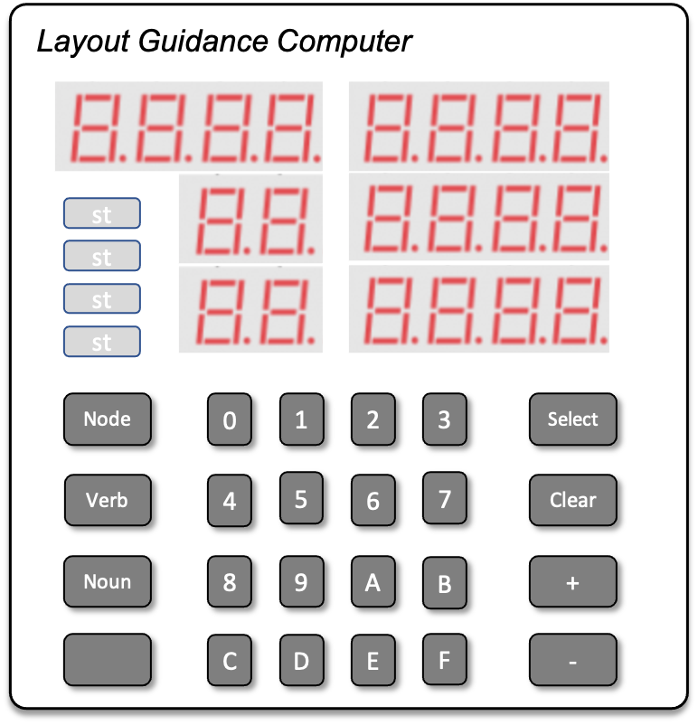

If you take a picture from the Apollo space program days, it looks very much the same. There are buttons for setting a node, entering a verb and noun. There are also buttons for entering data clearing and finishing data entry. The display is organized to show the current node, non and verb. There are three registers for parameters and values. If you would enter a command it would involve setting the node, entering a noun and a verb. So, setting a new limit for a DCC track, you would enter the node number of the DCC block controller, enter the limit in one of the registers, and set the verb "set" and noun "limit". More on this in the next sections.

### *Nodes, Verbs, Nouns and Registers*

// **note** how close are the verbs to the console commands ?
// **note** can they replace them for a uniform serial command interface ?
// **note** can they be another way of sending data around ? ( "Node xxx Verb yyy Noun zzz" )


### *Display and Keyboard*


### *Summary*


<!--------------------------------------------------------------------------------------------------------->
<!--------------------------------------------------------------------------------------------------------->
<!-- Chapter - Utility boards  --------------------------------------------------------------------------->
<!--------------------------------------------------------------------------------------------------------->
<!--------------------------------------------------------------------------------------------------------->

<div style="page-break-before: always;"></div>

## *Utility boards*

// ??? adapter PCB

// ??? experimental breadboard stuff

// ??? DCC bus to digital IO 


<!--------------------------------------------------------------------------------------------------------->
<!--------------------------------------------------------------------------------------------------------->
<!-- Chapter - UI Elements -------------------------------------------------------------------------------->
<!--------------------------------------------------------------------------------------------------------->
<!--------------------------------------------------------------------------------------------------------->

<div style="page-break-before: always;"></div>

## *UI Elements*

User interfaces such as Cab Handhelds or Switch Panels offer the user control and display elements for a layout. Typically there many buttons and LEDs but also rotary encoders and displays. You start an Arduino project and the first Led is blinking, a button is pushed. Before you know it, buttons need to be debounced, short and long pressed, active high or active low. You would like to toggle a Led and remember its state. There are displays with different interfaces and capabilities. On some displays you want to control the brightness and contrast. Finally, in some projects you run out of physical pins and want to connect an array of buttons or LEDs through a shift register. The list is long. In all Arduino projects you implement it somehow directly in project just to take part of the functions to the next project and so on. UI Elements is the library the implements the most common UI elements.

### *Concepts*

When building simple controller applications, a LED and a button are the most common things used in becoming familiar how to program for such a controller. Digital pins configured as an output and the LED will light up when driven by the output pin. Likewise, a HW pin configured as an input the state of a button can be read. But wait, while LEDs are electronic items, a button is something mechanical and pushing it typically will cause the value read to initially "bounce" between low and high. The first thing the UI Elements library will do is to shield the user from these mechanical issues.

Furthermore a button can be pushed once, double or for a longer period. The UI Elements library works with a state machine approach. A periodic function, "tick" is expected to be called from the outer loop of the program. For all UI Element Objects, the state machine is called and the element state is advanced. Communication back to the program is handled via previously registered callback functions.

Displays come in a large variety and capabilities. UI Elements will offer an abstraction of an ASCII display with a fixed number of line and columns. LCD and OLED displays are unified with with a simple interface to set a cursor and to write a character to that position.

Finally, buttons and LEDs can be combined to arrays. Consider a Cab Handheld with for example 10 buttons, a rotary encoder, several LEDs and a display. We will quickly run out of HW pins on the controller. An array of buttons features the same capabilities of a single button object, the values of the buttons are however read in through a shift register serial output or a PIO Extender chip, such as we used for actors and sensors before, are required.

### *Buttons*

A button is an object that has one input value and analyzes whether the button was clicked, double clicked or long pressed. All this is done with a state machine that manages the button state. For each action a callback function can be registered. There is also a callback function for getting the button data. Buttons are one  of the most used UI Elements. This set of methods implements the single button and an array of buttons. Each button is essentially a state machine with a set of defined callback functions. The time for debouncing, detecting a click or a long press can be set individually for each button. A switch is also just a button with a long press characteristic. For each button a button descriptor keeps the data about callback, HW pin and so on. The following brief example shows how to implement a single button and handle the click event. The following example shows a simple button clicked implementation.


```cpp
#include "UIElements.h"

// create the button, pin 5 is the button input
UIButton aButton( 5 );

bool getButtonData( uint8_t pin ) {
	return( digitalread( pin ));
}

void buttonHandler( uint8_t buttonId ) {
	// the button was clicked. buttonId contains the pin number 5
}

void setup ( ) {
	// the Arduino setup function, register the click callback
	aButton.attachgetDataFunction( getButtonData );
  aButton.attachButtonClicked( buttonHandler );
}

void loop ( ) {

    // in the main loop of the program the UIElements "tick" function.
	UIElements::tick( );
}
```

Instead of implementing the button data retrieval directly in the button object, there is a callback that obtains the hardware value. This might look like an overkill in abstracting a button. But consider a button connected to a serial shift register or a button connected to an interface chip such as the MCP23017. Each of these hardware interfaces would require a special case in the button object. Abstracting the data retrieval, allows to implement very different hardware buttons. All this comfort comes with a price though. The button object has a size of roundabout 26 to 32 bytes. So, an array of 256 buttons would occupy quite some memory storage. For such applications, a dedicated special button array class would perhaps be the better choice. Note that the buttonId does not necessarily have to be a physical pin number. For example, a shift register with implementation with 64 buttons could simply assign logical numbers that the data retrieval function understands to get the correct bit from the shift register.

### *Rotary Encoders*

A rotary encoder works similar to a button. It is a type of position sensor that generates an electrical signal according to the rotational movement. The most common one has two outputs that are turned on 90 degrees out of phase from each other. Just monitoring one of the inputs allows for detecting rotary movement. However, analyzing both inputs at the same time allows for detecting the rotational direction. If the pin A changes its signal level, examining the input B allows for determining the direction. If both inputs signals are equal the rotation is clockwise, else counter clock wise. The UIEncoder element manages all these details and offers a callback to be invoked when the position of the rotary encoder changes. Just like buttons, there is a data retrieval callback function. Here is a simple example.

```cpp
#include "UIElements.h"

// create the rotary encoder, pin 5 and 6 are the inputs, MIN and MAX defines the encoder range.
UIEncoder anEncoder( 5, 6, MIN, MAX );

bool getEncoderData( uint8_t pin ) {
	return( digitalRead( pin ));
}

void positionChangedHandler( uint8_t newPosition ) {
	// the encoder was turned, the delta passed to the callback function.
}

void setup ( ) {
	// the Arduino setup function, register the positionChanged callback
	anEncoder.attachGetDataFunction( getEncoderData );
    anEncoder.attachPositionChanged( positionChangedHandler );
}

void loop ( ) {

    // in the main loop of the program the UIElements "tick" function.
	UIElements::tick( );
}
```

### *LEDs*

When talking about buttons and switches, the LEDs built the counterpart and signal a state. A LED is an object that can be turn on and off and blink. Just like buttons a state machine manages the LED state and there is a callback for setting the data according to the hardware implementation.

### *Displays*

In addition to a LED signaling light, there is the requirements to display human readable text. The UI element display is an object that represents a matrix of ASCII characters. A display has n lines with m characters. There are methods to set a cursor to a line / column position and a method to print a character. There is a variety of display hardware available. The common ones are a LCD display with 4 x 20 or 2 x 16 characters. There are also OLED displays which are graphical displays with for example 128 x 64 pixels. These display can print characters using different fonts.

The display UI element provides as a common function set the methods to clear a display, set a cursor position and write a character to that position. In addition, each type of display has capabilities specific to this display. A LCD display has methods for turning on and off the backlight. There are also blinking cursors and so on. The OLED display allows for smaller or larger character fonts. While the display UI element object presents a common method set for all display types it will not shield these additional capabilities. The following shot example will show an OLED display connected via the default I2C lines.

```cpp
#include "UIElements.h"

UIDisplay *oled;

void setup ( ) {

	oled = new UIDisplayOledSSD1306 ( DT_OLED_DISPLAY_128x64_16_4 );

	// write to top of screen
	oled -> clear( );
	oled -> print( "Hello world!");

	// write to line 2
	oled -> setCursor( 0, 2 );
	oled -> print( "Line 2");
}

void loop ( ) {
	// in the main loop of the program the UIElements "tick" function. This is not really
	// necessary for the display function, but for the rest of UI elements.
	UIElements::tick( );
}
```

### *Screens*

UI Elements such as Buttons, Knobs, LEDs and displays are the atoms of a user interface. The next level is to organize these atoms into screens. A screen is first of all a display UI element that is manipulated with the help of UI input elements such as buttons. The UI Screen is a very simple element to organize and manipulate these screens.

The UIScreen object is the class for implementing a screen. Screens are a display of whatever you want to put on that display.There are virtual methods that will be called when a button event such a click is encountered. Two buttons needed for navigation. They are the MENU and SELECT button. With the exception of the root screen, a screen has a parent and a potential child list. The hierarchy is formed by appending a screen to another screen child list. The MENU button is typically used to scroll through the child list. A long press of the menu button always gets back to the root screen's first child, no matter where you are. Child lists are toggled through with the menu button in a circular fashion. From the last screen on the child list, the next toggle gets us to the first child. The SELCET button selects the current screen and triggers an action. When navigating to a screen, the exit callback is invoked for the screen to leave and the enter callback is invoked for the screen to enter. The exit callback would typically be used to clean up of store data away, the enter callback would be used to set up the data and display the initial screen content.

```
a conceptual picture of a screen hierarchy ?

MENU -> MENU -> MENU -> MENU -> MENU -> back to first menu
  |
  v
SUB-MENU
   |
   v
SUB-MENU
   |
   v
SUB-MENU
  |
  v
  back to first sub menu

```
To keep the screen hierarchy flexible, the meaning of the MENU and SELECT button within a given screen is not fixed. But as a convention, the MENU button should be used to toggle through screens, the SELECT button is used to enter a screen child list and also as a kind of commit button. All other buttons, if any are completely user defined.

The connection from UIElement events to screens is handled by registering the static callback functions defined for the UI elements. All UI Elements for which the callback set will just pass the event to the current screen. For example, the UIScreen base class has the MENU and SELECT button event handler to navigate through the screens.

A screen that inherits from the UIScreen could overwrite these handlers and assign a new meaning to the MENU and SELECT button. For the other elements, i.e. the other buttons but also encoders, there are dedicated handlers that are passed the resource ID of UIElement. A screen that for example that displays the value of an encoder UIElement will build a class that inherits form UIScreen and override the encoder callback. In a similar way the MENU and SELECT button can also be override, but then it is up to the implementer to handle the navigation. That's it.

// ??? **note** have an example ...

### *Summary*

This chapter presented the UI element library, which is the common UI layer for handhelds, control panels and monitor displays.


<!--------------------------------------------------------------------------------------------------------->
<!--------------------------------------------------------------------------------------------------------->
<!-- Chapter - Outlook ------------------------------------------------------------------------------------>
<!--------------------------------------------------------------------------------------------------------->
<!--------------------------------------------------------------------------------------------------------->

<div style="page-break-before: always;"></div>

## *Outlook*

// **note** wrap up what was all done and why
// **note** what is left and where to go next
// **note** new generations of processors, e.g. raspberry pico are very interesting and dirt cheap


### ( Planned ) GitHub Structure

// ??? **note** rework when finalized... 

Libraries

- LcsCdcLib
- LcsRuntimeLib
- LcsUIElementsLib
- LcsExtXXXLib ( one for each extension )

Firmware

- LcsBaseStation
- LcsBlockController
- LcsCabHandheld
- LcsCabThrottle
- LcsMonitor

### Schematics and Boards

Schematics and Boards so far

... to fill in ...


<!--------------------------------------------------------------------------------------------------------->
<!--------------------------------------------------------------------------------------------------------->
<!-- Appendix - LCS Nodes Items Reference ----------------------------------------------------------------->
<!--------------------------------------------------------------------------------------------------------->
<!--------------------------------------------------------------------------------------------------------->

<div style="page-break-before: always;"></div>

## *Appendix n - LCS Nodes Items Reference*

LCS Nodes offer access via **nodeInfo** and **nodeControl** library functions. There are selector codes, called **items** that specify whether a variable is access or a function is executed. In addition, the firmware programmer can also add item codes for specific purposes. This appendix lists the items defined for the LCS nodes described in the previous chapters.

### Concept review

// ??? **note** describe briefly the concept again ...

### Common items for an LCS node

// ??? common to all LCS nodes...

### Power Module items


### Base Station items


### Cab Handheld items


### GPIO extension items


### Occupancy detect extension items


### Servo extension items

// ??? more to come ...


<!--------------------------------------------------------------------------------------------------------->
<!--------------------------------------------------------------------------------------------------------->
<!-- Appendix - Appendix Overview  ------------------------------------------------------------------------>
<!--------------------------------------------------------------------------------------------------------->
<!--------------------------------------------------------------------------------------------------------->

<div style="page-break-before: always;"></div>

## *Appendix Overview*

// ??? **note** talk about what is in the


<!--------------------------------------------------------------------------------------------------------->
<!--------------------------------------------------------------------------------------------------------->
<!-- Appendix - Library Serial Commands Reference --------------------------------------------------------->
<!--------------------------------------------------------------------------------------------------------->
<!--------------------------------------------------------------------------------------------------------->

<div style="page-break-before: always;"></div>

## *Appendix n - Library Serial Commands Reference*

This appendix contains the list of LCS core library commands. The command line is embraced by the "<" and ">" pair. The LCS commands consist of the command followed by an optional list of arguments. To distinguish an LCS command from any other command handled outside of the library, the LCS commands start with an "!" character. The command line format was modeled after the DCC++ command line. Invalid input arguments for a command are just ignored and the command is not executed.

|Command | Arguments | Operation |
|:---|:---|:---|
|!c | - | enter node configuration mode |
|!o | - | enter node operations mode |
|!a | eventId \[portId\] | add an event to the eventMap. If the portId is omitted, all ports will get an entry with the eventId.
|!r | eventId \[portId\]| remove an event to the eventMap. If the portId is omitted, all eventMap entries with a matching eventId will be removed. |
|!f | eventId \[ portId \] | search an event in the eventMap. |
|!e | mode nodeId&nbsp;eventId&nbsp;\[arg\] | simulate sending an event ( mode: 0 - ON, 1 - OFF, 2 - EVT |
|!n| portId item \[val1\[val2\]\] | list a node or port map item.|
|!N| portId item \[val1\[val2\]\] | set a node or port map item.|
|!v | attrId \[mode\] | list an attribute. |
|!V | attrId mode val | set an attribute.|
|!B | byte1 [ byte2 .. byte8 ] | send a raw LCS message |
|!s | \[level\] | list status at detail level, default is summary. ( 1 - ConfigDesc, 2 - NodeMap, 3 - PortMap, 4 - EventMap, 5 - AttrMap, 6 - NVM Area, 7 - MEM Area ) |

// ??? **note** driver commands ...

|Command | Arguments | Operation |
|:---|:---|:---|

// ??? **note** add some text to each entry rather than a single page for each command.


<!--------------------------------------------------------------------------------------------------------->
<!--------------------------------------------------------------------------------------------------------->
<!-- Appendix - DCC++ Serial Commands Reference ------------------------------------------------------------>
<!--------------------------------------------------------------------------------------------------------->
<!--------------------------------------------------------------------------------------------------------->

<div style="page-break-before: always;"></div>

## *Appendix n - DCC++ Serial Commands Reference*

// **note** need to add return values...
// ??? note add a reference to the DCC++ web site

| Command | Arguments | Reply | Operation |
|:--|:--|:--|:--|
| O | cabId | | allocate a session for the cab|
| K | sessionId | | release a session |
| t | sessionId cabId speed direction| | set cab speed / direction|
| f | cabId funcId val | | set cab function value, function group DCC format |
| v | sessionId funcId val| | set cab function value, individual |
| R | cvId [ callbacknum callbacksub ] | | read CV byte on the programming track |
| W | cvId val [ callbacknum callbacksub ] | | write CV byte on the programming track |
| B | cvId bitPos bitVal [ callbacknum callbacksub ] | | write CV bit on the programming track |
| b | cabId cvId bitPos bitVal | | write CV bit on the programming track |
| w | cabId cvId val | | write CV byte on the operations track |
| M | sessionId byte1 byte2 [ byte3 ... byte10 ] | | send DCC packet on operations track |
| P | sessionId byte1 byte2 [ byte3 ... byte10 ] | | send DCC packet on programming track |
| X | | | emergency stop all |
| 0 | | | turn operations and programming track power off |
| 1 | | | turn operations and programming track power on |
| 2 | | | turn operations power on |
| 3 | | | turn programming track power on |
| a | [ opt ] | | list current consumption, where opt=0 -> MAIN (default ), opt=1 -> PROG, opt=2 -> both |
| C | [ option ] | | set options for the track. 0 -> set service track in operations mode, 1 - > set service track in service mode, 2 -> enable RailCom, 3 -> disable RailCom |
| s | [ level ] | | list status at detail level, default is summary. 0 -> summary, 1 -> configuration,  2 -> session map |
| S | | | list base station configuration |
| L | | | list base station session table |
| D | | | enter diagnostics mode - need to restart later! |
| ? | | | list this help |


<!--------------------------------------------------------------------------------------------------------->
<!--------------------------------------------------------------------------------------------------------->
<!-- Appendix - Core Library Routines Reference ----------------------------------------------------------->
<!--------------------------------------------------------------------------------------------------------->
<!--------------------------------------------------------------------------------------------------------->

<div style="page-break-before: always;"></div>

## *Appendix n - Runtime Library Routines Reference*

// ??? **note** this appendix will not repeat what is documented in the source. This is a battle you cannot win. I have a small utility that takes an augmented C-source include file and makes it a markdown document. 

// ??? **note** we could just include this file, or keep a reference to it for the utility to include. The result of the utility is a markdown file with all the text in this file and the included files, which is then the base for PDF creation.

// ?? **note** have a table with all items... 

| Item | purpose | Get | Put | Req |
|:--|:--|:--:|:--:|:--:|
| an item | what it does | X | X | - |


<!--------------------------------------------------------------------------------------------------------->
<!--------------------------------------------------------------------------------------------------------->
<!-- Appendix - Controller Dependent Code Library Routines Reference -------------------------------------->
<!--------------------------------------------------------------------------------------------------------->
<!--------------------------------------------------------------------------------------------------------->

<div style="page-break-before: always;"></div>

## *Appendix n - Controller Dependent Code Library Routines Reference*

// ??? **note** this appendix will not repeat what is documented in the source. This is a battle you cannot win. I have a small utility that takes an augmented C-source include file and makes it a markdown document. 

// ??? **note** we could just include this file, or keep a reference to it for the utility to include. The result of the utility is a markdown file with
// all the text in this file and the included files, which is then the base for PDF creation.


<!--------------------------------------------------------------------------------------------------------->
<!--------------------------------------------------------------------------------------------------------->
<!-- Appendix - LCS Nodes and EasyEda --------------------------------------------------------------------->
<!--------------------------------------------------------------------------------------------------------->
<!--------------------------------------------------------------------------------------------------------->

<div style="page-break-before: always;"></div>

## *Appendix n - LCS Nodes and EasyEda*

The schematics and boards shown were all developed using the EasyED software. EasyEDA is a design tool for developing the schematics and PCB layouts. A PCB can then be ordered at very reasonable prices. Even during LCS node early design stages it is therefore sometimes worthwhile to just produce a PCB and avoid searching software bugs that are actually just loose connection on a breadboard. To ease the development, there are experimental boards. However when it comes to a final design, PCB boards need to be developed and ordered in larger quantitates. The LCS Node design introduced contains a main controller board and extension boards. The sizes and location of the connectors have been standardized. This appendix contains the PCB drawings of the most common LCS boards to give you a head start in developing your own boards, ensuring that all boards fit together.

### *Symbols and Footprints*

EasyEDA allows you to create symbols that represent components and can be placed in a schematic. To each symbol there should be a footprint that is used to put the component on to the PCB. The connection between the two is a list of assignments that associate a **pin** on the symbol with a **pad** on the footprint. For LcsNodes there is a list of symbols and footprints to ensure that the PCBs do have all their connectors at the exact place, so that they fit together.

#### Symbols

To ease the development of LCS boards, the entire board and its connectors are available as a symbol. Depending on the category, the symbol features the connection end points for the connectors found on the board. This symbol is associated with the corresponding footprint described in the next section. Note that the footprint needs to match the symbol. That is the number, position and meaning of the connectors found on the board map, only length of the PCB board varies.


#### Footprints

This section contains all the footprints developed so far. There are three main categories. The first is anything that represents an LCS Controller portion. The LCS Main Controller Board for example is a 10x8cm board shown below.

<br>
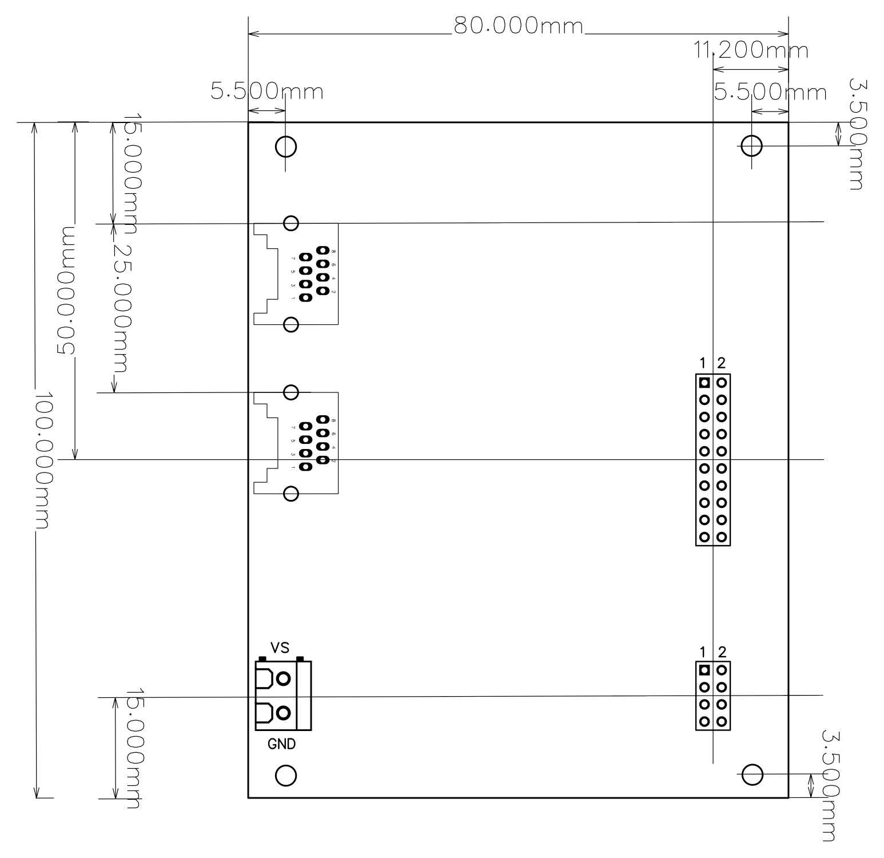 
<br>

For monolithic design, such as the LCS base station, we would like to have more room on the board. Well, here is a 10x12cm board. If there is a need for any other main controller board length, just clone the footprint give it a new name, change the board length and place the connectors and holes accordingly.

<br>
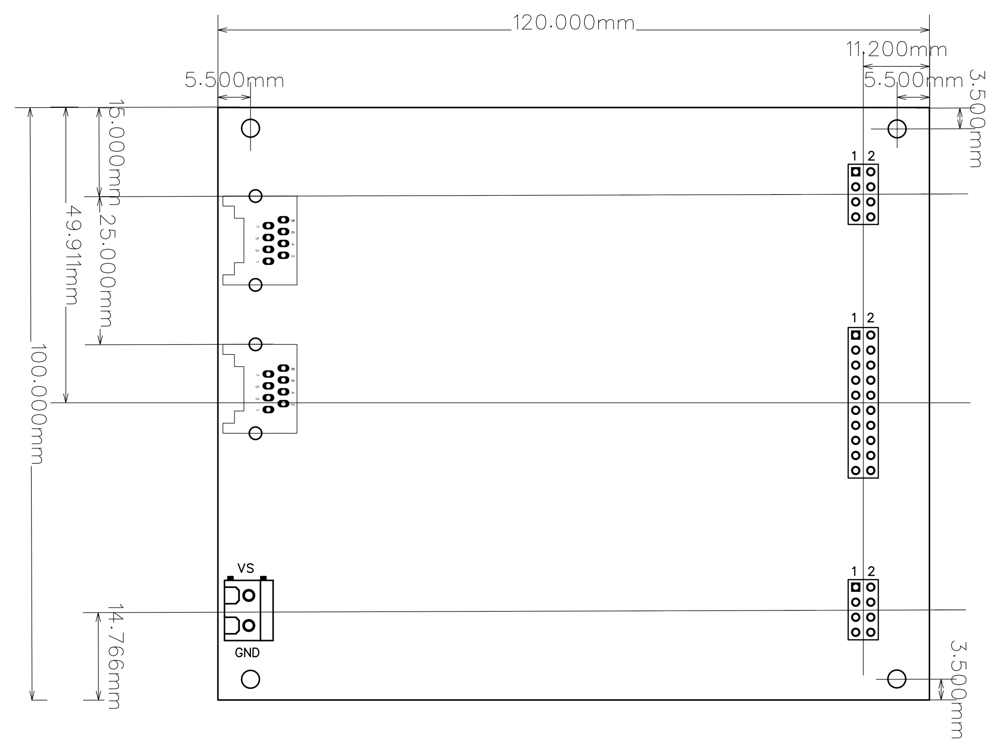
<br>

Another combination used is a main controller style board with a track power output. The Quad Block controller described is a good example. The footprint features on the right the LCS node inputs and on the left the track power output, extension connector and a power line connector. If you need anything that combines main controller and track power generation, this is the board to work from.

<br>
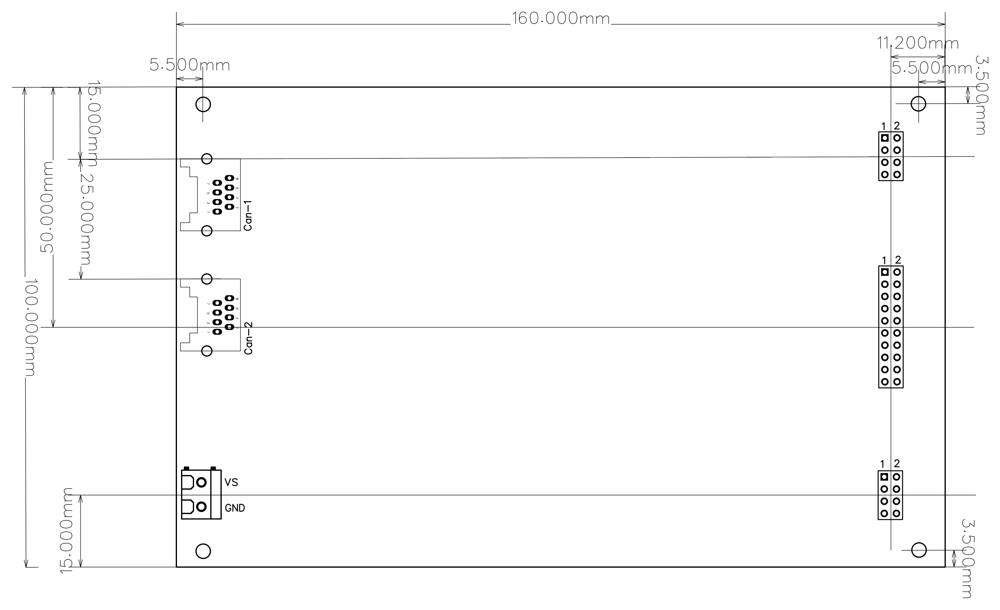
<br>

Finally, there are the extension boards. They are straightforward and just offer the three connector lines to the left and to the right. Just the length varies. Common length are an 8cm and a 16cm board.

<br>
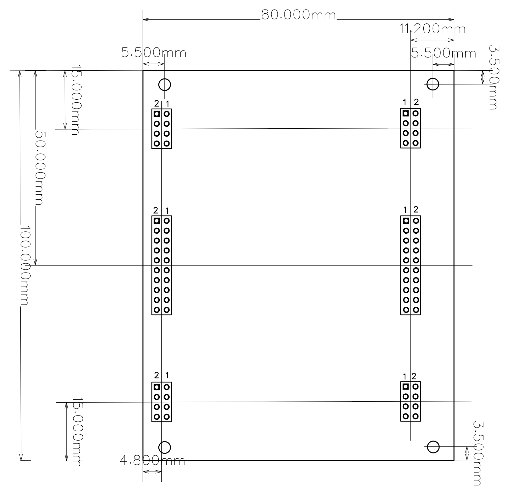
<br>

<br>

<br>

As always, there could be many more combinations as new boards with different demands are developed. Nevertheless it is important that when connectors are used, that they have the same meaning and are placed at the same location. This is the whole idea of using footprints to ensure this exact fitting.

### Links

|Tool|Link|Comment|
|:--|:--|:--|
| EasyEDA | http://easyeda.com/de | Design tool for schematics and PCB layouts |
| JLCPCB | - | part of EasyEDA that manufactures PCB boards, order from within EasyEDA |


<!--------------------------------------------------------------------------------------------------------->
<!--------------------------------------------------------------------------------------------------------->
<!-- Appendix - Inspiring work and links ------------------------------------------------------------------>
<!--------------------------------------------------------------------------------------------------------->
<!--------------------------------------------------------------------------------------------------------->

<div style="page-break-before: always;"></div>

## *Appendix n - Inspiring work and links*
For me, work on this layout system started with getting my hands on an Arduino Uno and the proud setup of a blinking LED. Next, connecting a CAN bus shield allowed for two Arduino boards to talk to each other. I was hooked. There was the quick realization that this new world of "lego blocks" could be the basis of all kinds of projects, including projects for the model railroad. And sure enough, there are an overwhelming number of clubs and individuals working on the subject, willing to share their great expertise and work. This appendix just lists a few of the great web sites and projects that profoundly influenced the development of my layout control system. One I would like to point out is the IOTT YouTube series of Hans Tanner, which gives a wonderful introduction into electronics, concepts and applications for model railroading. In making all of my work public too, I hope to also give back to others that are underway in our great hobby.

### Standards

The most relevant standard to read the DCC standard. There is the NMRA which owns it and their web site has all the relevant document. In Germany, the RailCommunity is also offering the DCC standard documents in close alignment with the NMRA.

|Organization|Link|Comment|
|:--|:--|:--|
|NMRA|(http://www.nmra.org)||
|Rail Community|(http://www.RailCommunity.org)|||

### Projects

There are many projects on the subject of layout control and DCC electronics. Below is a list of just a few of them. The list contains also the external libraries used in our runtime.

|Project|Link|Comment|
|:--|:--|:--|
|DCC++|https://sites.google.com/site/dccppsite/|DCC++ is a full-function open-source hardware and software system for the operation of DCC-equipped model railroads.|
|DCC-EX|https://dcc-ex.com|DCC-EX is a team of dedicated enthusiasts producing open source DCC solutions for you to run your complete model railroad layout. |
|MERG CBUS|http://www.merg.org| A system for comprehensive layout control based on a general purpose Layout Control Bus (LCB). |
|can2040|https://github.com/KevinOConnor/can2040| the CAN bus software implementation for the Raspberry Pi Pico. |
|JMRI|http://www.jmri.org|The JMRI project is building tools for model railroad computer control.|
|OpenDCC|http://www.opendcc.de|The OpenDCC web page contains a lots of useful information about model railroading and digital control. Definitively worth a visit.|
|IOTT| https://github.com/tanner87661 and also on Youtube | IOTT - the Internet of Toy Trains ( Hans Tanner )|
|Z21|https://pgahtow.de/w/Hauptseite| where I got the RailCom detector from ... |

### Tools

|Tool|Link|Comment|
|:--|:--|:--|
|Arduino| http://www.arduino.cc|-|
|Raspberry PI Pico| http://www.raspberrypi.org |-|
|EasyEDA| http://easyeda.com/de| Design tool for schematics and PCB layouts |
|JLCPCB| - | part of EasyEDA that manufactures PCB boards |
|JMRI| http://www.jmri.org |-|


<!--------------------------------------------------------------------------------------------------------->
<!--------------------------------------------------------------------------------------------------------->
<!-- Appendix - A generic power supply -------------------------------------------------------------------->
<!--------------------------------------------------------------------------------------------------------->
<!--------------------------------------------------------------------------------------------------------->

<div style="page-break-before: always;"></div>

## *Appendix n - A generic power supply*

Depending on the actual node hardware design, power is implemented in a variety of ways. A small handheld node would certainly draw its power from the LCS bus. A booster has a much higher power consumption requirement. The typical node needs in any case a 5V power, which can for example be drawn from a high power line on the layout. And as with every building block shown so far, there are many ways to Rome.

A power supply for a generic node could draw power from the LCD bus or from an external power line. Furthermore, some LCS nodes need a way to detect a power failure and perform any last second items before power is gone. The following schematic shows a power supply that allows for automatic switching between two inputs. It also features a power fail detection mechanism.


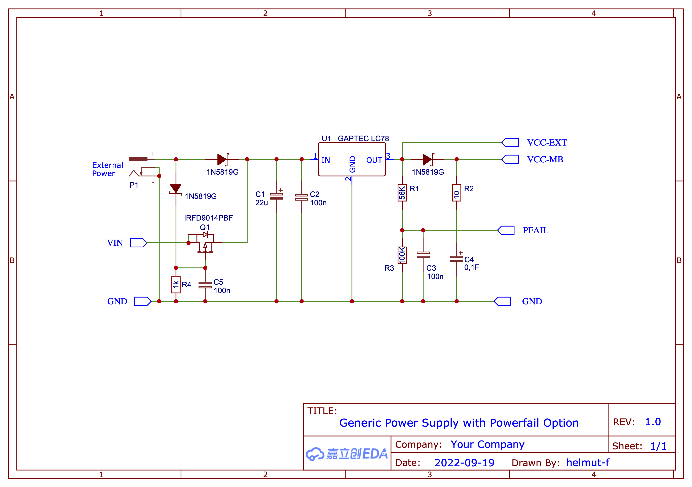

The right part of the schematic shows how the power input lines are switched depending what is connected. The voltage regulator itself is pretty much standard. Since the power line may have up to 24Volts, a switched regulator is a good choice. The right side features a power fail signal detection output and a capacitor to provide power for the last actions before power done. Naturally the timing depends on the actual power drawn by the board. When a power fail is detected, it is a good idea to immediately turn off power consuming devices and focus on the last items to do before power is gone. A good example is to save the last data items in the non-volatile storage.


<!--------------------------------------------------------------------------------------------------------->
<!--------------------------------------------------------------------------------------------------------->
<!-- Appendix - Notes for making this book ---------------------------------------------------------------->
<!--------------------------------------------------------------------------------------------------------->
<!--------------------------------------------------------------------------------------------------------->

<div style="page-break-before: always;"></div>

## *Notes for making this book*

// how to format, etc.

// the utility...

// it is on GitHub and a note how to produce a PDF from the files...


<!--------------------------------------------------------------------------------------------------------->
<!--------------------------------------------------------------------------------------------------------->
<!--------------------------------------------------------------------------------------------------------->
<!-- End of file ------------------------------------------------------------------------------------------>
<!--------------------------------------------------------------------------------------------------------->
<!--------------------------------------------------------------------------------------------------------->
<!--------------------------------------------------------------------------------------------------------->